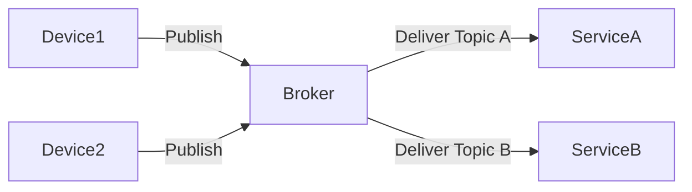
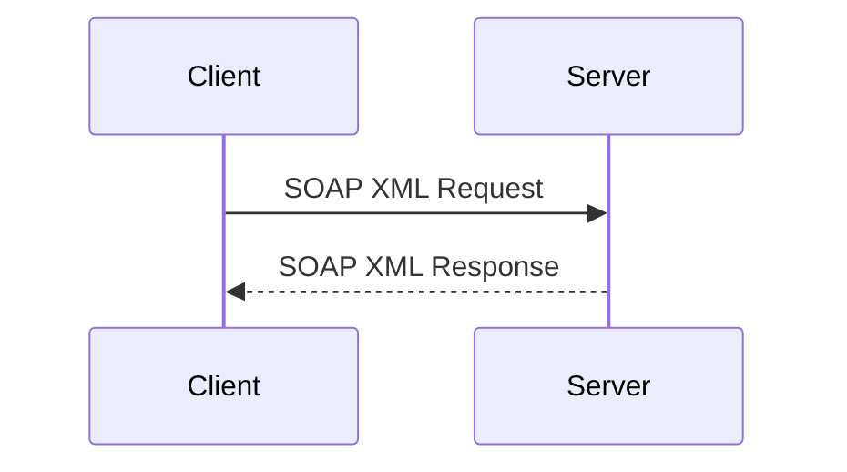
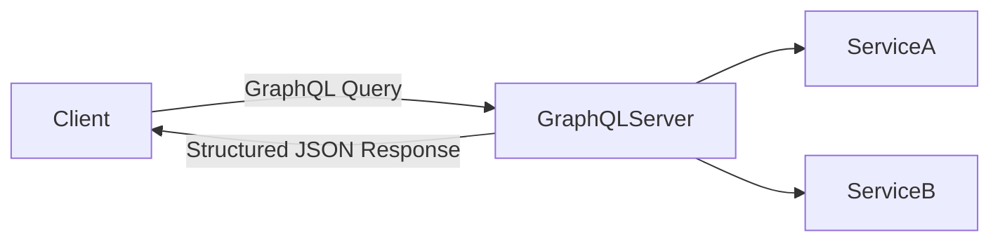
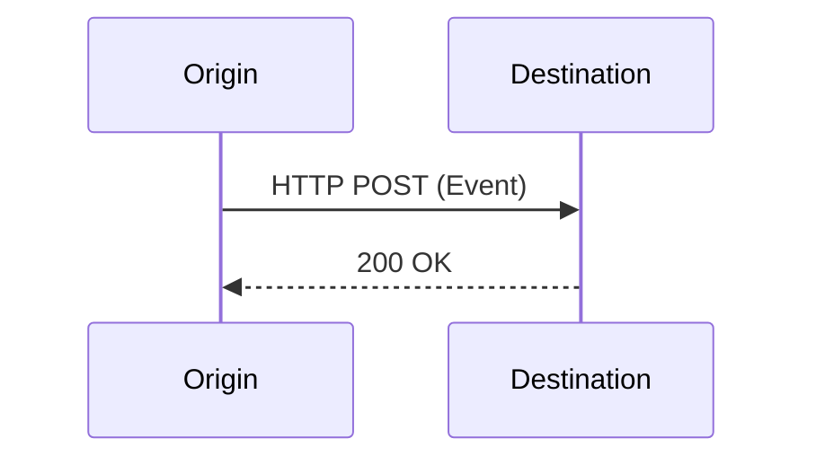
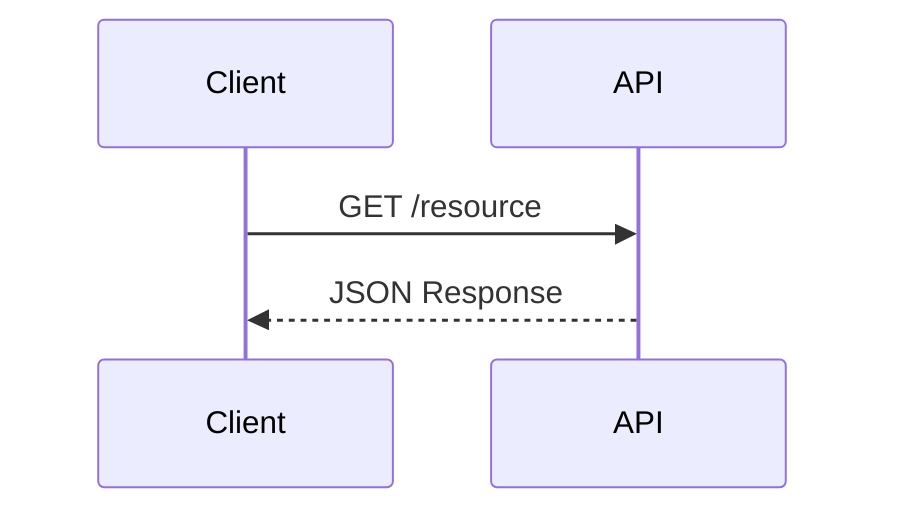
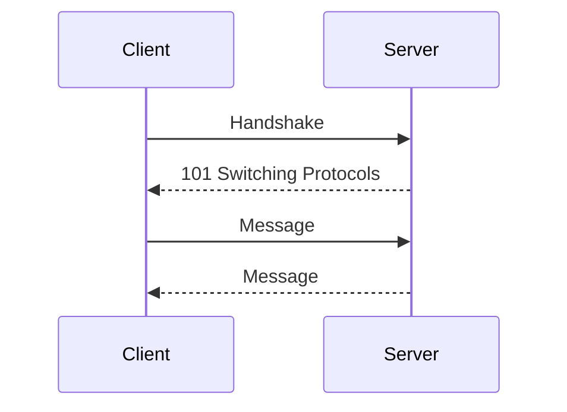

Modern distributed systems rely on well-defined API interaction patterns. While new frameworks and tooling continue to evolve, the core architectural styles remain foundational. This article revisits six widely utilized API architectures:

- MQTT  
- SOAP  
- GraphQL  
- Webhooks  
- REST  
- WebSocket  

We examine how each works, their pros and cons, and include high-level Mermaid diagrams to illustrate interaction flows.

---

## 1. MQTT (Message Queuing Telemetry Transport)

MQTT is a lightweight publish-subscribe messaging protocol optimized for low-bandwidth, high-latency, or unreliable networks. It is widely used in IoT and edge environments.

### Pros
- Lightweight and bandwidth-efficient
- Excellent for IoT and edge devices
- Decouples producers and consumers
- Supports QoS levels

### Cons
- Requires broker infrastructure
- Not ideal for synchronous request-response
- Limited built-in security (depends on transport layer)

---

## 2. SOAP

SOAP is a protocol using XML-based messaging for structured enterprise communication.

### Pros
- Strong contract-first design (WSDL)
- Built-in standards (WS-Security, transactions)
- Enterprise reliability

### Cons
- Verbose XML payloads
- Heavy compared to REST/JSON
- Slower adoption in modern systems

---

## 3. GraphQL

GraphQL provides a single flexible endpoint where clients define exactly what data they need.

### Pros
- Eliminates over-fetching
- Strong schema typing
- Single endpoint

### Cons
- Complex caching
- Resolver performance risks
- Requires governance discipline

---

## 4. Webhooks

Webhooks enable event-driven communication by pushing HTTP callbacks.

### Pros
- Real-time event notifications
- Simple HTTP model
- Decoupled architecture

### Cons
- Requires public endpoints
- Retry and idempotency complexity
- Security validation needed

---

## 5. REST

REST is a resource-oriented architectural style using HTTP verbs and stateless communication.

### Pros
- Simple and widely adopted
- Stateless scalability
- CDN-friendly

### Cons
- Over/under-fetching
- Multiple endpoints for complex queries
- Weak contracts without OpenAPI

---

## 6. WebSocket

WebSocket enables persistent, bidirectional communication.

### Pros
- Real-time communication
- Low latency
- Bidirectional

### Cons
- Stateful connection management
- Harder horizontal scaling
- Complex security

---

## Final Thoughts

There is no universally superior API style. The right choice depends on communication patterns, scalability, flexibility, and governance requirements.

Mature architectures often combine multiple interaction models intentionally rather than relying on a single pattern.
