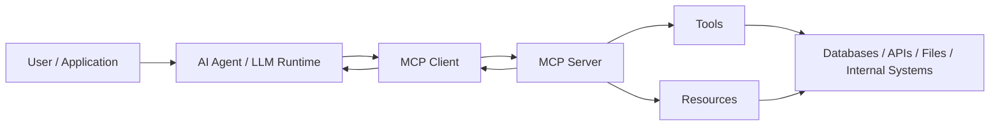

## Introduction

Large Language Models (LLMs) are powerful reasoning engines, but they are fundamentally stateless and context-limited. In real-world systems, meaningful AI behavior depends on structured access to external context: APIs, databases, files, internal tools, telemetry systems, and enterprise knowledge bases.

Managing this context is one of the hardest problems in AI system design.

Historically, developers solved this through:

- Ad-hoc prompt engineering  
- Custom API wrappers  
- Embedded tool calls  
- Hardcoded integrations  
- Vendor-specific extensions  

These approaches do not scale. They create tight coupling between models and infrastructure, reduce portability, and introduce security risks.

The **Model Context Protocol (MCP)** defines a standardized, extensible, and secure way for AI models and agents to access external context and tools.

MCP transforms context from an informal prompt artifact into a structured, governed interface.

---

## Why MCP Was Created

### The Limits of Ad-Hoc Prompt Engineering

In early AI applications, context injection often meant:

- Fetching data from a database  
- Serializing it into text  
- Appending it to a prompt  
- Hoping the model interprets it correctly  

This approach is fragile:

- No structured contract  
- No validation  
- No permissions model  
- Hard to evolve  
- Difficult to debug  

As systems grow, prompt-based integration becomes unmanageable.

### Tool Integration Challenges

Modern AI agents frequently need to:

- Query databases  
- Call REST APIs  
- Access internal documentation  
- Execute workflows  
- Read or write files  
- Trigger infrastructure tasks  

Without a standard protocol:

- Each integration is custom  
- Security policies are duplicated  
- Governance becomes inconsistent  
- Migration between model providers becomes complex  

### Enterprise AI Scenarios

In enterprise environments, AI agents may:

- Access ERP systems  
- Query data warehouses  
- Interact with microservices  
- Trigger CI/CD pipelines  
- Coordinate with other agents  

These scenarios require structured interfaces, permission boundaries, and auditability. MCP was designed to meet these needs.

---

## Core Concepts of MCP

### MCP Server

The MCP Server:

- Exposes tools, resources, and prompts  
- Defines available capabilities  
- Enforces permissions and boundaries  
- Acts as the controlled interface between AI and infrastructure  

### MCP Client

The MCP Client:

- Connects to the MCP server  
- Mediates requests between the model and external systems  
- Manages session lifecycle  
- Handles transport (stdio, HTTP)  

### Tools

Tools represent executable capabilities:

- Database queries  
- API calls  
- File operations  
- Workflow execution  

They are explicitly defined and governed.

### Resources

Resources represent retrievable context:

- Files  
- Documents  
- Structured datasets  
- Metadata  

### Prompts

Prompts can be predefined, parameterized, versioned, and reused to ensure consistency across agents.

### Context Boundaries

MCP enforces:

- Tool visibility rules  
- Resource access policies  
- Execution scope limitations  

### Transport Mechanisms

Common transports:

- stdio (local integration)  
- HTTP (remote integration)  

The protocol logic is transport-agnostic.

---

## How MCP Works (High-Level Flow)

1. Client connects to MCP server  
2. Server exposes tools and resources  
3. Model requests tool execution or context  
4. Server executes and returns structured response  
5. Model continues reasoning with controlled context  

This replaces free-form prompt injection with structured interaction.

---

## Architecture Diagram

---

## Why MCP Matters for Platform Engineering

From a platform engineering perspective, MCP provides:

- Decoupling between models and infrastructure  
- Standardized capability exposure  
- Reduced duplication of integration logic  
- Improved governance and observability  
- Vendor portability  

For SRE teams, MCP enables:

- Controlled execution boundaries  
- Centralized logging and auditing  
- Policy enforcement  
- Safer multi-agent architectures  

Instead of embedding infrastructure logic inside prompts, organizations can expose AI capabilities through a managed protocol layer.

---

## Conclusion

Context management is one of the most complex challenges in scalable AI systems.

Without structure:

- Integrations become brittle  
- Security becomes reactive  
- Vendor lock-in increases  
- Multi-agent systems become chaotic  

The Model Context Protocol introduces a standardized approach to context exchange between models and external systems.

It transforms ad-hoc integrations into governed infrastructure.

For architects and platform engineers, MCP represents a foundational architectural boundary for enterprise-grade AI systems.
