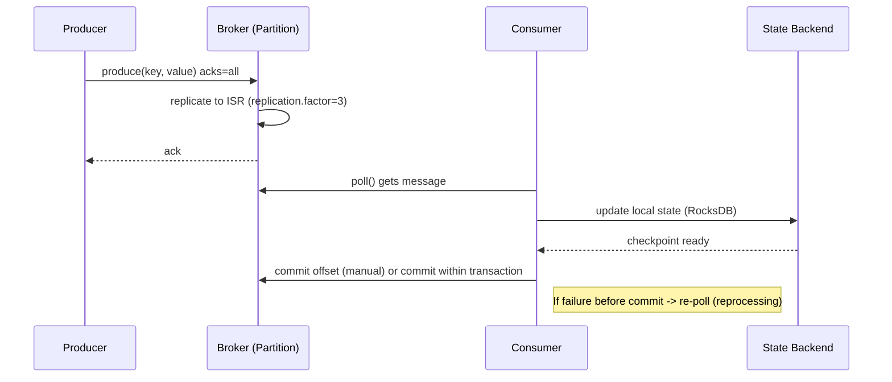

_Series "Modern Large-Scale Systems: Architecture, Patterns, and Advanced Practices" - Part 2 of 4_

## Designing global-scale data storage

Designing data storage for global presence is not just choosing a "distributed" database; it involves conscious decisions about data model, expected consistency, replication topologies, and latency mitigation considering operational costs and complexity. Below I summarize suitable models, consistency mechanisms, replication techniques, and strategies to control latency — with practical trade-offs and examples applicable to production systems.

### Types of databases and suitable data models

- Distributed relational (NewSQL): Spanner, CockroachDB. Useful when you need global ACID transactions and SQL. Require infrastructure for clock synchronization (Spanner) or Raft consensus per range (CockroachDB).
- Wide-column / key-value: Cassandra, Scylla, DynamoDB. Designed for high ingestion, massive partitioning, and multi-region replication. Prefer eventual-consistent or quorum-tunable models.
- Document stores: MongoDB Atlas, Cosmos DB. Schema-flexible, support geo-replicas and configurable consistency levels (e.g., Cosmos DB: strong, bounded staleness, session, etc.).
- Object/blob storage: S3-compatible (multi-region replication). Used for artifacts, blobs, and as cold layer for analytical data.
- OLAP and data lakes: BigQuery, Snowflake, ADLS. Not for low-latency OLTP but essential for global analysis and aggregation.

Practical rule: if your domain needs local read latency and tolerates slightly stale data, opt for key-value/doc + local replication. If you need strong distributed transactions, consider NewSQL with the cost of additional latency.

### Consistency in geographically distributed systems

Common models and their implications:
- Strong / Linearizability: guarantees any read sees the latest global write. Requires strong synchronization (consensus) and usually penalizes latency (e.g., Spanner/TrueTime).
- Causal: preserves causality between operations (useful for consistent user experience without full linearizability cost).
- Bounded staleness: reads can be "up to N seconds" stale — good compromise for UX with controlled latency (e.g., Cosmos DB).
- Eventual: guarantees convergence without temporal constraints — maximum availability and low local latency, but requires conflict resolution.

Techniques to implement them:
- Consensus (Raft/Paxos/etcd): for strong mode; synchronized operations via leaders and quorums.
- Quorum tuning: with N replicas, requiring W and R satisfies rule R + W > N to avoid losing writes.
- Session tokens / cookie-based guarantees: read-your-writes without linearizability (present in Cosmos DB, DynamoDB global tables with session consistency patterns).
- CRDTs / vector clocks / HLC (Hybrid Logical Clocks): automatic conflict resolution in multi-master systems without coordination (ideal for counters, sets, etc.).

### Efficient replication and synchronization techniques

Topologies and mechanisms:
- Synchronous (sync replication): write replicated and confirmed in multiple regions before ACK. Limited use to few centers due to latency.
- Asynchronous (async/replicate later): local write ACK and later replication; good performance but introduces inconsistency window.
- Multi-master (active-active): writes in multiple regions; requires conflict resolution mechanism (CRDTs, last-write-wins with HLC, application logic).
- Single-leader regional (active-passive): one region acts as source of truth; local reads from replicas. Reduces conflicts but centralizes write latency.
- Leader per shard (geo-sharding): data partitioned by region/customer (preferred when dataset can be partitioned by territory or customer id).

Efficient synchronization:
- Anti-entropy / gossip and Merkle trees to detect and repair differences without transferring full state (Cassandra uses Merkle trees for replica reconciliation).
- CDC (Change Data Capture) + log shipping (Debezium, Kafka Connect) to replicate changes between clusters or to data lakes.
- Batching, compression, and delta-encoding over WAN to reduce I/O between regions.

### Latency: implications and mitigations

Impact: geographic replication adds latency due to physical distance and consensus steps. Increasing strong consistency usually increases write response time and sometimes reads.

Practical mitigations:
- Local reads: maintain local read-only replicas and direct reads to nearest replica.
- Geo-partitioning: assign data and operations to closest region by data ownership (e.g., user data by residence region).
- Prefer local commit + async global replicate: fast ACK to client, later synchronization; compensate with reconciliation (CRDTs or idempotent programming).
- Edge caching: use CDN/edge caches for objects and Redis/ElastiCache near region for ultra-fast reads.
- Quorum tuning: N=3 with W=2, R=2 is common; lower R for fast reads or lower W for fast writes depending on load and failure profiles.
- Time-sync and HLC: use HLC for deterministic ordering between regions without relying on perfect physical clock; avoids unwanted reorderings during resolution.

Tradeoff summary: strong consistency = latency and cost; eventual/causal = lower latency and higher resolution complexity.

### Operational and design recommendations

- Define SLA per operation: not all operations need the same consistency. Design APIs that allow specifying consistency per call.
- Geo-shard by data ownership when possible; avoid global hot shards.
- Implement observability on replication (lag, conflict rates, anti-entropy metrics).
- Use CDC for integration between global OLTP and analytical pipelines.
- Document conflict resolution and convergence patterns for developers: which CRDTs are used, when LWW/HLC is accepted, etc.

Below is a topology diagram and a comparative table of popular distributed databases.

*Diagram: Geographic replication topology and data partitioning*

```mermaid
flowchart LR
    subgraph Region_US_East
      A1[App US-East] --> R1[Replica Shard A (Leader)]
      R1 -->|async| R1b[Replica Shard A (Local Read Replica)]
    end
    subgraph Region_EU_West
      A2[App EU-West] --> R2[Replica Shard A (Follower)]
      R2 -->|async| R2b[Replica Shard A (Local Read Replica)]
    end
    subgraph Region_AP_South
      A3[App AP-South] --> R3[Replica Shard B (Leader)]
      R3 -->|async| R3b[Replica Shard B (Local Read Replica)]
    end
    R1 -- "replicate (CDC/stream)" --> R2
    R1 -- "replicate (CDC/stream)" --> R3
    R2 -- "read local" --> A2
    R1 -- "read local" --> A1
    R3 -- "read local" --> A3
    classDef leader fill:#ffd,stroke:#333
    class R1,R3 leader
    note1["Strategies:
- Geo-shard by domain
- Local reads to replicas
- Writes to regional leader
- Async replication with CDC/anti-entropy"]
    R1 --- note1
```

*Diagram: Comparison of distributed databases for global storage*

| System | Model | Consistency | Replication | Strengths / Typical Use |
|---|---|---:|---|---|
| Google Spanner | Relational NewSQL | Strong (linearizable) | Multi-region synchronous (TrueTime) | Global ACID transactions, SQL, high latency cost for global writes |
| CockroachDB | Relational NewSQL | Configurable (serializable) | Range-by-Raft, geo-partitioning | SQL with fault tolerance, good fit for global OLTP |
| Cassandra / Scylla | Wide-column | Eventual (tunable quorum) | Multi-datacenter async, gossip, hinted handoff | High ingestion, massive partitioning, low local write latency |
| DynamoDB Global Tables | Key-value/document | Eventual / session | Active-active cross-region replication | Serverless operations, auto-scaling, AWS integration |
| Cosmos DB | Multi-model (document/key-value) | Multiple levels (strong, bounded staleness, session) | Optional multi-master, automatic replication | Fine-grained consistency control per operation, global SLA |
| MongoDB Atlas Global Clusters | Document | Eventual / tunable | Zones & global clusters, replica sets | Schema flexibility, partitioned by zone/region |

## Strategies for continuous processing of infinite event streams

### Architectures supporting large-scale real-time events

The most robust patterns today treat the event stream as an immutable log and use specialized layers for ingestion, processing, and storage. Predominant architectures are:

- Log-centric streaming (Kafka, Kinesis, Pub/Sub) with parallel consumers (consumer groups).
- Kappa architecture: everything is processed as a stream; batch functions are seen as re-executions over the historical log.
- Hybrid Lambda: streaming layer for low latency and batch for corrections and full computations (less popular in new designs except for migration cases).
- Event-sourcing + CQRS for domains where state is rebuilt from events and there is clear separation between write (commands) and read (projections).

In practice, a typical large-scale architecture includes: producers -> partitioned messaging system -> processing layers (stateless, stateful operators with checkpoints) -> sinks (OLAP, materialized view stores, caches) and replay and version control mechanisms.

### Durability and event ordering

Guaranteeing durability and order requires two key decisions: use a replicated log storage system and define the partition key.

- Durability: configure replication (e.g., Kafka replication.factor=3) and ISR policies (min.insync.replicas=2) to tolerate broker failures. Producers with `acks=all` and `enable.idempotence=true` reduce duplicate risk.
- Order: order is guaranteed only within a partition. Design the `partition key` according to operations requiring order (e.g., userId, accountId). Avoid hot partitions: if a key is very popular, order is maintained but with a throughput hotspot.
- Retention and compaction: use time-based retention for transactional data and log compaction for key changes needing state reconstruction.

For processing guarantees:
- At-most-once: low duplicates, possible losses.
- At-least-once: possible duplicates; common configuration (consumer commits offsets after processing).
- Exactly-once (EOS): possible in frameworks like Apache Flink, Kafka Streams or using Kafka transactions (producer transactional.id + commit offsets inside transaction). EOS adds cost and operational complexity.

### Batch vs streaming: relevant differences

- Latency: batch (minutes to hours) vs streaming (ms–s). If the application needs real-time responses, streaming is mandatory.
- Computation model: batch operates on finite sets and is simpler for global aggregation; streaming requires windows (tumbling, sliding, session) and handling lateness/out-of-order.
- Completeness vs provisionality: streaming results are usually incremental and eventually consistent; batch results are complete.
- Cost and operation: streaming keeps services always active, requires backpressure management, checkpointing, and state; batch can be cheaper for sporadic processes and highly aggregable data.

In many large systems the choice is pragmatic: use streaming for critical path (latency) and batch for correction calculations or historical aggregations (Lambda pattern), or simply adopt Kappa and re-execute the pipeline over the historical log when needed.

### Scalability and fault tolerance

Scalability is achieved through partitioning, parallelism, and automatic rebalancing:

- Partitioning: increase number of partitions to raise parallelism, but remember max consumption parallelism = number of partitions.
- Consumer groups: multiple consumer instances share partitions; when one instance fails, the group rebalances and partitions migrate.
- Autoscaling: scale stateless processors horizontally; for stateful processors, coordinate parallelism increase with checkpoint/restore mechanisms (Flink savepoints, Kafka Streams repartitioning).

Fault tolerance:
- Log replication (brokers), with leader election.
- Checkpoint and externalized state (local RocksDB + changelog topic). On failure, operator restores from last checkpoint.
- Reprocessing and replay: keeping the log allows recomputing projections or redoing calculations after logic fixes.
- Backpressure: supported by modern frameworks (Flink, Akka Streams) to avoid consumer overload.

Costs and trade-offs: higher replication and lower window lateness increase latency and storage cost; EOS reduces duplicates but penalizes throughput.

### Practical configuration and code example

- Recommended Kafka (operational example): replication.factor=3, min.insync.replicas=2, producer: acks=all, enable.idempotence=true, max.in.flight.requests.per.connection=1 (or managed by library).
- In processing: use periodic checkpoints and savepoints for upgrades.

See the minimal example of transactional producer and consumer with manual commit below.

*Diagram: Streaming event processing architecture*

```mermaid
flowchart LR
  Producers[Producers / Ingest]
  Ingest[Ingestion Layer\n(Kafka / Kinesis / PubSub)]
  StreamProc[Stream Processing\n(Stateless & Stateful Operators)]
  Checkpoint[Checkpointing & State Backend\n(RocksDB + Changelog)]
  OLAP[OLAP / Data Warehouse]
  Serving[Serving Stores / Materialized Views]
  Replay[Replay / Reprocessing]

  Producers --> Ingest
  Ingest --> StreamProc
  StreamProc --> Checkpoint
  StreamProc --> Serving
  StreamProc --> OLAP
  Checkpoint --> Replay
  Replay --> StreamProc
  style Ingest fill:#f9f,stroke:#333,stroke-width:1px
  style Checkpoint fill:#efe,stroke:#333,stroke-width:1px
  style Replay fill:#ffd,stroke:#333,stroke-width:1px
```

*Diagram: Sequence: from ingestion to offset commit*



## Architectural patterns for big data

### Common patterns

Big data solutions feature recurring patterns because they solve core problems: massive ingestion, economical storage, analytical processing, and delivery to consumers. The most common are:

- Zoned data lake: object storage (S3/GCS/ADLS) organized in "raw / staged / curated / serving" zones with columnar formats (Parquet/ORC) and catalogs (Glue, Hive Metastore).
- Data warehouse (analytical): columnar store optimized for ad-hoc queries with SQL capabilities and cost-based optimizers (BigQuery, Snowflake, Redshift).
- Lakehouse / Medallion: combination of data lake + ACID guarantees and transactional metadata (Delta Lake, Apache Iceberg) to eliminate friction between batch and analytical processing.
- Event sourcing / log as source: use an immutable log (Kafka, Pulsar) as single source of truth to rehydrate materializations.
- Layered ETL/ELT: ingestion (stream/batch), transformation (streaming engines or jobs), and serving (tables, materialized views, OLAP cubes).
- Data mesh (organizational): decomposition by domains with productized data APIs and clear contracts.

Practical suggestion: keep clear separation between economical storage (objects) and elastic compute; decouple raw retention from serving layer.

### Integration between data lake and data warehouse

Modern architectures coexist with both: the lake holds historical and semi-structured copy; the warehouse exposes curated sets for BI. Integration patterns:

- Inverted ELT: load raw data to lake, run transformations (Spark/Beam/SQL), and materialize views in warehouse for analysts. Advantage: history preservation and easy reprocessing.
- Query federation / external tables: warehouse queries data directly on lake (externally managed tables). Useful for exploration but may need compaction and optimized formats.
- Medallion / zoned: raw → cleaned → conformed → serving; warehouse consumes "serving" layer and avoids duplicated logic.

Mandatory element: metadata catalog with lineage (OpenLineage, Apache Atlas) and centralized access policies (for governance and performance).

### Lambda vs Kappa: advantages and disadvantages

Lambda and Kappa are responses to batch + streaming problem.

- Lambda (dual path): maintains batch pipeline (reprocessing, exact view) and streaming pipeline (low latency).
  - Pros: tolerance to historical errors, accuracy when batch corrects streaming; proven in systems where recomputation is needed.
  - Cons: duplicated logic (two codes), higher operational cost, synchronization complexity.

- Kappa (single path, stream-first): everything processed via stream processor and batch is simply log replay.
  - Pros: simpler architecture, less duplication, aligned with modern event-driven systems.
  - Cons: requires log system and processors with good replay and state support (checkpointing/compaction); massive reprocessing can be slow and costly if not well designed.

Quick technical comparison:

| Aspect | Lambda | Kappa |
|---|---:|---:|
| Operational complexity | High | Medium–Low |
| Latency | Very low (stream) | Very low |
| Historical accuracy | High (batch corrects) | Depends on replay and idempotency |
| Reprocessing | Efficient in batch | Depends on log and size |

Comparative diagram below (Mermaid).

### Performance optimization and scalability

Concrete practices and numbers:

- File format and size: use columnar (Parquet/ORC/Iceberg/Delta). Aim for files between 128MB–1GB for efficient reads; many small files degrade performance.
- Prudent partitioning: partition by low cardinality dimensions (date, region). Avoid partitioning by user_id with millions of values.
- Compaction and housekeeping: schedule compactions (merge small files) and sorting/clustering (Z-order, sort) to reduce I/O reads.
- Predicate pushdown and stats: enable statistics (min/max, bloom filters) and pruning in query engine.
- Compute/storage separation: scale processing clusters (Spark, Flink, Presto/Trino) independently from storage (S3/GCS); use caches (Alluxio, query cache) for repeated workloads.
- Streaming state: choose state backends (RocksDB) and TTL limits; checkpoint every 30s–5min depending on criticality; use savepoints for migrations.
- Autoscaling and backpressure: configure parallelism limits and queue retention mechanisms; plan for spikes (temporary overprovision or burstable instances).

Operationally, invest in observability: end-to-end latency metrics, join cardinality, partition growth, and file size. The most effective incremental improvement is reducing unnecessary reads (pruning + compaction) and eliminating duplicated code between pipelines.

### Conclusion

There is no single "optimal" architecture: for pipelines requiring historical accuracy and where recomputation is cheap, Lambda remains valid; for teams mature in streaming and with good logs, Kappa simplifies operations. Integrating lake + warehouse with a catalog and transactional formats (Iceberg/Delta) reduces friction and facilitates scalability. Discipline in partitioning, compaction, and decoupling compute/storage yields the greatest performance gains.

*Diagram: Comparison: Lambda vs Kappa*

```mermaid
flowchart LR
  subgraph Lambda
    A[Ingestion (stream)] --> B[Speed layer (stream processing)]
    C[Batch ingestion] --> D[Batch layer (recompute)]
    B --> E[Serving layer]
    D --> E
    style Lambda fill:#f9f,stroke:#333,stroke-width:1px
  end

  subgraph Kappa
    F[Ingestion (stream/log)] --> G[Streaming processor (single path)]
    G --> H[Materialized views / Serving]
    style Kappa fill:#9ff,stroke:#333,stroke-width:1px
  end

  B ---|low latency| E
  D ---|accurate history| E
  G ---|low latency + replay| H

  Lambda --- Kappa
  click B "" "Speed layer = low latency path"
  click D "" "Batch layer = recompute for correctness"
  click G "" "Kappa = stream first, use replays for corrections"
```

*Diagram: Data flow: Data Lake integrated with Data Warehouse*

```mermaid
flowchart LR
  Ingest[Sources: apps, logs, IoT] --> Stream[Ingest Stream (Kafka)]
  Ingest --> Batch[Ingest Batch (files)]
  Stream --> Raw[Data Lake - Raw (S3/GCS)]
  Batch --> Raw
  Raw --> ETL[Transformations (Spark/Flink/DBT)]
  ETL --> Curated[Data Lake - Curated (Parquet/Delta/Iceberg)]
  Curated --> Warehouse[Data Warehouse / Query Service (BigQuery/Snowflake)]
  Warehouse --> BI[BI / Dashboards / ML]
  Curated --> Serving[External Tables / Federated Query]
  Raw --- Catalog[Catalog & Lineage (Glue/Atlas)]
  Curated --- Catalog
  Warehouse --- Catalog
  style Raw fill:#fff2cc
  style Curated fill:#e6ffed
  style Warehouse fill:#e6f0ff
  classDef infra fill:#f4f4f4,stroke:#ccc
  class Catalog infra
```

_Next part: 3/4_
