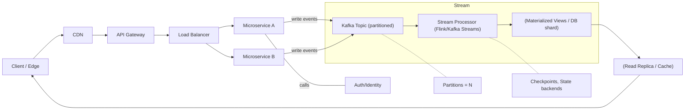

_Series "Modern Large-Scale Systems: Architecture, Patterns, and Advanced Practices" - Part 3 of 4_

## Practical examples and case studies

Below we present real cases and practical examples showing how the patterns and strategies from previous sections are applied in production. Each case emphasizes architectural decisions, operational metrics, and practical lessons applicable to other large-scale systems.

### 1) Event streaming platform (e.g., Kafka + Flink systems)

Typical architecture:
- Producers scale horizontally and write messages to partitioned topics.
- Topics with partitions (e.g., 100–1000) to parallelize consumption.
- Stream processors (Apache Flink or Kafka Streams) maintain local state and checkpoint to durable storage.
- Outputs: materialized views (Cassandra/DynamoDB) and real-time consumers.

Patterns used: key-based partitioning, windowed processing, exactly-once (weak order + idempotency), log compaction for materialized views.

Operational metrics: end-to-end latency target 50–200 ms for low-latency pipelines; throughput of hundreds of MB/s per cluster; retention configured per RPO (24 h for raw, weeks/months with compaction for entities).

Lessons:
- Choosing the correct partition key is critical: avoid hot shards (e.g., hashing user_id vs. customer_id with salt) and maintain stable cardinality.
- Stateful processing requires more disk and memory; plan linear scaling to number of active keys.
- Checkpoints and backpressure must be tested under load (Flink 1.14+ or Kafka Streams have tuning options).

See the idempotent consumer example in Python below to implement practical guarantees when native exactly-once is unavailable.

### 2) Microservices platform oriented to requests (e.g., Netflix, Spotify)

Typical architecture:
- API Gateway + CDN for caching and edge routing.
- Microservices with bulkhead patterns, circuit breaker (Resilience4j/Envoy), limited retries and backoff.
- Partitioned databases; distributed caches (Redis/ElastiCache) and cold storage (S3/Blob).

Patterns used: CQRS to separate read/write loads, cache with asynchronous invalidation (events), canary deployment and feature flags.

Lessons:
- Separating read and write SLA simplifies optimization: replicas and caches for reads, queues and compaction for asynchronous writes.
- Observability (distributed traces, p99/p999 latency metrics, correlated logs) is essential to locate hotspots.

### 3) Business systems with geo-replication (e.g., multi-region retail)

Patterns: regional leaders + asynchronous replication, conflict resolution (CRDTs or reconciliation jobs), local APIs with failover to remote replica.

Lessons:
- Prioritize RTO over consistency in regions: design idempotent and compensating operations.
- Automated failover tests weekly and chaos exercises to validate recovery.

### Code and pseudocode: practical pattern implementation

- Idempotent consumer with DLQ (see first snippet in "Kafka consumer idempotent.py"). Implements:
  - Key partitioning for ordering.
  - Idempotency storage (Redis) with TTL for deduplication.
  - Manual offset commit after persisting results.

- Consistent hashing (second snippet) to assign keys to shards without redistributing the entire set when nodes are added.

### General lessons learned

- Operational complexity scales with guarantees (exactly-once >> at-least-once in cost). Opt for practical idempotency and observability.
- Data design and partitioning is the most influential scalability decision: design for frequent aggregation and query.
- Automation (infrastructure as code, canary deployments, load tests reproducing production patterns) reduces incident risk at scale.

References to code snippets in this section: "Kafka consumer idempotent.py" and "Consistent hashing.py" are included below as executable examples or easily translatable to your stack.

*Diagram: Simplified architecture of a large-scale system*

## Limitations, trade-offs, and common challenges

Large-scale architectures solve volume, velocity, and diversity problems but introduce clear technical and business limits. Here I summarize the most relevant constraints, classic trade-offs (especially consistency vs availability in presence of partitions), and operational challenges that condition the choice of patterns and technologies.

### Technical and business limitations

- Cost vs performance: doubling replicas (e.g., from 3 to 5) reduces data loss risk and improves zonal availability but increases storage and replication egress cost by ~66%. Higher SLOs (99.99% vs 99.9%) usually increase operational cost >2x due to redundancy and mitigation processes.
- Geographic latency: cross-region replicas add ~50–300 ms latency per hop; global synchronous writes are usually unacceptable in interactive apps. Deciding between synchronous (strong) and asynchronous (eventual) replication is a user experience vs immediate durability trade-off.
- Algorithmic complexity: consensus (Raft/Paxos) introduces protocol steps that increase latency and require more engineering for reconfigurations and consistent backups.
- Vendor lock-in and exit costs: managed services can speed delivery but may lock data formats, APIs, and pricing models (egress, snapshots) affecting future migrations.

### Trade-offs: Consistency, Availability, and Partition (CAP)

CAP remains the compass: in presence of network partition (P), a system must choose between Consistency (C) or Availability (A). In practice:

- CP systems (e.g., databases with consensus on each write): prioritize consistency; during partitions may become unavailable.
- AP systems (e.g., asynchronous replication systems like Dynamo): remain available during partitions but accept conflict/post-resolution (eventual/causal consistency).
- In environments without evident partition, many systems offer intermediate configurations (tunable consistency: strong/causal/eventual) at the cost of latency and complexity.

See the table in the diagram for direct comparison.

### Main operational and maintenance challenges

- Observability and debugging: correlating traces and metrics across regions requires distributed sampling and clock synchronization (NTP/clock skew); coherence errors are often discovered late without distributed tracing (OpenTelemetry) and chaos tests.
- Schema migrations and changes: petabyte-scale schema changes require rolling migration, backfill, and dual-write strategies; failures increase inconsistency windows.
- Disaster recovery (DR): realistic RTO/RPO + regular tests. An RTO=1h and RPO=15m target needs near real-time replication and automated runbooks.
- High load operations (hot shards, thundering herd): require dynamic re-sharding and circuit breakers; without them nonlinear latencies appear.
- Technical debt management: accumulation of patches, ad hoc scripts, and lack of IaC increase change cost and human error risk.

### How these limitations affect pattern and technology choice

- If your main SLO is strong consistency (e.g., financial balances), choose CP patterns with consensus (Raft/Paxos) and synchronous replicas, accepting higher latency and cost.
- For geo-distributed read-intensive applications (e.g., CDN content, catalogs), prefer AP with asynchronous replication and invalidation/cache strategies, sacrificing immediate consistency.
- Microservices and queues: to decouple and increase availability, introduce eventual consistency; designing compensations, idempotency, and reconciliation metrics is essential.
- Operationally, if the team is small, managed services (knowing lock-in trade-offs) reduce toil; large teams may opt for own control to optimize costs at scale.

Conclusion: limitations are inevitable; the key is to explicitly document trade-offs (latency vs cost vs consistency), test them with real load, and automate runbooks and rollback to limit risks.

*Diagram: CAP trade-offs: practical comparison*

| Choice | What it sacrifices | Behavior during partition | Typical examples |
|---|---:|---|---|
| CP (Consistency + Partition tolerance) | Temporary availability | Rejects/latency in operations to maintain consistency | Databases with global consensus (etcd, Consul leader mode, Spanner with synchronization) |
| AP (Availability + Partition tolerance) | Immediate consistency | Continues accepting operations; requires later resolution and reconciliation | Dynamo-like systems, geo-replicated caches, many eventual-consistent NoSQL stores |
| CA (Consistency + Availability) | Partition tolerance (not guaranteed in real networks) | Not resistant to network partitions; only viable in reliable networks | Single-datacenter systems or supplements with very reliable private networks |

Notes: in production P (partition) is almost always assumed; thus practical choice is between CP and AP and/or intermediate mechanisms (tunable consistency, local consensus + async fanout).

## Comparison with alternative architectures

Modern large-scale architectures (microservices, event-driven, CQRS, serverless, service meshes) are not a panacea: they are a set of trade-offs designed to solve specific scalability, availability, and team autonomy problems. Below is a practical contrast with traditional and emerging approaches, and criteria to choose.

### Monoliths / centralized architectures vs modern

- Operational complexity: a typical monolith reduces distributed complexity (no networks, no serialization between bounded contexts), facilitating initial deployments and debugging. However, as the team and domain grow, accumulated complexity in code and dependencies turns the monolith into a bottleneck for parallel deployments and focused scaling.

- Scaling and cost: monoliths scale vertically or by replicating the same image: coarse-grained scaling that can be costly. Modern architectures allow scaling hot components independently (e.g., scale queue/event processor without duplicating UI logic), and serverless models turn fixed cost into pay-per-use.

- Consistency and performance: centralization favors strong consistency (simple ACID transactions), low intra-process latency, and lower serialization costs. Distributed systems sacrifice consistency and need patterns (sagas, idempotency) and higher latency due to RPC/serde.

In summary: if the product is small, with a team < 6 and fast delivery requirements without massive spikes, a well-modularized monolith (modular monolith) remains perfectly reasonable.

### Emerging alternatives and when to apply

- Serverless (FaaS) and BaaS: excellent for unpredictable spikes, short-lived workloads, and teams wanting to minimize operations. Penalizes latency due to cold starts and execution limits (e.g., Lambda 15 min). Use when load pattern is very variable and pay-per-invocation cost model is advantageous.

- Mesh + sidecars (Istio, Linkerd): provides observability, traffic control, and resilience without code changes. Suitable when fine traffic control (canary, mirroring) and cross-cutting policies are needed.

- Event-driven / stream-first: appropriate when domain has much asynchrony, integrations, or auditability and replay requirements. Adds complexity in ordering, compaction, and backpressure.

### Hybrid / mixed architectures: when to recommend

I recommend hybrids when no single approach satisfies all requirements: e.g., modular monolith for low-variability CRUD paths + microservices/event processors for fast-changing or spiky components. Or Kubernetes for core services and serverless for occasional ETL tasks or low-cost webhooks.

Practical criteria to choose hybrid:
- Critical latency vs elasticity: keep critical in local processes; externalize elastic.
- Team and ownership: separate by autonomous teams.
- Operational cost: use serverless for sporadic functions; avoid for constant workloads.

### Criteria guiding architectural choice

1. Non-functional requirements: max latency, RTO/RPO, expected concurrent peaks.
2. Team size and organization: number of teams, ownership, deployment cadence.
3. Cost model and usage predictability.
4. Admitted operational complexity (observability, SLOs, runbooks).
5. Domain consistency and transactionality (if ACID needed prefer centralization or very mature compensation patterns).
6. Reuse and external integrations (BaaS simplifies integration).

The right decision is almost always pragmatic: start simple (modular monolith), measure, and evolve to microservices or serverless where distributed complexity ROI is positive.

*Diagram: Comparison: Monolith vs Microservices vs Serverless*

| Criterion | Monolith (modular) | Microservices/Event-driven | Serverless (FaaS/BaaS) |
|---|---:|---:|---:|
| Initial complexity | Low | Medium-high | Low for first prototype |
| Operational complexity | Low-medium | High (observability, networking) | Low-medium (depends on provider) |
| Scaling | Coarse (replicas) | Fine-grained (per service) | Automatic per invocation |
| Cost | Predictable, potentially higher | Variable | Pay-per-use (advantageous for spikes) |
| Latency | Low (intra-process) | Higher due to RPC | Variable (cold starts) |
| Fault isolation | Low | High | High (by design) |
| Consistency | Easy ACID | Requires patterns (sagas) | Distributed, eventual |
| Recommended use cases | MVP, small teams, critical ops with low variability | Systems with independent modules, selective scaling, domain teams | Webhooks, ad hoc ETL, spiky tasks, rapid prototypes |

_Next part (4/4): [Part 4: Advanced](/blog/modern-large-scale-systems-architecture-patterns-and-advanced-practices-part-4/)_
