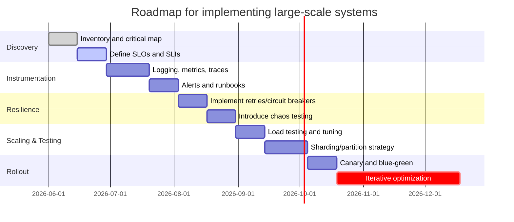

_Series "Modern Large-Scale Systems: Architecture, Patterns, and Advanced Practices" - Part 4 of 4_

## Final recommendations and best practices

Designing and operating large-scale systems is both discipline and craft: it requires metric-based decisions, rapid iteration, and deliberate risk management. Below are concrete and pragmatic practices to ensure scalability and availability, avoid common mistakes, stay up to date, and improve existing systems.

### Key best practices

- Define clear SLOs/SLIs before any optimization. Example: p95 latency < 1s and monthly availability 99.95% (~22 min downtime). Use error budget policies to prioritize new features vs reliability.
- Observability by design: metrics (Prometheus), distributed traces (OpenTelemetry), structured logs, and operational dashboards. Instrument critical paths and business errors.
- Decoupling and fault tolerance: idempotency, backpressure, circuit breakers, and retries with jitter. Design for graceful degradation (feature flags, caches with TTLs).
- Autoscaling + limits: combine horizontal autoscaling (stateless) with rate limiting and quotas to avoid burst spillover.
- Resilience testing: regular load tests and controlled chaos exercises (Chaos Engineering) respecting runbooks and error budgets.
- Progressive deployment: canary + blue/green + feature flags with automated rollback when SLIs degrade.

### Common mistakes to avoid

- Premature optimization of micro-benchmarks without measuring production critical path.
- Lack of runbooks and operational procedures; knowledge in one person's head is a critical risk.
- Rigid dependencies in a single region or provider without regional failure plan.
- Centralized data schemas that prevent partitioning; not designing partition/consistency from the start.
- Not maintaining resource limits or consumer quotas; traffic spikes must be absorbable.

### Staying updated

- Follow technical sources: AWS Well-Architected, Google SRE book, CNCF (Kubernetes, Prometheus, Envoy), and books like "Designing Data-Intensive Applications" (K. Kleppmann).
- Apply 80/20: prototype new tools in micro-projects before production adoption.
- Participate in conferences (KubeCon, SREcon), meetups, and read RFCs and changelogs of critical projects.

### Evaluate and improve existing systems (practical steps)

1. Inventory and dependency map: identify critical paths and single points of failure.
2. Define/validate SLOs and calculate current error budget.
3. Instrument missing parts and establish baselines (latency, throughput, error rate, saturation).
4. Prioritize improvements by SLO impact and cost: caching, sharding, autoscaling tuning, circuit breakers.
5. Implement changes via progressive rollouts and load tests; automate rollback if SLIs worsen.
6. Repeat: maintaining large systems is a cycle of measurement, mitigation, and automation.

The most valuable discipline is measuring and deciding with data. A poorly defined SLO or lack of observability quickly leads to wrong decisions; on the other hand, a small set of well-applied best practices (SLOs, observability, progressive deployments, load tests) offers the highest return in reliability and scaling.

*Diagram: Roadmap for implementing large-scale systems*

## Conclusion

Designing and operating modern large-scale systems involves a delicate balance between scalability, availability, latency, and operational complexity. Architectural patterns such as microservices, event-driven, CQRS, and sharding offer a robust framework but require careful implementation and exhaustive observability to avoid production issues.

The choice of storage model and strategy, along with efficient event stream processing and proper use of big data patterns, are fundamental to guarantee global performance and consistency. Additionally, understanding the trade-offs imposed by the CAP theorem and costs associated with replication and geo-replication helps make decisions aligned with SLOs and team capabilities.

Finally, we recommend defining clear metrics, implementing resilience tests, and designing for controlled degradation, avoiding premature optimizations. Adopting these practices will facilitate building scalable, robust, and maintainable systems that meet current and future digital market demands.

## References

1. [Site Reliability Engineering — The Google SRE Book](https://sre.google/sre-book/) — Practical principles on SLIs/SLOs, error budgets, and automated operation practices.
2. [Designing Data-Intensive Applications — Martin Kleppmann](https://dataintensive.net/) — Coverage of partitioning, replication, consistency models, and distributed systems trade-offs.
3. [AWS Well-Architected Framework](https://docs.aws.amazon.com/wellarchitected/latest/framework/welcome.html) — Guide on architectural principles for scalability, resilience, and cloud operations.
4. [CAP theorem — Wikipedia](https://en.wikipedia.org/wiki/CAP_theorem) — Summary of theoretical limitations between consistency, availability, and partitions in distributed systems.
5. [CQRS — Martin Fowler](https://martinfowler.com/bliki/CQRS.html) — Concepts and trade-offs of CQRS; good starting point to understand command and query separation.
6. [Event Sourcing — Martin Fowler](https://martinfowler.com/eaaDev/EventSourcing.html) — Explains event sourcing, auditability advantages, and complexity costs.
7. [Designing Data-Intensive Applications — Martin Kleppmann (O'Reilly)](https://www.oreilly.com/library/view/designing-data-intensive-applications/9781449373320/) — Deep coverage on partitioning, replication, consensus, and consistency models.
8. [Partitioning and sharding patterns — AWS Architecture](https://aws.amazon.com/architecture/) — Practical guides and use cases on data partitioning, replication, and multi-AZ/multi-region design.
9. [Spanner: Google Cloud Spanner documentation](https://cloud.google.com/spanner/docs) — Documentation on Spanner design, TrueTime, and global transactions.
10. [Apache Cassandra Architecture](https://cassandra.apache.org/doc/latest/architecture/) — Description of gossip, hinted handoff, Merkle tree anti-entropy, and tunable consistency models.
11. [CockroachDB: Geo-Partitioning and Replication](https://www.cockroachlabs.com/docs/stable/) — Guides on locality partitioning, range replication, and design for low regional latency.
12. [Azure Cosmos DB consistency levels](https://learn.microsoft.com/azure/cosmos-db/consistency-levels) — Explains strong, bounded staleness, session, and other consistency models applicable to global systems.
13. [Designing Data-Intensive Applications (CAP, PACELC) — Martin Kleppmann (reference concepts)](https://dataintensive.net/) — Concepts of consistency, availability, and partitioning that help make architectural decisions.
14. [Apache Kafka documentation — Concepts](https://kafka.apache.org/documentation/) — Official documentation on partitions, replication, idempotent producers, and transactions.
15. [Apache Flink — Stateful stream processing](https://nightlies.apache.org/flink/flink-docs-release-1.15/docs/ops/state/state_backends/) — Explains checkpointing, state backends, and fault tolerance in stateful processing.
16. [Google Cloud Pub/Sub and Dataflow (Beam) concepts](https://cloud.google.com/architecture/streaming-data-architecture) — Conceptual guide on streaming processing models, windows, and event time.
17. [Delta Lake](https://delta.io/) — Open-source project for ACID transactions and metadata management over data lakes (compaction, optimize, time travel).
18. [Apache Iceberg](https://iceberg.apache.org/) — Table format for data lakes facilitating snapshots, compaction, and efficient queries on large volumes.
19. [Should you use Lambda architecture? (Confluent)](https://www.confluent.io/blog/lambda-architecture-why-should-you-use/) — Practical analysis of pros/cons of lambda vs modern streaming architectures.
20. [BigQuery: best practices for performance](https://cloud.google.com/bigquery/docs/best-practices-performance) — Guide with recommendations on partitioning, clustering, and columnar formats to optimize queries.
21. [Apache Kafka — Documentation](https://kafka.apache.org/documentation/) — Official documentation on partitions, retention, compaction, and consumption models.
22. [Apache Flink — Stateful Stream Processing](https://nightlies.apache.org/flink/flink-docs-release-1.14/docs/learn-flink/state/) — Concepts on state, checkpoints, and backpressure applicable to stateful processing.
23. [AWS DynamoDB — Best practices](https://docs.aws.amazon.com/amazondynamodb/latest/developerguide/best-practices.html) — Data modeling patterns, partitioning, and operational limits relevant for materialized views.
24. [Netflix Tech Blog](https://netflixtechblog.com/) — Distributed architecture studies and operational lessons in high-scale systems.
25. [Brewer's CAP theorem and Gilbert-Lynch formalization](https://dl.acm.org/doi/10.1145/564585.564601) — Key paper formalizing consistency, availability, and partition constraints.
26. [Raft: In Search of an Understandable Consensus Algorithm (Diego Ongaro & John Ousterhout)](https://raft.github.io/raft.pdf) — Explains operational implications and latencies of leader-based consensus.
27. [Monolith First (practices and trade-offs) — Martin Fowler](https://martinfowler.com/articles/monolith-first.html) — Pragmatic guide on when to start with a monolith and when to extract services.
28. [What is Serverless? — AWS](https://aws.amazon.com/serverless/) — Description of serverless models, limits, and common usage patterns.
29. [Kubernetes: Concepts and Patterns](https://kubernetes.io/docs/concepts/overview/what-is-kubernetes/) — Context on orchestration and patterns to deploy microservices on Kubernetes.
30. [The Twelve-Factor App](https://12factor.net/) — Principles for designing SaaS and microservices apps, useful for modularization decisions.
31. [AWS Well-Architected Framework](https://aws.amazon.com/architecture/well-architected/) — Practical guide on architecture pillars (reliability, performance, operations). Useful for trade-off decisions.
32. [Site Reliability Engineering: How Google Runs Production Systems](https://sre.google/books/) — Operational fundamentals, SLOs, error budgets, and essential runbook practices.
33. [Designing Data-Intensive Applications — Martin Kleppmann](https://dataintensive.net/) — Deep coverage of consistency, partitioning, replication, and large-scale data patterns.
34. [CNCF Observability Landscape / OpenTelemetry](https://opentelemetry.io/) — Recommended ecosystem and tools for tracing, metrics, and logs.

---

_End of series._
