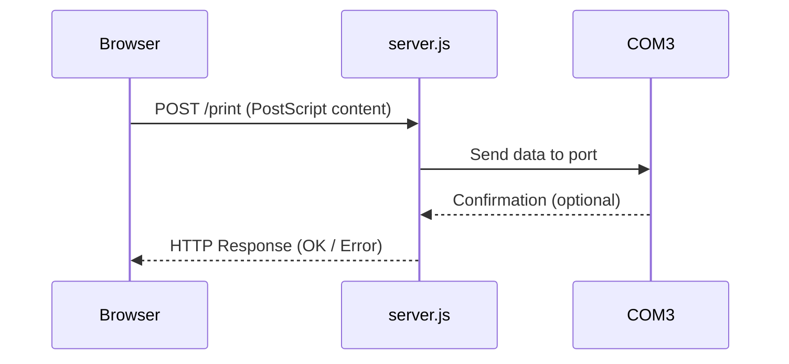
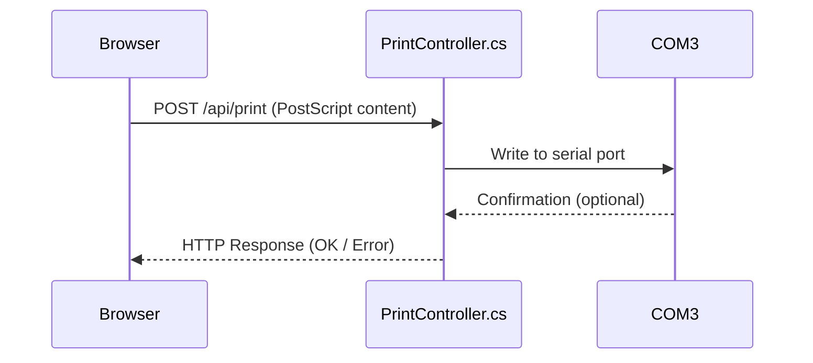

This project exposes a local API to send PostScript-formatted data to a printer connected via a COM port (e.g., COM3), from a web application (such as Angular).

It includes two implementations:
- **Node.js** (`print-service-node`)
- **.NET 6 (WebAPI)** (`print-service-dotnet`)

It also includes:
- **Python printer emulator** (`emulator/postscript_com3_emulator.py`) for testing without physical hardware
- Scripts to install the service as a Windows service using NSSM
- Inno Setup script to generate an `.exe` installer

---

## Project Structure

```
print-service-node/                 --> Local Node.js service
print-service-dotnet/               --> Local .NET 6 WebAPI service
emulator/postscript_com3_emulator.py  --> Printer emulator on COM3
```

---

## Requirements

### Node.js
- Node.js
- `pkg` (`npm install -g pkg`)
- NSSM installed at: `C:\Program Files\nssm\nssm.exe`

### .NET
- .NET 6 SDK
- NSSM
- (Optional) Inno Setup to create `.exe` installer

### For testing without a physical printer
- [com0com (virtual COM port pair)](https://sourceforge.net/projects/com0com/)
  - Install
  - Create pair: `COM3 <-> COM4`
  - Use COM3 in the service and COM4 in the emulator, or vice versa

---

## Installation

### Node.js

```bash
cd print-service-node
npm install
pkg .
```

To install as a service:

```bash
install_service.bat
```

### .NET

```bash
cd print-service-dotnet
dotnet build
```

Then:

```bash
install_service.bat
```

---

## Printer Emulator (Python)

File: `emulator/postscript_com3_emulator.py`

This script simulates a PostScript printer connected to `COM3`. Each time it receives a data block (detecting `\n` or `\x0C` as end), it saves the content to a `.txt` file inside a `prints` folder.

### How it works
- Opens port `COM3`
- Continuously listens for incoming data
- When it detects end of job, saves the received content as:
  ```
  impresiones/impresion_YYYYMMDD_HHMMSS.txt
  ```

### Usage

```bash
pip install pyserial
python emulator/postscript_com3_emulator.py
```

---

## Sequence Diagrams

### Node.js (`print-service-node/server.js`)



### .NET (`print-service-dotnet/Controllers/PrintController.cs`)



---

## Create `.exe` Installer with Inno Setup (.NET)

1. Install [Inno Setup](https://jrsoftware.org/isinfo.php)
2. Open `PrintServiceInstaller.iss` in Inno
3. Compile

---

## Uninstall

Both versions have their own `uninstall_service.bat` to stop and remove the service.

---

## License

MIT
