En la era actual, donde la inteligencia artificial y el procesamiento de lenguaje natural están transformando la manera en que interactuamos con la información, las bases de datos vectoriales emergen como una tecnología clave para manejar grandes volúmenes de datos semánticos. Estas bases permiten realizar búsquedas eficientes y precisas en espacios de alta dimensión, superando las limitaciones de las bases de datos tradicionales para aplicaciones de búsqueda semántica y recomendación.

Este artículo se adentra en los fundamentos técnicos que sustentan las bases de datos vectoriales, desde la representación de datos como vectores numéricos hasta las técnicas avanzadas de indexación y búsqueda aproximada. También se examina su arquitectura interna, diferenciándola claramente de las bases de datos relacionales y NoSQL, y se discuten casos de uso ideales, incluyendo la integración con modelos de tokenización y sistemas de recuperación avanzada.

Dirigido a ingenieros senior y arquitectos de la nube con experiencia en bases de datos y sistemas distribuidos, este análisis ofrece un enfoque avanzado que combina teoría y práctica para comprender cómo diseñar, implementar y optimizar soluciones basadas en bases de datos vectoriales en entornos de alta complejidad.

## Tabla de contenidos

- Introducción y Contexto Histórico
- Fundamentos Técnicos de las Bases de Datos Vectoriales
- Arquitectura y Modelos de Datos
- Comparación con Bases de Datos Relacionales y NoSQL
- Técnicas de Indexación y Búsqueda Vectorial
- Casos de Uso Ideales y Aplicaciones Reales
- Tokenización y su Relación con Bases de Datos Vectoriales
- Limitaciones, Desafíos y Consideraciones
- Recomendaciones y Futuro de las Bases de Datos Vectoriales

## Introducción y Contexto Histórico

El término "base de datos vectoriales" surge de la confluencia entre dos líneas históricas: modelos vectoriales de representación de información (information retrieval) y algoritmos eficientes de búsqueda de vecinos en espacios de alta dimensión. Aunque la expresión como producto o categoría tecnológica es reciente, sus raíces técnicas son antiguas.

### Origen histórico

El concepto arranca con el modelo de espacio vectorial para recuperación de información (Salton et al., décadas de 1960–1970), donde documentos y consultas se representan como vectores en un espacio de términos y la similitud (cosine, inner product) determina relevancia. Paralelamente, en ciencias de la computación surgieron estructuras y algoritmos para búsqueda de vecinos: árboles KD (Bentley, 1975) y más tarde técnicas para mitigar la maldición de la dimensionalidad como Locality-Sensitive Hashing (Indyk & Motwani, 1998) y Product Quantization (Jegou et al., 2011). La combinación de representaciones densas aprendidas (embeddings) y algoritmos ANN (approximate nearest neighbor) es lo que configura lo que hoy llamamos sistemas de bases de datos vectoriales.

### Necesidades tecnológicas que impulsaron su desarrollo

Tres necesidades prácticas explican la adopción reciente:

- Búsqueda semántica en lugar de coincidencia léxica: los usuarios esperan recuperar conceptos, no solo términos exactos.
- Escalado a billones de vectores: sistemas de recomendación, imágenes y logs generan grandes volúmenes que requieren índices comprimidos, cuantización y particionado distribuido.
- Latencia y costo: las aplicaciones en tiempo real (chatbots, RAG, recomendaciones) exigen respuestas en decenas a cientos de milisegundos, lo que obliga a algoritmos ANN, cachés y arquitecturas en memoria.

### Relación con avances en ML y NLP

El salto cualitativo llegó con las representaciones densas aprendidas: word2vec (Mikolov, 2013), embeddings para oraciones y más tarde transformadores como BERT (Devlin et al., 2018) y modelos contrastivos multimodales (CLIP, etc.). Esos modelos transforman texto, imágenes y audio en vectores numéricos semánticamente ricos. Las bases de datos vectoriales se especializan en almacenar, indexar y buscar eficientemente esos vectores: el ML produce la representación; la base de datos vectorial responde consultas de similitud.

Relacionamiento técnico clave:

- ML/NLP = función f: item -> R^d (embedder).
- Vector DB = estructuras + algoritmos para nearest neighbor (exacto o aproximado), compresión, particionado y actualización online.

### Diferencias fundamentales con bases de datos tradicionales

- Semántica de consulta: SQL/NoSQL buscan correspondencia exacta o filtros por atributos; vector DBs evalúan distancia/similitud en R^d.
- Índices: B-trees/LSM no sirven para alta dimensión; se usan ANN, HNSW, IVFPQ, LSH, etc.
- Consistencia y transacciones: operaciones son frecuentemente asíncronas/near-real-time; ACID fuerte es menos común o más costoso.
- Compresión y aproximación: técnicas como product quantization o OPQ introducen error controlado para ganar rendimiento; las bases tradicionales no toleran esa aproximación.
- Multi-modalidad: estructuras optimizadas para vectores de distinto origen (texto, imagen) y para combinar señales numéricas y semánticas.

En resumen, las bases de datos vectoriales no son una moda: son la pieza de infraestructura que conecta representaciones densas producidas por ML con requisitos de latencia, escala y economía en aplicaciones modernas de búsqueda semántica y recuperación. Su historia combina IR clásico, álgebra lineal aplicada y avances recientes en representación aprendida.

*Diagrama: Evolución histórica de las ideas que llevaron a las bases de datos vectoriales*

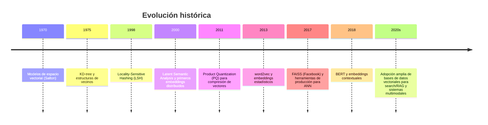

*Diagrama: Relación entre machine learning y bases de datos vectoriales*

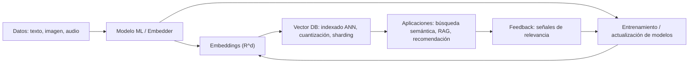

## Fundamentos Técnicos de las Bases de Datos Vectoriales

### ¿Qué es un vector en este contexto?

En el contexto de bases de datos vectoriales un `vector` es una representación numérica (array de floats) que describe las características semánticas de un objeto: una frase, un párrafo, una imagen, un fragmento de audio, etc. Técnicamente es un punto en un espacio euclidiano de dimensión `d` (por ejemplo d = 384, 512, 1536). En la práctica se almacenan como arrays de tipo `float32` o en versiones cuantizadas (int8, uint8) para reducir memoria.

Consideraciones numéricas concretas:
- Dimensiones típicas: 128, 256, 384, 512, 768, 1024, 1536.
- Tamaño de almacenamiento: con `float32` cada dimensión ocupa 4 bytes → un vector de 1536 dims ≈ 6 KiB. 1M vectores de 1536 dims ≈ 6 GiB solo de payload.
- Normalización: para algunas métricas (p. ej. coseno) se normalizan los vectores a norma 1 para convertir la similitud en un producto interno.

### Cómo se codifican datos no estructurados

La codificación (embedding) transforma datos no estructurados a vectores mediante modelos entrenados:

- Texto: modelos de lenguaje / sentence encoders (p. ej. SentenceTransformers: `all-MiniLM-L6-v2`, d=384; o modelos OpenAI embeddings como `text-embedding-3-small`/`text-embedding-3-large`). Estos modelos usualmente combinan subword tokenization y capas transformadoras para producir un vector por input.
- Imágenes: redes convolucionales o modelos ViT/CLIP extraen un vector de características; CLIP (OpenAI) produce embeddings compatibles multimodales para imagen/texto.
- Audio: redes convolucionales 1D o transformadores para espectrogramas; se reduce a vectores resumen (pooling).
- Estructurado → vector: características numéricas/one-hot→embedding layer o concatenación seguida de capas densas.

Tradeoffs prácticos:
- Dimensión vs. información: más dimensiones capturan más matices pero incrementan costo de almacenamiento y búsqueda.
- Latencia de codificación: modelos grandes tienen mayor latencia; a menudo se precalculan embeddings offline para datos estáticos.

### Métricas de distancia o similitud

Las comparaciones entre vectores usan métricas que definen "cercanía" semántica. Tabla comparativa:

| Métrica | Fórmula (entre a y b) | Propiedades | Uso típico / Comentarios |
|---|---:|---|---|
| Euclidiana (L2) | ||a - b||_2 | Distancia geométrica; sensible a magnitud | Búsqueda por proximidad en espacio absoluto; usada con IndexFlatL2 (FAISS) |
| Coseno | 1 - (a·b) / (||a|| ||b||) | Invariante a escala; mide orientación | Muy común en embeddings de texto; normalizar vectores transforma coseno en producto interno |
| Producto interno (dot) | - a·b | Mide similitud si vectores normalizados | Rápido en hardware (BLAS); usado en modelos con embeddings no normalizados |
| Manhattan (L1) | Σ |a_i - b_i| | Más robusto a outliers en algunas dimensiones | Raro en práctica de embeddings semánticos |
| Hamming | count(a_i != b_i) | Discreto, para vectores binarios | Útil cuando se usan binarizaciones o hashing |

Elección práctica: para texto, coseno o dot (con normalización) domina; para señales donde la magnitud importa, L2 puede ser preferible.

### Retos computacionales en alta dimensión

1. Complejidad y costo por consulta
   - Comparación exacta (brute-force) cuesta O(n · d) operaciones por consulta (n = número de vectores, d = dimensión). Ejemplo: 1M vectores × d=1536 → 1.536e9 multiplicaciones por consulta — impráctico en CPU sin optimizaciones.

2. Memoria y almacenamiento
   - El tamaño por vector escala linealmente; 1M vectores de 768 dims con float32 ≈ 3 GiB. Con replicas, índices y metadatos, el costo crece.

3. Curse of dimensionality
   - A medida que d crece, las distancias tienden a concentrarse (contrastividad baja), lo que reduce la discriminación. Técnicas: reducción de dimensionalidad (PCA), selección de dimensiones, o embeddings más compactos.

4. Índices y aproximación (approximate nearest neighbors, ANN)
   - Para escalar se usan estructuras ANN: inverted file + quantization (IVF + PQ), HNSW (graph-based), product quantization (PQ), OPQ, o LSH. Cada técnica tiene tradeoffs entre recall, latencia y memoria.
   - Ejemplo: FAISS (Facebook AI Similarity Search) implementa IVF, PQ, HNSW, y técnicas GPU para acelerar búsquedas.

5. Precisión vs. rendimiento
   - Más compresión (int8, PQ) reduce memoria pero degrada recall. HNSW ofrece alto recall con baja latencia pero consume más memoria que PQ.

6. Paralelismo y hardware
   - GPUs y AVX vectorizado: multiplicaciones vectoriales pueden aprovechar BLAS, kernels CUDA y optimizaciones de memoria. El cuello de botella suele ser bandwidth de memoria y latencia de acceso.

7. Consistencia y actualización
   - En escenarios con escrituras frecuentes, mantener índices ANN actualizados (p. ej. HNSW dinámico) introduce costos y estrategias de background rebuild o escritura en buffer + merge.

### Conclusión técnica

Las bases de datos vectoriales operan en la intersección de ML y sistemas: representaciones densas extraídas por modelos, y motores de búsqueda optimizados (ANN) que equilibran memoria, latencia y recall. Entender dimensiones, métricas y técnicas de indexado es clave para diseñar soluciones que escalen sin perder precisión semántica.

*Diagrama: Arquitectura: representación de datos no estructurados como vectores*

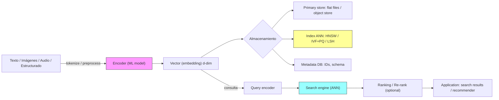

*Diagrama: Comparación rápida de métricas de distancia*

| Métrica | Fórmula | Ventaja | Desventaja |

## Arquitectura y Modelos de Datos

Una base de datos vectorial combina almacenamiento denso de vectores, estructuras de índice diseñadas para búsquedas aproximadas (ANN) y un modelo de datos que enlaza esos vectores con metadatos y requisitos de consistencia. En esta sección describo la arquitectura típica, los formatos de almacenamiento comunes, las estrategias de indexación y los patrones de modelado de datos para integrar vectores con metadatos en sistemas de producción.

### Estructura general de la arquitectura

A alto nivel una base de datos vectorial productiva suele tener estas capas:

- API / Gateway: recibe peticiones de búsqueda, ingesta y administración.
- Normalización / Embeddings: paso opcional donde se generan o normalizan embeddings (puede estar fuera del DB como servicio ML).
- Planificador de consulta: aplica filtros, decide shards a consultar, parámetros de ANN (ef, top-k).
- Motor ANN (index + search): estructura en memoria/SSD que realiza búsqueda aproximada por similaridad.
- Almacenamiento primario de vectores y metadatos: puede estar en memoria, en disco con mmap, o en almacenamiento en bloque optimizado para lecturas (NVMe).
- Subsistemas: persistencia (WAL/SST), replicación, reindexado batch, métricas y monitorización.

El diseño puede separarse en dos: el plano de datos (nodos que almacenan vectores e índices) y el plano de control (coordinación, planificación, metadata, catálogos). La mayoría de implementaciones escalables soportan sharding horizontal y replicación asíncrona para balancear latencia y disponibilidad.

### Formatos de almacenamiento y representación de vectores

Principales opciones de representación:

- float32 (FP32): precisión máxima; costo de memoria/disk alto. Buena para indexación exacta o cuando se reproduce modelo exactamente.
- float16 (FP16): reduce memoria ~2× con menor degradación en muchas tareas de similitud coseno/L2.
- int8 / Quantized (PQ, OPQ, Scalar Quantization): códigos compactos (1–4 bytes por vector) para reducir I/O y cache-misses. Requiere decodificación o distancia asimétrica.

Formatos en disco/memoria:

- Memoria residente (RAM): vectores sin compresión en memoria para menor latencia; escala limitada por RAM.
- Memory-mapped files (mmap): carga lazy desde SSD, buen balance costo/latencia si los accesos son secuenciales o cacheados.
- On-disk PQ codes: solo códigos PQ en disco; tabla de centroides en memoria pequeña.

Tradeoffs: FP32 ofrece mayor recall pero mayor costo de memoria y I/O. PQ/OPQ reduce I/O y aumenta throughput a costa de pérdida de recall.

### Estructuras de índice y su organización

Índices principales usados en producción:

- HNSW (Hierarchical Navigable Small World): grafo de proximidad que entrega alta recall y baja latencia para consultas dinámicas. Excelente para cargas con inserciones en línea. Parámetros críticos: M (grado medio) y ef/efConstruction. Aumentar M mejora recall y costo de memoria.
- IVF (Inverted File) + PQ: particiona el espacio en centroids (coarse clusters, p ej. k-means) y busca solo dentro de unos cuantos centroids; PQ comprime vectores locales. Muy eficiente a escala masiva, pero la actualización es más costosa que HNSW.
- KD-Trees / Random projection trees (Annoy, FLANN): útiles para índices estáticos y cargas de solo lectura.
- ScaNN / RP Forest / Product quantization avanzado: combinan particionamiento y cuantización con técnicas de re-ranking.

Organización por niveles:

- Routing / Partitioning: particionamiento por rango o hash para shardear. También se usan particiones semánticas (por tenant o por dominio) para reducir falsos positivos.
- Candidate selection: primer paso rápido (centroids, filtros booleanos) que reduce la población a N' candidatos.
- Re-ranking exacto o asimétrico: calcular distancias precisas sobre los candidatos (posible en FP32) para devolver el top-k exacto o de mayor recall.

Parámetros prácticos (valores de partida):

- HNSW: M = 16–48, efConstruction = 100–200, ef (consulta) = 50–200.
- IVF+PQ: nlist (num clusters) ≈ sqrt(N) como heurística inicial; nprobe (clusters a buscar) tradeoff entre latencia y recall.

costo de memoria: además del tamaño del vector, índices como HNSW necesitan memoria extra para punteros/vecinos (overhead que escala con M*N). IVF+PQ necesita almacenar centroids y códigos compactos.

### Modelos de datos: integrar vectores y metadatos

Patrón dominantes:

1. Vector column + metadatos estructurados
   - Ejemplo: tabla con columnas (id, embedding, metadata JSONB, created_at).
   - Ventaja: consultas híbridas (filtros SQL sobre metadata + búsqueda de similaridad), transacciones y compatibilidad con motores OLTP.
2. Separación vector-storage / metadata-store
   - Metadata en almacén de documentos (e.g., JSON store), vectores en almacén optimizado ANN. Útil cuando el índice ANN necesita un layout de disco muy distinto.
3. Inverted index híbrido
   - Para búsquedas semánticas con filtros de texto/categorical, combinar un índice invertido (palabras o tokens) que reduce candidatos antes del ANN.

Patrones de consulta híbrida:

- Prefiltro por metadatos (p. ej. tenant_id, fecha) para limitar shards y reducir costo ANN.
- Post-filtering / re-ranking: aplicar reglas de negocio tras la búsqueda vectorial (fechas, scores compuestos).

IDs y versionado

- Mantener un mapeo estable id -> posición/index entry. Si el índice es recreado (reindex), conservar mapping y versionar vectores para soportar rollbacks.
- Operaciones: insert/delete/update deben diseñarse con colas de trabajo (WAL + background reindex) cuando se usan índices inmensamente densos como IVF.

### Tradeoffs operacionales

- Latencia vs recall: aumentar nprobe/ef mejora recall y latencia; PQ reduce I/O pero complica re-ranking exacto.
- Ingesta en tiempo real vs throughput batch: HNSW es más amigable para escrituras pequeñas; IVF suele requerir batch reindex para mantener calidad.
- Consistencia vs disponibilidad: replicación sincrónica aumenta latencia de escritura; replicación asíncrona es común en sistemas distribuidos.

### Recomendaciones prácticas

- Diseña el esquema para permitir prefiltros por metadatos; las consultas híbridas reducen dramáticamente costo de ANN.
- Comienza con HNSW para casos con actualizaciones frecuentes y con IVF+PQ cuando el dataset crece a decenas/centenas de millones de vectores y I/O es limitante.
- Mide recall con conjuntos de queries reales y ajusta ef/nprobe; no asumas que un único conjunto de parámetros sirve para todos los dominios.

*Diagrama: Arquitectura típica de una base de datos vectorial*

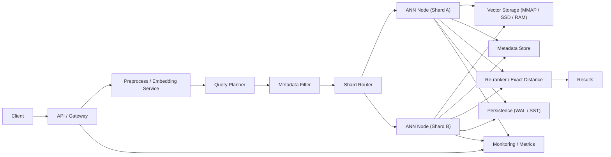

*Diagrama: Flujo de consulta y recuperación*

## Comparación con Bases de Datos Relacionales y NoSQL

### Modelo de datos

- Relacionales: tablas normalizadas, filas/columnas, esquemas estrictos. Diseñadas para representar entidades y relaciones (1:N, N:M) con integridad referencial (FK), tipos y constraints.
- NoSQL: familia amplia — clave-valor, documentos (JSON), wide-column, grafos. Suelen ser schemaless o con esquemas flexibles y optimizadas para escalado horizontal y throughput.
- Vectoriales: almacenan vectores (float32/float16) de alta dimensión (p. ej. 768–4096 dims) asociados a un identificador y metadatos. El foco no es la integridad relacional sino operaciones de similarity search (k-NN), almacenaje compacto y acceso eficiente a distancias (coseno, L2, inner product).

Consecuencia práctica: mientras una RDBMS modela relaciones y transacciones, una base vectorial modela "cercanía semántica" entre embeddings; los metadatos quedan para filtros secundarios.

### ¿Qué limitaciones de las bases tradicionales motivan las vectoriales?

1. Búsqueda semántica: SQL/LIKE y motores FTS (Postgres GIN/tsvector) funcionan con tokens y lexemas; no capturan similitud semántica entre conceptos.
2. Escala en alta dimensionalidad: estructuras OLTP/NoSQL no están optimizadas para índices de vectores y sufren latencias y espacio ineficiente.
3. Latencia en nearest-neighbor a gran escala: consultas k-NN exactas en millones de vectores son lentas; las bases vectoriales usan índices ANN (HNSW, IVF+PQ) para latencias de ms con recall configurable.
4. Integración ML: workflows ML requieren versiones de embeddings, retrain e índices que soporten inserciones/actualizaciones rápidas y búsquedas por semántica.

### Modelo de consulta y consistencia

- Relacionales: SQL declarativo, joins complejos, transacciones ACID (strong consistency). Latencias predecibles para operaciones transaccionales; escalado vertical habitual, réplica para lectura/escritura mediante soluciones distribuidas (Postgres, CockroachDB).
- NoSQL: APIs CRUD (get/put/query), consultas frecuentemente limitadas (document query, map-reduce). Consistencia configurable (strong/eventual) según engine; diseñado para throughput y particionado.
- Vectoriales: consultas típicas: Top-K nearest neighbors + optional filters (metadata predicates). Internamente usan índices ANN con parámetros (ej. HNSW: M, efConstruction, efSearch; IVF+PQ: nlist, nprobe, code_size). Consistencia: muchas implementaciones ofrecen consistencia eventual en índices aproximados — las inserciones pueden tardar en aparecer en el índice o afectar recall; las operaciones transaccionales completas (multi-row ACID) no son el objetivo.

Trade-off clave: exactitud vs latencia/escala. Vector DBs hacen explícito el trade-off (recall vs throughput) mientras RDBMS priorizan integridad y precisión.

### Escenarios que favorecen cada tipo

- Relacionales (RDBMS): sistemas transaccionales, contabilidad, inventarios, lógica de negocios con integridad referencial y joins complejos.
- NoSQL: catálogos altamente escalables, telemetría, sesiones, caches distribuidas, cargas con esquema variable o particionado en tiempo.
- Vectoriales: búsqueda semántica (NLP embeddings), recomendaciones basadas en similitud, deduplicación multimodal (imagen/texto), retrieval-augmented generation (RAG), nearest-neighbor en sistemas de personalización en tiempo real.

Patrón de arquitectura recomendado: usar un híbrido — RDBMS/NoSQL para datos transaccionales y metadatos; base vectorial para índices de embeddings y consultas de similitud. Mantener IDs canónicos en la fuente de verdad y sincronizar metadatos.

### Tabla comparativa y diagrama

En la tabla siguiente se resumen las diferencias técnicas y a continuación un diagrama de flujo muestra casos de uso ideales por tipo de base de datos.

*Diagrama: Comparación técnica: RDBMS vs NoSQL vs Vector DB*

| Característica | RDBMS | NoSQL | Vector DB |
|---|---:|---:|---:|
| Modelo de datos | Tablas normalizadas, esquema fijo | Documentos/clave-valor/columna, schemaless | Vectores + metadatos (schemaless) |
| Consultas | SQL, joins complejos | CRUD, consultas por documento/clave | k-NN + filtros por metadato |
| Consistencia | ACID (fuerte) | Configurable (fuerte/eventual) | Suele ser eventual en índices ANN |
| Índices | B-tree, GiST, GIN | Indexes específicos del motor | HNSW, IVF+PQ, PQ, OPQ (ANN) |
| Escalado | Vertical/particionado complejo | Horizontal nativo | Horizontal con shards/replicas; sincronización de índices necesaria |
| Casos ideales | OLTP, analytics transaccional | Alta ingestión, esquema flexible | Búsqueda semántica, recomendación, RAG |
| Actualizaciones masivas | Eficientes (ACID) | Eficientes | Pueden requerir reindexado o tuning |

*Diagrama: Casos de uso ideales por tipo de base de datos*

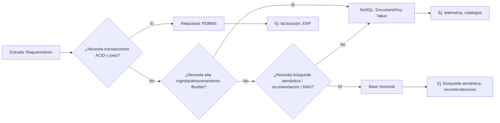

## Técnicas de Indexación y Búsqueda Vectorial

### Técnicas comunes para acelerar búsquedas en espacios vectoriales

La búsqueda por similitud en espacios vectoriales se apoya en tres familias principales de técnicas:

- Estructuras de búsqueda basadas en grafos: HNSW (Hierarchical Navigable Small World), NMSLIB. Construyen un grafo de vecinos y realizan búsquedas por recorrido heurístico.
- Particionamiento / cuantización: IVF (Inverted File / clustering con k-means), K‑means y variantes (PQ/OPQ para compresión posterior).
- Árboles y proyecciones: KD‑trees, RP‑trees, Annoy (forest of random projection trees). Útiles en dimensiones moderadas pero degradan en alta dimensión.

Cada técnica busca reducir el número de distancia(s) exactas que se calculan frente al enfoque "brute force" (O(n·d) por query), donde n = número de vectores y d = dimensión.

### ¿Cómo funcionan los algoritmos ANN (Approximate Nearest Neighbors)?

ANN no garantiza el vecino más cercano exacto; ofrece un tradeoff entre recall y tiempo/recursos. Principios operativos:

- HNSW: construye múltiples niveles de grafos small‑world. En el nivel superior hay pocos nodos para un barrido rápido; los niveles inferiores contienen más conexiones locales. La búsqueda comienza en un vértice de alto nivel y desciende usando búsqueda golosa + heap (parámetros clave: M — conexiones por nodo; efConstruction/ef — controlan calidad de construcción y búsqueda). Complejidad empírica: sublineal; latencias muy bajas para millones de puntos cuando está en memoria.

- IVF (Inverted File) + PQ (Product Quantization): primero se clusteriza el espacio en nlist centroides (IVF). Una query se asigna a unos pocos centroides (nprobe) y sólo se examinan los vectores en esas cestas. Si se aplica PQ, los vectores se almacenan comprimidos (subvector quantization) reduciendo memoria y ancho de banda de memoria, a costa de pérdida en precisión. OPQ (Optimized PQ) rota vectores antes de cuantizar para mejor rendimiento.

- Árboles / proyecciones (Annoy, RP‑trees): dividen el espacio por hiperplanos aleatorios o coordenadas. Son simples y eficientes en memoria; funcionan bien con recall medio en dimensiones menores (~< 100).

- ScaNN (Google): combina re‑ranking, re‑ordering de distancias y técnicas de compresión y hashing para equilibrar rendimiento/precisión en hardware moderno.

### Exacto vs Aproximado: ventajas y desventajas

- Métodos exactos (brute force con índices acelerados por SIMD/GPU):
  - Ventajas: recall = 100% (determinista), simple de razonar.
  - Desventajas: escala pobre con n elevado; elevado consumo de CPU/memoria; latencias crecientes salvo que uses GPU o shard masivamente.

- Métodos aproximados (HNSW, IVF+PQ, Annoy, ScaNN):
  - Ventajas: latencias mucho menores, menor uso de memoria con PQ, escalado práctico a decenas/hundreds de millones; permiten cumplir SLAs en tiempo real.
  - Desventajas: recall < 100% (configurable), resultados no deterministas (dependen de hiperparámetros y estado del índice), mantenimiento/actualización en línea puede ser más costoso o complejo (reconstrucción parcial o inserciones lentas dependiendo del método).

Decisión práctica: para sistemas de producción con requisitos de latencia (<10–50 ms) y conjuntos de datos grandes (>10M), los índices ANN son la norma; reserva búsqueda exacta para offline o reevaluación de top‑k (re‑ranking) con distancia exacta.

### Impacto en escalabilidad y latencia

- Latencia: HNSW entrega latencias extremadamente bajas cuando el grafo cabe en memoria RAM y ef es moderado; sin embargo el costo de construcción (efConstruction, M) puede ser alto. IVF+PQ reduce latencia y uso de memoria pero la calidad depende fuertemente de nlist/nprobe y del grado de cuantización (m, bits).

- Escalabilidad horizontal: IVF facilita sharding por listas (o por round‑robin de centroids); HNSW puede shardear por rango o por hashing de vectores, pero la sincronización de grafos distribuidos es más compleja.

- Consumo de memoria vs precisión: PQ permite ahorrar 4–16× en memoria (ejemplo: 64‑dim con PQ m=8, 8 bits/subvector → 8 bytes por vector) a costa de pérdida de recall. HNSW requiere almacenar vecinos y pointers (M * n * pointer_size), que puede ser alto si M es grande.

- Actualizaciones en línea: HNSW soporta inserciones rápidas pero no siempre eficientes a escala masiva (recomendable reconstrucción por lotes para insert/delete intensivos). IVF+PQ suele requerir rebalanceo si el datalake cambia mucho.

### Parámetros clave y una regla práctica

- HNSW: M (8–64), efConstruction (200–2000), ef (tamaño del heap de búsqueda, aumenta recall y latencia). Ejemplo: M=16, efConstruction=500, ef=200 suele balancear bien.
- IVF+PQ (Faiss): nlist (sqrt(n) como inicio), nprobe (1–20; mayor nprobe aumenta recall y latencia), PQ m (num subvectores) y bits (común m=8, bits=8).

Regla rápida: si necesitas recall > 95% y latencias < 50 ms para 50M vectores, HNSW en RAM o IVF( nlist≈√n )+PQ con nprobe tunado son opciones razonables.

### Tabla comparativa rápida

| Algoritmo | Memoria | Latencia típica | Escalado | Mejor para |
|---|---:|---:|---|---|
| HNSW | Alta (pointers) | Muy baja (µs–ms) | RAM‑bound, shardable con cuidado | Búsquedas en tiempo real, recall alto |
| IVF (+PQ) | Media–baja (si PQ) | Baja–media (ajustable con nprobe) | Fácil de shardear por centroids | Grandes datasets, compresión y batching |
| PQ (solo) | Muy baja | Muy baja | Muy escalable | Archivado y cargas de trabajo con tolerancia a error |

### Recomendación de arquitectura práctica

- Para servicio de baja latencia en línea: usa HNSW si el índice cabe en RAM y tienes requisitos altos de recall.
- Para datasets muy grandes con restricciones de memoria: IVF+PQ (Faiss) y OPQ para mejorar precisión.
- Siempre añade una etapa de re‑ranking exacto para los top‑k retornados por ANN si necesitas precisión máxima en la respuesta final.

Ver diagrama: "Indexación y búsqueda ANN" para el flujo típico de construcción y consulta.

*Diagrama: Indexación y búsqueda ANN*

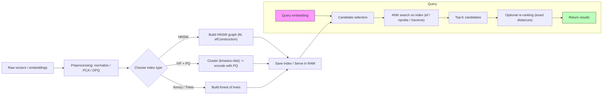

## Casos de Uso Ideales y Aplicaciones Reales

Las bases de datos vectoriales destacan cuando la señal principal no es unívocamente indexable por claves exactas sino por similitud en espacios embebidos: texto semántico, imágenes, audio y comportamientos de usuario. A continuación se describen los casos más comunes, cómo se aplican en sistemas productivos y cómo encajan en pipelines de ML/NLP.

### Casos de uso más comunes

- Búsqueda semántica (semantic search): recuperar documentos relevantes por significado en lugar de coincidencia de tokens. Ideal para FAQ, documentación técnica y búsqueda en logs.
- Recomendación por afinidad: matching de usuarios/ítems usando vectores de preferencias o contenido (item2vec, user embeddings). Útil en ecommerce, medios y contenido personalizado.
- Recuperación multimodal: búsqueda y matching entre imágenes, texto y audio (p. ej. búsqueda visual y búsqueda por ejemplo de imagen).
- Detección de duplicados y clustering a gran escala: deduplicación de imágenes, detección de contenido similar.
- Reranking y augmentation para LLMs: recuperar contexto relevante (RAG) para mejorar respuestas de modelos de lenguaje.

### Cómo se aplican en recomendación y búsqueda semántica

Recomendación: los sistemas modernos mezclan señales colaborativas y de contenido. Un patrón frecuente:

1) Entrenar embeddings de items y usuarios (por ejemplo, 768 dimensiones con un transformer o factorization). 2) Indexar vectores de items en una base vectorial optimizada (HNSW, IVF+PQ). 3) Para una petición de recomendación, consulta k-NN en el índice y aplica reglas de negocio/filtrado (por país, inventario, freshness). 4) Combinar la puntuación de similitud vectorial con señales heurísticas: final_score = alpha * cosine_sim + beta * recency_score + gamma * business_priority.

Búsqueda semántica: el pipeline típico es tokenización → embedding del query → búsqueda ANN → reranking fines-grained (con cross-encoder o BM25 híbrido). La capacidad diferencial es recuperar resultados relevantes aunque no compartan tokens exactos.

Operacionales importantes: latencia objetivo (e.g., <30–100 ms por consulta para UX interactivo), recall@k (e.g., 0.8 en k=10 como objetivo en muchos sistemas), costo de almacenamiento (float32: dim*4 bytes), y tradeoff entre recall y throughput al ajustar parámetros del índice (M, efConstruction, efSearch en HNSW; nlist/ nprobe en IVF).

### Ejemplos reales en la industria y resultados

- Pinterest Lens: búsqueda visual a gran escala y recomendaciones visuales; mejoró descubrimiento usando búsqueda por imagen y embeddings visuales (mejor engagement). (ver fuentes)
- Spotify/Netflix (público y reportado en literatura): usan embeddings de comportamiento y contenido para mejorar recomendaciones y cold-start handling — reducciones medibles en churn y mejoras en click-through.
- Uso en RAG: equipos que integran vector DB con LLMs han reportado mejoras significativas en exactitud de respuestas y reducción de "hallucinations" al proveer contexto preciso.

Los resultados cuantitativos dependen del dominio: en texto técnico la búsqueda semántica puede doblar recall@10 respecto a BM25 en consultas de intención; en imagen, la búsqueda visual puede aumentar CTR entre 10–40% según caso.

### Integración con pipelines ML y NLP

Las bases vectoriales no son un microservicio aislado: suelen formar parte de un pipeline con estos componentes:

- Offline: extracción/entrenamiento de embeddings (PyTorch/TF, transformers, SentenceTransformers), evaluación (recall, MAP), y creación de índices (FAISS, HNSWlib, Milvus).
- Ingest y orquestación: batch/streaming embeddings (Spark/Flink o ETL en Airflow/Kubeflow) hacia el store vectorial; metadata en RDBMS/NoSQL para filtros y joins.
- Online: servicio de embedding del query, consulta ANN, post-filtering y reranking (a menudo usando un cross-encoder o ML model ligero), y respuesta.

Puntos prácticos: batch-size de embeddings (p. ej., 256–1024) para throughput óptimo en GPU; sharding del índice para escalado horizontal; cuantización (PQ/OPQ/8-bit) para reducir memoria a costa de degradación controlada en recall; y pipelines CI para reentrenar embeddings y reindexar periódicamente sin afectar la latencia.

### Tradeoffs y recomendaciones

- Precisión vs latencia: ajustar efSearch/M o usar dos niveles (ANN coarse + reranker).  
- Frescura vs costo: índices grandes requieren estrategias de update incremental o delta-index para evitar reindexados full-costosos.  
- Almacenamiento: calcule memoria raw = n_vectors * dim * 4 bytes; use PQ si la memoria es limitante.

En resumen: las bases vectoriales ofrecen valor diferencial donde la semántica o la similitud perceptual son la señal principal. Su integración eficaz requiere pensar en embedding lifecycle, estructuras de indexación y en cómo mezclar señales vectoriales con reglas y metadata.

*Diagrama: Integración de una base vectorial en un sistema de recomendación*

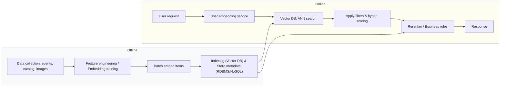

*Diagrama: Pipeline típico de búsqueda semántica con tokenización y vectorización*

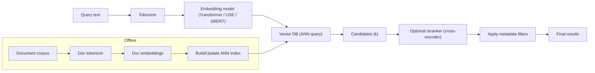

## Tokenización y su Relación con Bases de Datos Vectoriales

### ¿Qué es la tokenización y por qué es crítica para bases de datos vectoriales?

La tokenización es el proceso que transforma texto en una secuencia discreta de unidades (tokens) que el modelo de lenguaje puede procesar. En el pipeline que termina en una base de datos vectorial, la tokenización es la primera transformación determinante: define la granularidad de entrada al modelo de embeddings y, por tanto, condiciona la semántica capturada por los vectores.

Si el tokenizer no coincide con el esperado por el modelo de embeddings (o si aplica normalizaciones distintas), los vectores resultantes pueden desviarse significativamente, degradando la calidad de la búsqueda semántica y aumentando los falsos positivos/negativos en recuperación.

### ¿Cómo influye la tokenización en la calidad de la representación vectorial?

Impactos concretos:

- Cobertura léxica y OOV: los tokenizers subword (BPE, WordPiece, Unigram) reducen el problema de palabras fuera de vocabulario (OOV) dividiéndolas en subunidades; esto mejora que vectores de términos raros conserven semántica relevante.
- Ambigüedad morfológica: tokenización por palabras o por caracteres puede perder o introducir señal morfológica; subword suele equilibrar entre espacio y semántica.
- Normalización (casing, Unicode NFKC/NFKD): diferencias en normalización cambian tokens y por tanto vectores; usar distinto normalizador entre entrenamiento y producción genera desalineamiento.
- Context window y truncamiento: la tokenización determina el conteo de tokens. Si un documento se trunca antes de generar el embedding, se pierden señales relevantes; si se divide en chunks, el tamaño y solapamiento (overlap) definidos en tokens condicionan la granularidad de búsqueda y la latencia.

En resumen: tokenización es una fuente primaria de sesgos y ruido que se propaga hacia la base vectorial.

### Técnicas de tokenización y cuáles son más usadas en este contexto

Las técnicas principales y su rol en sistemas de embeddings son:

- Whitespace / rule-based: simple, rápida, pero pobre manejo de OOV; rara vez usada directamente con modelos modernos.
- Character-level: máxima robustez a OOV; vectores terminan muy ruidosos para semántica de alto nivel.
- BPE (Byte-Pair Encoding): popular por balance entre vocab y cobertura; usado en muchos pipelines de embeddings (por ejemplo, modelos basados en BPE). Referencia: Sennrich et al., 2016.
- WordPiece: similar a BPE, optimiza probabilidad condicional; usado históricamente por modelos como BERT.
- Unigram (SentencePiece): modelo probabilístico que selecciona subwords por máxima probabilidad; ventilado por su buen comportamiento multilingüe y cuando se desea vocab más compacto.
- Byte-level BPE (GPT-2, RoBERTa): tokeniza a nivel de bytes, evita problemas de encoding y normalización explícita; útil cuando el texto contiene símbolos no estándar.

Tradeoff habitual: subword (BPE/WordPiece/Unigram) ofrece mejor semántica por token que character-level, mantiene tamaño de vocab razonable y controla longitud de secuencia.

### Cómo afecta la tokenización a la escalabilidad y precisión de las búsquedas

- Escalabilidad (costo y throughput): el número de tokens determina tiempo de tokenización y cómputo de embeddings. Por ejemplo, duplicar tokens por documento (por tokenization más granular) approximadamente duplica costo de inferencia y ancho de banda hacia la base vectorial. Además, chunking fino genera más vectores por documento y por tanto mayor índice y costos de búsqueda/almacenamiento.

- Precisión (recall/precision): chunking por token con overlap mejora recall en consultas largas o donde la señal está localizada, pero puede reducir precision si aumenta el número de candidatos irrelevantes. Una práctica común: chunk de 200–500 tokens con solapamiento de 20–50 tokens (ajustar según modelo y latencia aceptable).

- Consistencia: usar el mismo tokenizer/version que el modelo de embeddings es regla No.1. Cualquier desalineamiento reduce precisión de búsqueda y complica re-ranking o explanations.

Buenas prácticas resumidas:

- Emparejar tokenizer y modelo de embeddings (misma librería y versión si es posible).
- Controlar chunk size en tokens, no en caracteres; almacenar token count junto al vector para decisiones de scoring y reranking.
- Normalizar Unicode y casing de forma consistente.
- Medir tradeoffs: evalúa recall@k y latencia según distintos tamaños de tokens y solapamientos.

*Diagrama: Proceso de tokenización y vectorización en NLP*

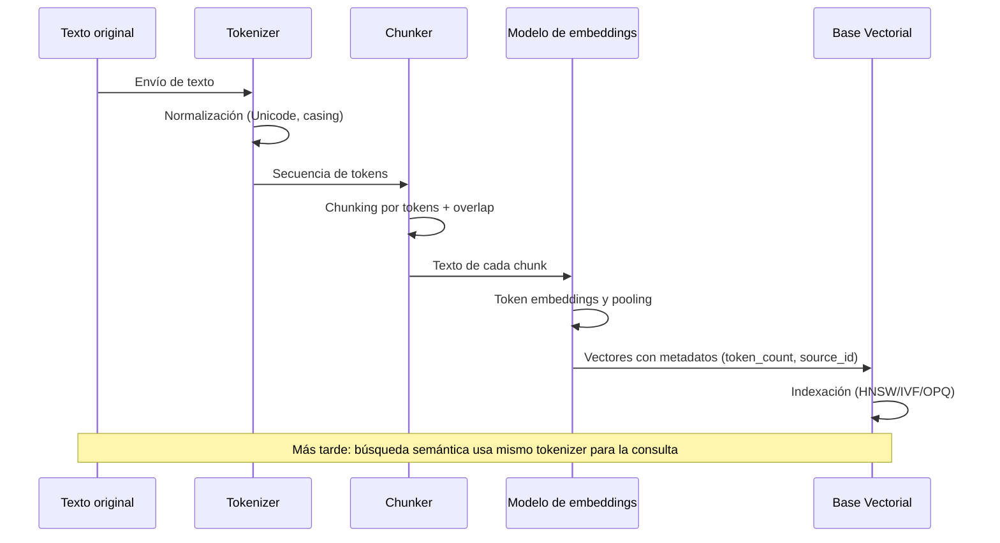

*Diagrama: Comparación de técnicas de tokenización y su impacto en vectores*

| Técnica | Ventajas | Inconvenientes | Impacto en calidad de vectores |
|---|---:|---|---|
| Whitespace / Rule-based | Muy rápida, simple | Mal manejo de OOV y morfología | Baja: útil solo en pipelines simples |
| Character-level | Robusta a OOV, sin vocab fijo | Longitud mayor, más ruido | Medium-Low: pobre semántica a nivel alto |
| BPE (Byte-Pair) | Balance vocab/cobertura; eficiente | Requiere entrenamiento del vocab | Alto: buena para capturar subwords frecuentes |
| WordPiece | Estabilidad para modelos tipo BERT | Vocab influye en token boundaries | Alto: usado en muchos modelos de referencia |
| Unigram (SentencePiece) | Probabilístico, bueno multilingüe | Puede producir subwords inusuales | Alto: especialmente en datasets diversos |
| Byte-level BPE | Evita issues de encoding; robusto | Más tokens en texto limpio | Alto: conveniente para textos con símbolos/byte streams |

## Limitaciones, Desafíos y Consideraciones

### Limitaciones técnicas actuales

- Precisión vs. latencia/espacio: los índices ANN (IVF, HNSW, PQ) ofrecen latencias bajas a costa de pérdida de recall. En la práctica, es habitual aceptar una caída de recall desde ~0.98 (búsqueda exacta) hasta 0.80–0.95 con ANN. Para mitigarlo, se usa re-ranking exacto sobre los top-K candidatos (por ejemplo, K=100) y métricas de control (recall@k, MRR) en pipelines de CI.

- Maleficio de la alta dimensionalidad (curse of dimensionality): vectores de 768–2048 dimensiones (modelos recientes) implican mayor costo de almacenamiento y peor discriminación de distancia. Ejemplo: un embedding de 384 dimensiones en float32 ocupa ~1.5 KB; 100M vectores representan ~150 GB solo en memoria raw (sin indexación ni metadatos).

- Compresión y cuantización: técnicas como PQ o OPQ reducen 8–16× el tamaño, pero introducen ruido. La elección de los parámetros (n_subquantizers, bits / subvector) debe validarse contra la métrica de negocio.

- Heterogeneidad y deriva de embeddings: diferentes versiones de modelos de embeddings (o cambios de tokenización) generan espacios incompatibles. Mezclar versiones sin control degrada búsquedas.

### Gestión y actualización de índices vectoriales

- Inserciones y borrados: HNSW soporta inserciones online con costo amortizado, pero borrados suelen ser "lazy" (tombstones) que requieren compactación. Para índices basados en clustering (IVF), la inserción masiva puede requerir reentrenamiento de centroides.

- Estrategias prácticas:
  - Build en background + switch atómico: construir un nuevo índice offline, testearlo y hacer un rename/alias atomic para evitar downtime.
  - Segmentación por tiempo/partición: mantener índices por shard temporal (daily/hourly) y consultar múltiples shards en paralelo.
  - Política de compactación: planificar reindex completo periódicamente (por ejemplo, semanal) y usar merges incrementales para evitar picos de I/O.

- Consistencia y versiones: versionar embeddings y almacenar metadata (modelo_version, tokenizer_hash). Evitar mezclar versiones en el mismo índice sin señalización; preferible usar índices separados por versión.

### Escalabilidad y rendimiento en producción

- Memoria y I/O: índices en memoria (HNSW) ofrecen latencia <ms, pero escalan en RAM; alternativas en disco+cache (IVF+PQ) reducen RAM pero elevan latencia.

- Distribución y sharding: para volúmenes grandes (≥100M vectores) es necesario shardear por clave (hash o rango) y mantener replicación para alta disponibilidad. El routing de consultas y la agregación de top-K de cada shard añade complejidad de red y latencia.

- CPU vs GPU: la construcción y las búsquedas grandes por lotes se aceleran con GPU (FAISS GPU), pero incrementar GPUs añade costos y coordinación (memoria GPU limitada por nodo). Balance entre CPU-only con PQ y GPU para re-ranking.

- SLA y throttling: diseñar límites de QPS, circuit breakers y caches (resultado de queries frecuentes). Medir p90/p99 latencias, no solo promedio.

### Seguridad y privacidad

- Leakage y ataques de inferencia: embeddings pueden filtrar información sensible; ataques de membership inference y extracción están documentados. Tratamiento: eliminar PII antes de embedding, aplicar detección de outliers y monitoring de anomalías.

- Encriptación y control de acceso: cifrado at-rest y in-transit (TLS), control de acceso RBAC, y auditoría de consultas son obligatorios en entornos regulados.

- Data poisoning y envenenamiento: inputs maliciosos pueden degradar calidad del índice. Mitigaciones: validación de entrada, canary tests y permitir rollbacks rápidos.

- Privacidad diferencial y DP embeddings: técnicas de DP pueden proteger información individual, pero reducen utilidad. Evaluar el tradeoff legal/operacional.

### Recomendaciones operativas

- Automatizar pruebas de calidad: pruebas unitarias de recall@k, pruebas de regresión de latencia y canary deploys de nuevos modelos de embedding.
- Monitorizar continuamente: recall, precision, latencia p99, tasa de errores, tamaño del índice y métricas de drift.
- Diseñar pipelines reproducibles: almacenar versiones de modelo, semilla de entrenamiento, y hashes de tokenizers junto a cada vector.

*Diagrama: Desafíos operativos en bases de datos vectoriales*

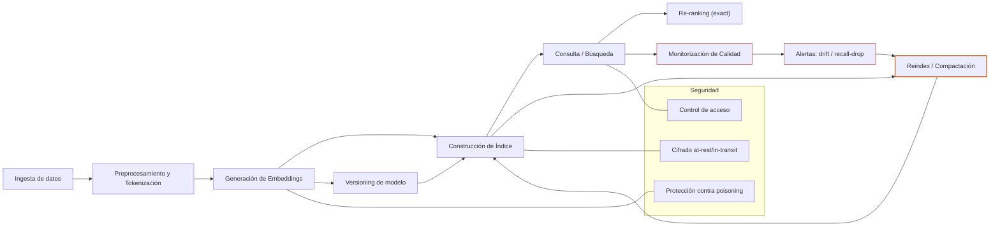

*Diagrama: Resumen de limitaciones y mitigaciones*

| Limitación | Impacto | Mitigación práctica |
|---|---:|---|
| Pérdida de precisión con ANN | Menor recall, impacto en UX | Re-ranking exacto sobre top-K, ajustar parámetros ANN y medir recall@k |
| costo de memoria (vectores float32) | Altos requerimientos RAM | PQ/OPQ, compresión, shards en disco con cache caliente |
| Actualizaciones y borrados complicados | Fragmentación, tombstones, degradación | Rebuild por lotes, segmentación temporal, política de compactación |
| Deriva de embeddings (model drift) | Incompatibilidad de espacios vectoriales | Versionar embeddings, pipelines reproducibles, canary deploys |
| Riesgos de privacidad (membership attacks) | Fugas de información sensible | Eliminar PII antes de embedder, cifrado, DP en casos necesarios |

## Recomendaciones y Futuro de las Bases de Datos Vectoriales

### Buenas prácticas al implementar

- Normalización y elección de métrica: para similitud semántica frecuente use `cosine` (implementado como inner-product sobre vectores normalizados) o `dot-product` si el embedding lo requiere. Normalice en punto de ingestión para evitar costos adicionales en consulta.

- Pre-procesado y dimensionalidad: evalúe reducción dimensional (PCA/OPQ) cuando la dimensión > 1024; apunte a 128–512 dimensiones para la mayoría de casos prácticos. Reducción: prueba A/B midiendo recall@k y latencia.

- Índice y tuning: empiece con HNSW (buena latencia y recall). Configuraciones iniciales de referencia: `M = 16–48`, `efConstruction = 200–1000`, `efSearch = 50–500` dependiendo de la latencia objetivo. Ajuste con pruebas de carga reales.

- Medición y SLOs: defina métricas concretas: recall@k, promedio y P99 de latencia, throughput (QPS), costo por consulta. Automatice pruebas de regresión para cada cambio de índice/embeddings.

- Híbrido vector+filtrado estructurado: evite post-filtering caro — aplique filtros estructurados (time ranges, tenant id) antes de la búsqueda vectorial o use índices compuestos si la solución lo soporta.

- Ingesta y consistencia: diseñe pipelines de embedding asíncronos con backpressure y compensación eventual; marque datos con versiones de embedding para poder invalidar/retroceder cuando el modelo cambia.

- Seguridad y privacidad: cifrado en tránsito y reposo, y diseño para poder borrar vectores (GDPR). Considere tokenización irreversible o técnicas de privacidad diferencial si necesario.

### Cómo elegir la solución adecuada

Use estas dimensiones para decidir:

- Latencia y SLA: si exige <10 ms y alta QPS, priorice soluciones optimizadas en memoria/GPU y HNSW con ajustes agresivos.
- Escala de datos: para >1B vectores, considere almacenamiento en disco con índices en memoria parcial (IVF + PQ) o soluciones distribuidas con sharding y replicación.
- Funcionalidad: necesidad de filtros complejos, actualizaciones frecuentes, transaccionalidad o multi-tenancy influye en elección (algoritmos ANN simples vs plataformas con ACID/ACLs).
- costo operativo: GPUs reducen latencia pero incrementan costo; para cargas medianas, CPU + HNSW suele ser más costo-eficiente.

Tabla resumen (alto nivel):

| Requisito clave | Recomendación inicial |
|---|---|
| Baja latencia (<20ms) | HNSW en memoria / GPU inference |
| Billones de vectores | Sharded IVF+PQ, almacenamiento en disco |
| Consultas con filtros complejos | Soporte nativo de híbrido vector+atributos |
| Actualizaciones frecuentes | Índices con soporte dinámico (HNSW) |

### Tendencias tecnológicas que moldean el futuro

- Aceleración por hardware (GPUs, DPUs, NPU): despliegues que mueven inferencia e índices cercanos al cómputo para reducir latencia.
- Convergencia multimodal: embeddings que agrupan texto, imagen, audio; necesidad de métricas y normalizaciones cross-modal.
- Indexación en streaming y pipelines en tiempo real: ingestion->embed->index sin ventanas largas; consistencia eventual bien definida.
- Standardización de APIs y formatos (Vector DB APIs, embedding formats) para interoperabilidad.
- Privacidad y verifiability: técnicas que permiten búsquedas útiles sin exponer vectores crudos (secure enclaves, encrypted search).

### Integración con IA y sistemas distribuidos

- RAG y model-to-data: los sistemas tenderán a ejecutar modelos (o proxies) junto a la base vectorial para reducir round-trips; patrones comunes: sidecar de embeddings, co-located model inference.
- Orquestación y estado en Kubernetes: use StatefulSets o operadores especializados para manejar shards, reindexado y backups. Automatice `rolling updates` de índices y estrategias de canary.
- Observabilidad y CI/CD del embedding: versiones de modelo, tests de regresión semántica y métricas de degradación automatizadas.

Conclusión: adopte un enfoque iterativo: evaluar con POC medible (recall/latencia), pilotar con datos reales y diseñar operaciones para actualizaciones de embeddings. La combinación de mejores prácticas, medición rigurosa y atención a tendencias (hardware, multimodalidad, privacidad) será la base para soluciones robustas y escalables.

*Diagrama: Roadmap de adopción de bases de datos vectoriales*

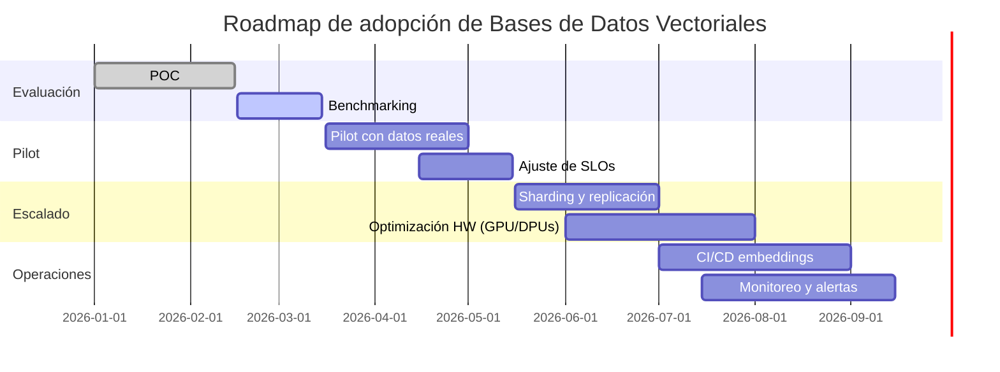

*Diagrama: Evolución futura y tendencias clave*

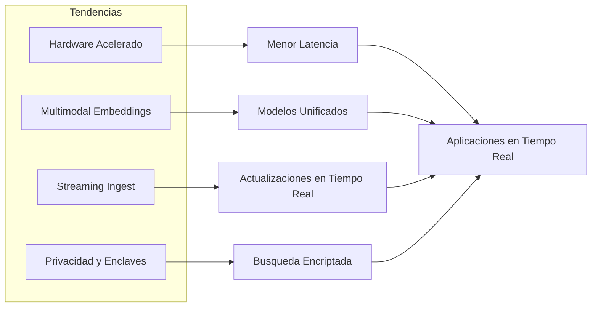

## Conclusión

Las bases de datos vectoriales representan una evolución necesaria para gestionar la creciente demanda de búsquedas semánticas y procesamiento de datos no estructurados en aplicaciones modernas. Comprender sus fundamentos técnicos, arquitectura y las compensaciones inherentes en sus índices es esencial para diseñar sistemas eficientes y escalables.

Para aprovechar al máximo esta tecnología, es fundamental normalizar embeddings, medir indicadores clave como recall y latencia, y ajustar cuidadosamente los parámetros de los índices según las necesidades específicas del caso de uso. Además, la integración con sistemas tradicionales mediante arquitecturas híbridas permite combinar lo mejor de ambos mundos: consistencia transaccional y búsqueda semántica avanzada.

Finalmente, mantenerse al día con las tendencias emergentes, como el hardware acelerado, la multimodalidad y la estandarización de APIs, facilitará la adopción y evolución de las bases de datos vectoriales en proyectos futuros, garantizando soluciones robustas y de alto rendimiento en entornos de datos complejos.

## Referencias

1. [Vector space model — Wikipedia](https://en.wikipedia.org/wiki/Vector_space_model) — Resumen histórico del modelo de espacio vectorial aplicado a recuperación de información (Salton).
2. [Locality-Sensitive Hashing (LSH) — Indyk & Motwani (1998)](https://theory.stanford.edu/~tim/ftp/near.pdf) — Documento clásico que formaliza LSH para aproximación de vecinos en alta dimensión.
3. [Product Quantization for Nearest Neighbor Search (Jégou et al., 2011)](https://arxiv.org/abs/1109.1416) — Explica técnicas de cuantización para compresión y búsqueda eficiente de vectores.
4. [word2vec — Mikolov et al. (2013)](https://arxiv.org/abs/1301.3781) — Uno de los primeros trabajos que popularizó embeddings densos aprendidos para palabras.
5. [BERT: Pre-training of Deep Bidirectional Transformers (Devlin et al., 2018)](https://arxiv.org/abs/1810.04805) — Introduce embeddings contextuales que transformaron tareas de NLP y popularizaron embeddings de oraciones y documentos.
6. [Facebook AI Similarity Search (FAISS) - GitHub](https://github.com/facebookresearch/faiss) — Implementaciones de índices ANN (IVF, PQ, HNSW) y soporte GPU — referencia práctica para indexado y búsqueda.
7. [Sentence-Transformers (SBERT) — documentación](https://www.sbert.net/) — Librería y modelos para obtener embeddings de oraciones y párrafos; ejemplos de modelos ligeros y tradeoffs de latencia/dimensión.
8. [Scikit-learn — métricas de distancia](https://scikit-learn.org/stable/modules/metrics.html) — Referencia para fórmulas y propiedades de métricas (cosine, euclidean, manhattan, etc.).
9. [Curse of dimensionality — Wikipedia](https://en.wikipedia.org/wiki/Curse_of_dimensionality) — Explicación teórica sobre por qué las distancias se vuelven menos informativas en alta dimensión.
10. [Faiss (Facebook AI Similarity Search) - GitHub](https://github.com/facebookresearch/faiss) — Implementaciones y ejemplos de IVF, PQ y otros índices vectoriales.
11. [Navigable Small World graphs (HNSW) — Malkov & Yashunin (paper)](https://arxiv.org/abs/1603.09320) — Documento seminal sobre HNSW, describe estructura y parámetros clave.
12. [pgvector — extensión para Postgres](https://github.com/pgvector/pgvector) — Ejemplo práctico de cómo almacenar vectores junto a metadata en Postgres y crear índices ANN.
13. [ScaNN (Google Research) — GitHub](https://github.com/google-research/google-research/tree/master/scann) — Técnicas combinadas de particionamiento y cuantización para búsquedas ANN a gran escala.
14. [PostgreSQL Documentation](https://www.postgresql.org/docs/current/index.html) — Documentación oficial sobre modelo relacional, índices GiST/GIN y full-text search.
15. [MongoDB Manual — Query and Indexes](https://docs.mongodb.com/manual/) — Referencia sobre modelo NoSQL (documentos), consistencia y patrones de escalado.
16. [FAISS (Facebook AI Similarity Search) — GitHub](https://github.com/facebookresearch/faiss) — Implementación y documentación de algoritmos para búsqueda de vectores (IVF, PQ, HNSW).
17. [Survey: Approximate Nearest Neighbor Algorithms](https://arxiv.org/abs/1709.06016) — Revisión académica que explica trade-offs y complejidades de ANN (precisión vs latencia).
18. [Faiss: A library for efficient similarity search](https://github.com/facebookresearch/faiss) — Repositorio oficial de Faiss (IVF, PQ, HNSW wrappers y ejemplos).
19. [Efficient and robust approximate nearest neighbor search using Hierarchical Navigable Small World graphs (HNSW)](https://arxiv.org/abs/1603.09320) — Artículo fundador de HNSW por Malkov y Yashunin; describe la estructura del grafo y parámetros clave.
20. [Product quantization for nearest neighbor search](https://hal.inria.fr/inria-00548637/document) — Paper original de Jégou et al. sobre Product Quantization (PQ) y su uso para compresión y búsqueda rápida.
21. [hnswlib: fast approximate nearest neighbors](https://github.com/nmslib/hnswlib) — Implementación C++/Python de HNSW ampliamente usada en producción.
22. [ScaNN: Efficient vector similarity search on massive datasets](https://github.com/google-research/google-research/tree/master/scann) — Implementación de Google con optimizaciones para re-ranking y hardware moderno.
23. [FAISS — A library for efficient similarity search](https://github.com/facebookresearch/faiss) — Documentación y parámetros comunes para índices HNSW/IVF/PQ; útil para entender tradeoffs de memoria y latencia.
24. [SentenceTransformers — Semantic embeddings in Python](https://www.sbert.net/) — Plantillas y modelos populares (p. ej. all-mpnet-base-v2) para generar embeddings semánticos.
25. [Milvus — vector database open source](https://milvus.io/) — Ejemplos de arquitectura para producción, persistencia de índices y estrategias de scaling.
26. [Pinterest engineering blog — visual search / Lens](https://medium.com/pinterest-engineering) — Artículos sobre cómo Pinterest aplicó embeddings visuales y búsqueda por imagen en producción (consultar entradas de Lens).
27. [Hugging Face Tokenizers documentation](https://huggingface.co/docs/tokenizers/index) — Documentación oficial sobre implementación y opciones de tokenizers usados en modelos Transformers.
28. [SentencePiece: A simple and language independent subword tokenizer](https://arxiv.org/abs/1808.06226) — Paper que describe el algoritmo Unigram y prácticas para tokenización independiente del lenguaje.
29. [Neural Machine Translation of Rare Words with Subword Units (BPE)](https://arxiv.org/abs/1508.07909) — Origen del uso de BPE en NLP y su impacto en manejo de palabras raras.
30. [SentenceTransformers — embedding models](https://www.sbert.net/) — Prácticas y modelos comunes para generación de embeddings; útil para entender emparejamiento tokenizer-modelo.
31. [FAISS — Facebook AI Similarity Search (repositorio)](https://github.com/facebookresearch/faiss) — Implementaciones de índices ANN, soporte CPU/GPU y técnicas de compresión (IVF, PQ).
32. [Hierarchical Navigable Small World graphs (HNSW) — Malkov & Yashunin, 2018](https://arxiv.org/abs/1603.09320) — Artículo que describe el algoritmo HNSW y sus propiedades sobre conectividad y rendimiento.
33. [Membership Inference Attacks against Machine Learning Models](https://arxiv.org/abs/1610.07533) — Documento clásico sobre ataques de inferencia de membresía; relevante para riesgos de privacidad en embeddings.
34. [HNSWlib — Github](https://github.com/nmslib/hnswlib) — Biblioteca práctica para HNSW con API Python/C++; útil para pruebas y prototipos.
35. [FAISS — Facebook AI Similarity Search (GitHub)](https://github.com/facebookresearch/faiss) — Implementación ampliamente utilizada para ANN; útil para experimentar con HNSW, IVF, PQ.
36. [Hierarchical Navigable Small World (HNSW) — paper](https://arxiv.org/abs/1603.09320) — Descripción original del algoritmo HNSW, base para muchos índices vectoriales.
37. [Retrieval-Augmented Generation (RAG) — paper](https://arxiv.org/abs/2005.11401) — Contexto sobre integración de recuperación (vectorial) con modelos de lenguaje.
38. [HNSWlib (GitHub)](https://github.com/nmslib/hnswlib) — Biblioteca C++/Python para HNSW, útil para prototipado rápido.
