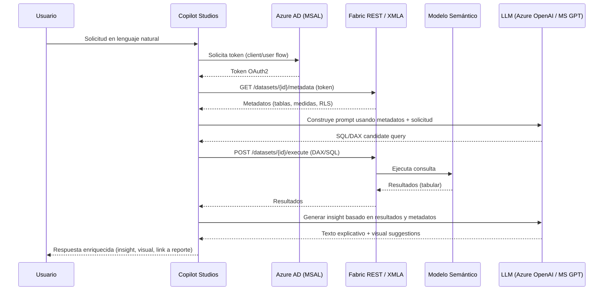
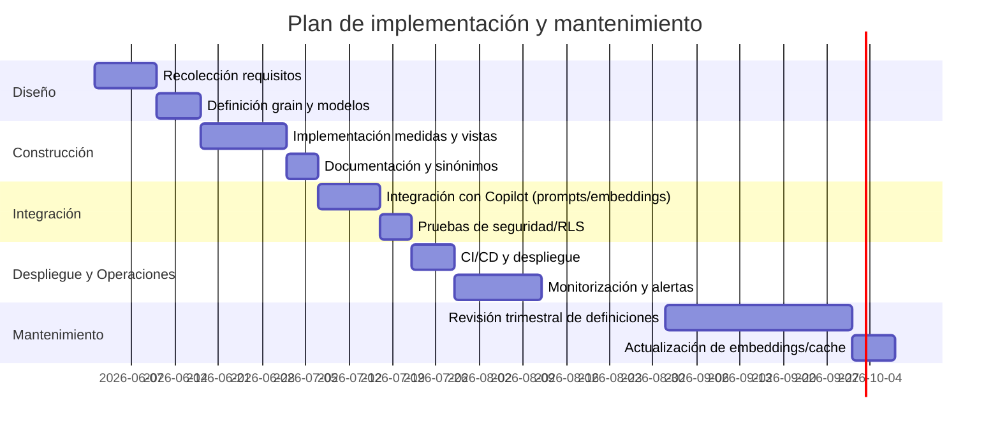

En la era actual de la analítica avanzada, la capacidad de transformar datos crudos en insights accionables es fundamental para la toma de decisiones estratégicas. Microsoft Fabric, con su modelo semántico, ofrece una capa lógica que facilita esta transformación, garantizando consistencia, gobernanza y reutilización de métricas en toda la organización. La integración con Copilot Studios potencia aún más este ecosistema, permitiendo consultas en lenguaje natural y generación automatizada de análisis.

Este artículo está dirigido a ingenieros de bases de datos, DBAs y arquitectos de datos con experiencia que buscan profundizar en la arquitectura y funcionamiento del modelo semántico dentro de Microsoft Fabric, así como en su integración técnica con Copilot Studios. No se abordarán conceptos básicos, sino que el enfoque será avanzado, cubriendo desde la estructura interna del modelo hasta ejemplos prácticos y consideraciones clave para su implementación efectiva.

A lo largo del texto, exploraremos la arquitectura y componentes esenciales del modelo semántico, el flujo de integración con Copilot Studios, ejemplos concretos de procesamiento y consultas, y finalmente, las limitaciones y desafíos técnicos que enfrentan estas soluciones en entornos empresariales. También se realizará una comparación con otras plataformas de modelado semántico y se ofrecerán recomendaciones para optimizar su uso en proyectos reales.

## Tabla de contenidos

- Introducción al modelo semántico en Microsoft Fabric
- Arquitectura y componentes clave del modelo semántico
- Integración con Copilot Studios: flujo y mecanismos
- Ejemplos prácticos de procesamiento y consultas
- Limitaciones y desafíos técnicos
- Comparativa con otras soluciones de modelado semántico
- Recomendaciones y mejores prácticas

## Introducción al modelo semántico en Microsoft Fabric

### ¿Qué es un modelo semántico en el contexto de Microsoft Fabric?

Un modelo semántico en Microsoft Fabric es la capa lógica que define cómo se interpretan y consumen los datos: tablas, relaciones, metadatos (etiquetas de negocio), medidas calculadas (DAX), jerarquías, roles de seguridad y perspectivas. No es el almacén físico de datos; es la representación semántica que transforma columnas y registros crudos en conceptos de negocio reutilizables (p. ej. "Ventas netas", "Cliente activo", "Región fiscal"). En Fabric se suele modelar con las herramientas de modelado compatibles (Power BI Desktop / Fabric semantic model authoring) y apuntando a datos almacenados en OneLake (lakehouses), SQL endpoints, o fuentes externas.

### Objetivo principal

El objetivo principal es desacoplar la lógica de negocio del almacenamiento físico y proporcionar una única verdad para el análisis. Con un modelo semántico se busca:

- Reutilización de métricas y KPIs en distintos artefactos (dashboards, Q&A, Copilot Studios).
- Consistencia en cálculos complejos (por ejemplo, comparaciones interanuales y reglas de reconocimiento de ingresos).
- Gobernanza: etiquetas, políticas y seguridad a nivel de modelo (RLS) en lugar de implementar medidas aisladas por informe.
- Optimización del rendimiento mediante estrategias como import, DirectQuery o composited models.

Ejemplo práctico: un equipo central crea 25 medidas financieras (margen bruto, ARR, churn) en el modelo semántico; el resto de equipos consume esas medidas sin reimplementarlas.

### Ventajas frente a modelos tradicionales de datos

Comparado con un enfoque tradicional (consultas ad‑hoc sobre vistas/ETL o informes que replican lógica), el modelo semántico aporta:

- Consistencia: medidas centralizadas evitan divergencias entre informes.
- Abstracción: usuarios no necesitan conocer joins complejos ni claves técnicas.
- Seguridad y gobernanza integradas: RLS y etiquetas aplicadas al modelo, no a cada vista individual.
- Rendimiento: caching y motores analíticos de Fabric permiten cargas rápidas; además se pueden combinar modos de acceso (import vs DirectQuery) para equilibrar latencia y frescura.

Tradeoffs: requiere inversión en diseño (normalización, nombrado, testing de medidas), y modelos muy grandes (>100 tablas o >billones de filas) pueden necesitar particionado e ingeniería adicional para mantener tiempo de recarga y latencia aceptables.

### ¿Qué tipos de datos y fuentes se pueden integrar?

Microsoft Fabric admite integrar prácticamente cualquier fuente relevante para análisis empresariales:

- Lakehouses / OneLake: Delta Lake, Parquet, CSV (alta compatibilidad para grandes volúmenes y procesamiento en Spark).
- SQL endpoints y bases de datos transaccionales: Azure SQL Database, SQL Server on‑premises (vía gateway), Synapse dedicated SQL.
- NoSQL y servicios analíticos: Azure Data Explorer (Kusto), Cosmos DB (vía conectores).
- Archivos y hojas de cálculo: Excel, CSV, JSON para datasets ligeros.
- Servicios SaaS: conectores a Dynamics, Salesforce, etc.

Ejemplo de arquitectura común: ETL/ELT en notebooks o pipelines (Spark/Notebook → Delta in OneLake) → definición de vistas/tabla en lakehouse → modelo semántico que importa tablas curadas y añade medidas DAX, roles RLS y perspectivas.

### Consideraciones operativas rápidas

- Escala: para modelos con cientos de millones de filas prefiera mezcla de import para agregados y DirectQuery para detalles operativos.
- Refresh: planifique incremental refresh y particionado (ej. particiones diarias) para reducir ventanas de recarga.
- Gobernanza: versionado del modelo (control de cambios), revisión de medidas y pruebas de regresión.

En la siguiente sección veremos cómo estos modelos se exponen a Copilot Studios y qué transformaciones adicionales se requieren para habilitar prompts semánticos y generación de insights automatizada.

*Diagrama: Concepto general de modelo semántico en Microsoft Fabric*

```mermaid
flowchart LR
  A[Fuentes de datos]
  A -->|Delta / Parquet| B(Lakehouse / OneLake)
  A -->|SQL / Synapse| C(SQL endpoints)
  A -->|Kusto / ADX| D(Azure Data Explorer)
  B --> E[Curación / ETL (Notebooks, Pipelines)]
  C --> E
  D --> E
  E --> F[Modelo Semántico (tablas, relaciones, DAX, RLS)]
  F --> G[Copilot Studios / Q&A / Dashboards]
  F --> H[SQL endpoint / Semantic API]
  G --> I[Analistas / Aplicaciones]
  H --> I
```

## Arquitectura y componentes clave del modelo semántico

### Componentes principales

El modelo semántico en Microsoft Fabric hereda el diseño y los mecanismos del motor Tabular (Power BI / Analysis Services) pero ajustado a la plataforma de Fabric (OneLake, Lakehouses y servicios de Power BI integrados). Los componentes que conviene distinguir son:

- Metadatos del modelo: definición de tablas, columnas, relaciones, medidas (DAX), jerarquías, carpetas de presentación, roles (Row-Level Security) y traducciones. Estos metadatos definen la "semántica" visible para consumidores y para Copilot Studios.
- Motor de almacenamiento (storage engine): almacenamiento columnar comprimido (VertiPaq / xVelocity) para los modos Import, y estructuras que conectan a fuentes para DirectQuery/Dual.
- Motor de cálculo (formula engine): procesa expresiones DAX, resuelve contexto de filtro y delega a storage engine cuando procede.
- Conectividad / puerta de enlace: XMLA endpoint / TMSL / TOM / REST APIs que permiten administración, despliegue y consultas programáticas.
- Particiones y políticas de refresco: objetos que controlan cómo y cuándo se actualizan porciones de datos (incremental refresh).
- Seguridad y control de acceso: roles a nivel de modelo, políticas a nivel de fila y el control de acceso a artefactos en Workspaces y OneLake.

Cada uno de estos componentes participa tanto en el runtime de consultas como en la gestión del ciclo de vida del modelo.

### Estructura: entidades, relaciones y métricas

La estructura del modelo semántico es relacional y columnar a la vez:

- Tablas (entidades): representan conjuntos de filas; en Fabric pueden provenir de Lakehouses (parquet/delta), Synapse, SQL Server, u otras fuentes mediante DirectQuery. Cada tabla tiene columnas físicas (datos) y columnas calculadas (DAX).
- Relaciones: definidas entre columnas (clave principal / foránea). El motor Tabular model utiliza estas relaciones para propagar contexto de filtro; se recomiendan relaciones 1:* con cardinalidad y dirección explícita.
- Medidas (metrics): definidas en DAX. Son objetos calculados que el formula engine evalúa en tiempo de consulta. Ejemplos frecuentes: totales, tasas, rolling averages, medidas semi-agregadas con FILTER/ALL.
- Jerarquías y carpetas de presentación: facilitan la experiencia de consumo (niveles de granularity, orden de atributos).
- Agregaciones y vistas materializadas: para mejorar rendimiento en escenarios DirectQuery, el modelo puede definir tablas de agregación que el engine usa automáticamente.

Ejemplo de medida DAX (sencilla pero representativa):

```sql
SalesAmountYoY =
VAR Current = SUM(Sales[Amount])
VAR Prior = CALCULATE(SUM(Sales[Amount]), SAMEPERIODLASTYEAR('Date'[Date]))
RETURN DIVIDE(Current - Prior, Prior)
```

### Tecnologías subyacentes para almacenamiento y procesamiento

- VertiPaq / xVelocity: almacenamiento/compresión columnar in-memory para tablas en modo Import. Es la base del rendimiento en consultas analíticas con alta cardinalidad.
- DirectQuery y Dual: cuando los volúmenes o requisitos de frescura impiden la importación, la capa semantic delega consultas a las fuentes (SQL, Synapse, Databricks) usando conexiones optimizadas. Dual permite tener parte de la tabla en memoria y parte en DirectQuery.
- OneLake / Lakehouses (Delta/Parquet): en Fabric los datos fuente frecuentemente residen en OneLake Lakehouses; las interfaces leen parquet/delta y se usan como orígenes de entrada para el proceso ETL y las particiones del modelo.
- XMLA endpoint, TMSL y Tabular Object Model (TOM): APIs y formatos para gestionar modelos (deploy, script, backup). Estas tecnologías permiten integración CI/CD y manipulación programática del modelo.
- DAX y formula engine: lenguaje y motor para definición de lógica semántica y cálculo de medidas.

Tradeoffs: VertiPaq ofrece respuesta rápida, pero exige memoria y mantenimiento de particiones. DirectQuery evita duplicar almacenamiento pero depende del rendimiento de la fuente y limita algunas optimizaciones de DAX.

### Gestión de actualizaciones y versionado

Fabric no impone un único mecanismo de versionado; las prácticas recomendadas combinan controles de fuente (Git) y herramientas de despliegue de modelos:

- Desarrollo y control de cambios: mantén el artefacto del modelo (bim/json), scripts TMSL o archivos de TabularEditor en un repositorio Git. TabularEditor (v3+) y ALM Toolkit son herramientas estándar para editar y serializar modelos.
- Despliegue (CI/CD): genera pipelines (Azure DevOps / GitHub Actions) que, a partir de artefactos (model.bim, script TMSL), despliegan contra el XMLA endpoint del workspace de Fabric usando TOM/AMO o TabularEditor CLI. El despliegue puede ejecutar el proceso de "compare + deploy" para minimizar downtime.
- Versionado de datos: usa particiones e incremental refresh (p. ej. políticas mensuales/diarias) para reducir ventanas de recarga. Registra cambios de particiones en pipelines ETL (ADF, Data Factory / Notebooks en Synapse).
- Backups y snapshots: exporta definiciones TMSL y, cuando sea necesario, realiza backups de modelos (export via XMLA) como puntos recuperables.
- Gestión de esquemas/contratos: documenta breaking changes (nombres de columnas, tipos) y usa perspectivas para mantener compatibilidad con consumers.

Operativa concreta: una práctica habitual es mantener en Git el proyecto Tabular (.bim o archivos de TabularEditor), ejecutar pruebas unitarias de medidas (TabularEditor Scripting / DAX Studio), y automatizar deploys con credenciales de servicio hacia el XMLA endpoint del workspace de Fabric.

### Consideraciones finales y recomendaciones

- Diseña particiones y políticas de refresh desde el inicio para escalar; evita recargas completas en conjuntos grandes.
- Prioriza medidas que se puedan delegar a la fuente (en DirectQuery) cuando la latencia y el coste de memoria sean críticos.
- Implementa CI/CD con TabularEditor + XMLA/TOM para mantener historial de cambios y despliegues reproducibles; añade pruebas de regresión para medidas DAX.

*Diagrama: Arquitectura interna del modelo semántico en Microsoft Fabric*

```mermaid
flowchart LR
  subgraph Sources
    A1[OneLake / Lakehouse (parquet/delta)]
    A2[Synapse / SQL / External DB]
  end
  A1 --> Ingest[ETL / Notebooks / Dataflows]
  A2 --> Ingest
  Ingest --> Storage[Lakehouse / Delta Storage]
  Storage -->|import| VertiPaq[VertiPaq (xVelocity) - Storage Engine]
  Storage -->|directquery| DirectQuery[Query Delegation Layer]
  VertiPaq --> Calc[Formula Engine / DAX]
  DirectQuery --> Calc
  Calc --> QueryAPI[Query API / XMLA / REST]
  QueryAPI --> Consumers[Power BI / Copilot Studios / BI Apps]
  subgraph Management
    M1[XMLA / TMSL / TOM]
    M2[TabularEditor / CI-CD]
    M3[Partitions & Refresh Policies]
  end
  M1 --> VertiPaq
  M2 --> M1
  M3 --> VertiPaq
  Copilot[Copilot Studios] -->|LLM-driven queries| QueryAPI
  Copilot --> Consumers
```

## Integración con Copilot Studios: flujo y mecanismos

Copilot Studios actúa como la capa de orquestación y experiencia conversacional que permite a equipos no solo generar prompts y copilots sino conectar esos copilots a fuentes de datos gobernadas. En el ecosistema de Microsoft Fabric, su función es doble: 1) descubrir y entender los metadatos del modelo semántico (tablas, columnas, medidas, relaciones, formatos) y 2) ejecutar consultas concretas contra ese modelo para obtener hechos que sirvan como evidencia (grounding) para las respuestas generadas por el LLM. En entornos empresariales esto significa que Copilot Studio funciona como el puente entre la lógica conversacional y el backend semántico de Fabric, respetando gobernanza, seguridad y límites de consulta.

### ¿Cómo se integra técnicamente el modelo semántico con Copilot Studios?

La integración se compone de tres capas principales:

- Descubrimiento / Metadatos: Copilot primero consulta los metadatos del modelo semántico (catálogo de tablas, relaciones, tipos, medidas con DAX) para construir un mapa del dominio. En Fabric estos metadatos están disponibles mediante las APIs de servicio (REST) del tenant o mediante endpoints compatibles con Analysis Services (XMLA / Tabular metadata).

- Consulta / Ejecución: Una vez construida la intención del usuario (ej.: "Mostrar ventas por región último trimestre"), Copilot traduce la intención a una consulta ejecutable (DAX, MDX o SQL según el modelo) y ejecuta esa consulta contra el endpoint del modelo semántico. Fabric acepta consultas tabulares (DAX) y también ofrece endpoints SQL para data en Lakehouses; elegir DAX vs SQL depende de si la fuente es el modelo tabular o un dataset SQL.

- Enriquecimiento y explicación: Los resultados numéricos y las filas devueltas sirven como evidencia. El LLM (ya sea Microsoft GPT interno o Azure OpenAI) utiliza esa evidencia, junto con los metadatos, para generar insights, explicaciones, visualizaciones sugeridas o acciones (por ejemplo, crear un KPI en un reporte).

Arquitectura típica:

1. Usuario/Analista en Copilot Studio formula una consulta en lenguaje natural.
2. Copilot Studio llama a las APIs de Fabric para leer el modelo semántico (metadatos) y validar permisos.
3. Copilot genera una consulta DAX/SQL y la envía al endpoint correspondiente (XMLA/REST SQL).
4. Fabric ejecuta la consulta y devuelve resultados estructurados.
5. Copilot usa el LLM para transformar resultados en un insight legible; opcionalmente almacena un artefacto (mensaje, visualización) en Fabric.

### Protocolos y APIs usadas

- Autenticación: OAuth 2.0 / OpenID Connect con Azure AD (MSAL para obtención de tokens). Copilot y Fabric intercambian tokens de acceso con scopes definidos (por ejemplo, "https://analysis.windows.net/powerbi/api/.default" o scopes específicos de Fabric cuando aplica).

- Metadatos:
  - REST API de Fabric / Power BI para listar datasets/datasets/{id}/metadata (suele exponer estructura de tablas, columnas y medidas).
  - XMLA endpoint (protocolos SOAP/XML para Analysis Services) o Tabular Metadata API para modelos tabulares (para obtener detalles avanzados como relaciones y medidas DAX).

- Ejecución de consultas:
  - XMLA / Execute (DAX/MDX) cuando se trabaja con un modelo tabular en modo Analysis Services.
  - REST Query APIs o endpoints SQL para ejecutar consultas SQL en datasets/Lakehouses.

- Observabilidad y telemetría: Requests pasan por gateways que registran métricas y logs; Copilot debe respetar políticas de throttling y necesita manejo de reintentos exponiendo latencia al usuario cuando las consultas tardan.

Nota práctica: la superficie exacta de API puede variar por actualización de Fabric; verificación del endpoint tenant-specific y scopes en Azure AD es obligatoria durante integración.

### Cómo Copilot aprovecha IA para enriquecer el modelo semántico

Copilot aporta capacidades que van más allá de simplemente preguntar y mostrar tablas:

- Prompt engineering automático: Con los metadatos del modelo, Copilot construye prompts más precisos para el LLM (por ejemplo anotar columnas sensibles, unidades, granularidad temporal) reduciendo ambigüedad y riesgo de hallucination.

- Generación de consultas robustas: El LLM sugiere y refina consultas DAX/SQL, incluso optimizadas para evitar ejes con cardinalidad alta o para aplicar filtros de seguridad por fila (RLS).

- Transformación de resultados en insights accionables: además de devolver números, Copilot sintetiza tendencias, anomalías y explicaciones ("Crecimiento del 12% impulsado por la región Norte y campañas X"), e incluso sugiere visualizaciones y medidas derivadas.

- Aprendizaje contextual y templates: Copilot Studio puede guardar plantillas (prompts y consultas) que encapsulan conocimiento del modelo semántico (ej.: cómo calcular ARR), acelerando respuestas futuras.

- Feedback loop (limitado y controlado): algunas integraciones permiten anotar el modelo con metadatos adicionales (descripciones de columnas, alias comunes, ejemplos de uso) basados en interacciones validadas por usuarios — esto mejora la relevancia de futuras consultas y la calidad de los prompts.

### Tradeoffs y consideraciones operativas

- Latencia vs precisión: ejecutar consultas en el modelo semántico para obtener grounding reduce hallucinations, pero aumenta latencia. Estrategia: cachear resultados frecuentes y usar respuestas mixtas (respuesta preliminar + actualización cuando query compleja termine).

- Seguridad y gobernanza: cualquier integración debe respetar RLS, DLP y auditoría. Nunca pase resultados sin filtrar al LLM si contienen datos sensibles; mejor enviar agregados y metadatos.

- Coste y rate limits: ejecutar consultas frecuentes desde Copilot puede aumentar costos de computación y consumo de recursos del modelo. Planifique cuotas y límites por usuario/tenant.

- Robustez de la traducción NL → DAX/SQL: requiere prompt templates y tests para evitar consultas ineficientes. Automatice validaciones (estimar cardinalidad, agregar TOP, timebox de ejecución).

En resumen, la integración de Copilot Studios con el modelo semántico de Microsoft Fabric combina APIs de metadatos, endpoints de ejecución (XMLA/SQL), autenticación basada en Azure AD y la potencia de LLMs para transformar datos gobernados en insights accionables. El éxito técnico depende de un buen diseño de prompts, controles de seguridad y estrategias de caching y observabilidad.

*Diagrama: Flujo de integración entre modelo semántico y Copilot Studios*



## Ejemplos prácticos de procesamiento y consultas

### Definición del modelo semántico para un caso de negocio (Retail Analytics)

Caso de negocio: panel de análisis de ventas y fidelidad de clientes para una cadena minorista. El objetivo del modelo semántico es exponer métricas empresariales (ventas, margen, unidades, retención de clientes) con contextos temporales y segmentaciones reutilizables, y habilitar consultas naturales vía Copilot Studios.

Elementos claves del modelo:

- Tablas centrales: `Sales` (fact), `Products`, `Customers`, `Stores`, `Date` (dimensión de tiempo).
- Relaciones: clave única en `Date[DateKey]`, `Customers[CustomerID]`, `Products[ProductID]` y relaciones 1:N hacia `Sales`.
- Medidas semánticas (DAX) en el dataset: `Total Sales`, `Gross Margin`, `Sales per Active Customer`, `YoY Growth`.
- Columnas con metadata/sinónimos: `Customer[Email]` etiquetado como `contact_email` para mejorar recuperación por lenguaje natural.
- Perspectivas: `Retail Management` (KPIs financieros) y `Customer Analytics` (retención, cohortes).
- Seguridad: roles con RLS por `StoreRegion` para limitar visibilidad por usuario.

Diseño práctico: definir medidas reutilizables (variables en DAX), evitar columnas calculadas costosas cuando se pueda resolver en consulta, y exponer jerarquías de fecha (Year/Quarter/Month) y producto (Category/Subcategory) para mejorar navegación automática en Copilot.

### Consultas avanzadas sobre el modelo

A continuación hay ejemplos concretos para ilustrar patrones comunes: medidas de negocio, tiempo-inteligencia, segmentos dinámicos y tablas top-n.

Ejemplo 1 — Total Sales y crecimiento YoY (DAX)

- Objetivo: definir medidas limpias, eficientes y reutilizables que Copilot pueda emplear directamente.

Código de medida (DAX):

Total Sales = SUM(Sales[SalesAmount])

YoY Sales Growth % =
VAR Current = [Total Sales]
VAR Prior = CALCULATE([Total Sales], DATEADD(Date[Date], -1, YEAR))
RETURN
IF(ISBLANK(Prior), BLANK(), (Current - Prior) / ABS(Prior))

Explicación: usar `VAR` para evitar re-evaluaciones y `DATEADD` para consistencia con la jerarquía de `Date`.

Ejemplo 2 — Top 10 productos por margen y filtro dinámico (DAX)

Top Products by Margin =
TOPN(
  10,
  SUMMARIZE(Products, Products[ProductID], Products[ProductName], "Margin", SUMX(RELATEDTABLE(Sales), Sales[SalesAmount] - Sales[Cost])),
  [Margin],
  DESC
)

Explicación: `SUMMARIZE` + `SUMX` evita crear una tabla física adicional; útil para visualizaciones ad-hoc solicitadas por Copilot.

Ejemplo 3 — Consulta SQL (T-SQL) optimizada contra un SQL endpoint/Lakehouse

En escenarios donde el dato está en Lakehouse y el semantic layer materializa vistas, puedes usar T-SQL para agregaciones y window functions:

SELECT
  p.ProductID,
  p.ProductName,
  SUM(s.SalesAmount) AS TotalSales,
  SUM(s.SalesAmount) - SUM(s.Cost) AS TotalMargin,
  RANK() OVER (ORDER BY SUM(s.SalesAmount) DESC) AS SalesRank
FROM Sales s
JOIN Products p ON s.ProductID = p.ProductID
WHERE s.SaleDate BETWEEN '2025-01-01' AND '2025-12-31'
GROUP BY p.ProductID, p.ProductName
ORDER BY TotalSales DESC
OFFSET 0 ROWS FETCH NEXT 10 ROWS ONLY;

Explicación: usar `RANK()` y `OFFSET/FETCH` para top-N; dejar la agregación en el motor SQL cuando el volumen sea alto y las tablas estén particionadas por `SaleDate`.

### Cómo Copilot Studios ayuda a generar y mejorar consultas

Copilot Studios actúa en tres capas prácticas:

1. Traducción NL → consulta: a partir de un prompt en lenguaje natural (ej. “Top 10 productos por margen en 2025, excluyendo promociones”) Copilot puede generar una consulta DAX o SQL válida sobre el modelo semántico expuesto.
2. Re-escritura y optimización: dado código DAX/SQL existente, Copilot sugiere optimizaciones (introducir `VAR`, usar `KEEPFILTERS`, empujar filtros al motor SQL/Materialized View) y marca riesgos de cardinalidad.
3. Explicabilidad y documentación: genera descripción de medidas, fortalece metadata y sugiere sinónimos/etiquetas para mejorar la experiencia de búsqueda en lenguaje natural.

Ejemplo práctico de interacción (prompt → resultado):

Prompt: "Mostrar crecimiento YoY de ventas por región excluyendo clientes con menos de 3 compras".

Copilot genera una medida DAX o una consulta que combina `CALCULATE`, `FILTER` sobre `Customers` con `COUNTROWS` de ventas por cliente, y añade manejo de `BLANK()` en el denominador. También propondrá una vista materializada si detecta que el filtro es pesado y repetitivo.

Limitaciones prácticas: Copilot puede proponer soluciones que no conocen índices/particiones concretas de tu Lakehouse; siempre validar planes de ejecución y probar en entornos de staging.

### Resultados y beneficios observables

- Productividad: redunda en menos tiempo para crear medidas y prototipos, especialmente en equipos donde analistas no son expertos en DAX. Copilot acelera la traducción de requisitos de negocio a DAX/SQL reutilizable.
- Calidad y gobernanza: medidas centralizadas en el semantic model reducen duplicidad y errores de interpretación; Copilot ayuda a homogenizar naming y descripciones.
- Rendimiento: al combinar generación automática de consultas con sugerencias de materialización/particionado, los tiempos de respuesta en paneles pueden mejorar al mover procesamiento a capas más apropiadas (SQL engine vs engine de modelado). Sin embargo, la mejora depende de la correcta adopción de las recomendaciones (indexado, particionado, agregaciones precomputadas).
- Descubribilidad: los sinónimos y la metadata enriquecida por Copilot facilitan consultas en lenguaje natural desde usuarios finales y reducen la curva de aprendizaje.

Consideraciones finales: siempre validar las consultas generadas por Copilot contra pruebas de rendimiento y seguridad; automatizar pruebas unitarias de medidas (p. ej. con Tabular Editor + DAX Studio) y controlar cambios mediante pipelines CI/CD para el semantic model.

*Diagrama: Flujo de consulta y respuesta con Copilot Studios*

```mermaid
flowchart LR
  U[Usuario - Natural language prompt] --> C[Copilot Studios - Interpretación]
  C --> M[Lookup: Semantic Model metadata (measures, synonyms, perspectives)]
  C --> G[Generación de consulta (DAX/SQL)]
  G --> E[Ejecutor: Fabric Engine (Dataset/SQL endpoint/Lakehouse)]
  E --> R[Resultados (tabular)]
  R --> P[Post-procesado por Copilot: explicaciones, visualizaciones sugeridas]
  P --> U
  M -- metadata --> P
  C -- sugerencias de optimización --> G
  E -- telemetría/perf --> C
```

## Limitaciones y desafíos técnicos

A continuación se analizan las limitaciones técnicas más relevantes cuando se usa el modelo semántico de Microsoft Fabric integrado con Copilot Studios, y las implicaciones prácticas en entornos productivos.

### Limitaciones técnicas del modelo semántico en Fabric

- Arquitectura híbrida y alcances del motor tabular: el modelo semántico en Fabric hereda muchas restricciones del motor tabular (Power BI/Analysis Services). Modelos en memoria (Import) ofrecen latencia baja pero dependen de la compresión y la RAM disponible; DirectQuery o DirectLake permiten consultas sobre datos en OneLake/lakehouses, pero sacrificarás rendimiento y funcionalidad DAX completa si dependes del push-down a orígenes externos.

- Cardinalidad y tamaño del modelo: columnas con cardinalidad muy alta (IDs únicos, GUIDs) degradan compresión y consumo de memoria. En la práctica, modelos que contienen decenas de millones de filas sin agregación rara vez escalan bien en modo Import; hay que diseñar agregaciones y particionamiento. Recomendación práctica: empujar a nivel de detalle al almacenamiento y exponer al semántico sólo las tablas agregadas o dimensiones con cardinalidad reducida.

- Complejidad de las relaciones y calculadas: relaciones complejas (muchos a muchos, relaciones actives/inactive combinadas) y medidas DAX muy pesadas afectan tiempo de evaluación y caching. Algunas optimizaciones automáticas no cubren escenarios con cálculos iterativos o filtros dinámicos complejos.

- Versionado y sincronización: el semántico es una capa con metadatos y transformaciones; mantener versiones congruentes entre modelos, datasets fuente (lakehouse/warehouse) y pipelines ETL es fuente de errores y fricción operacional.

### Desafíos de integrar Copilot Studios en entornos productivos

- Confiabilidad y trazabilidad de respuestas: Copilot resume y genera insights usando el modelo semántico como “knowledge base”, pero las respuestas de LLM pueden contener imprecisiones o inferencias fuera de contexto si el grounding (recuperación y prompt) no está bien controlado. Esto exige trazabilidad (qué tablas/filas dieron lugar al resultado) y mecanismos de verificación.

- Latencia y coste por consulta: cada interacción con Copilot que requiere acceso a datos (recuperación, embeddings, reconsulta al semantic model) añade latencia y potencial coste (compute, llamadas a LLMs). Para experiencias interactivas con alta concurrencia es crítico diseñar cache y límites de frecuencia.

- Consistencia y frescura: Copilot puede basarse en embeddings o snapshots del semántico. Si la cadencia de refresco de embeddings no está alineada con SLAs de datos, Copilot devolverá insights con datos obsoletos.

- Gobernanza de acceso y superficie de ataque: exponer el semántico a un agente LLM añade otra ruta de acceso a datos; hay que controlar scopes de token, evitar que prompts filtren secretos o datos sensibles y auditar las consultas generadas por el agente.

### Escalabilidad y rendimiento con grandes volúmenes de datos

Escenarios con tablas de decenas o centenas de millones de filas requieren decisiones de arquitectura: mover cómputo al origen (warehouse), usar tablas agregadas/materializadas, y diseñar índices/particiones.

- Mejores prácticas: uso de incremental refresh, tablas agregadas diarias/por producto, particionamiento por fecha y clustered columnstore indexes en SQL pools.
- Cache y warming: para consultas frecuentes, cachear resultados de Copilot y del motor semántico reduce latencia; usa TTL y estrategias de invalidación.
- Concurrencia: dimensiona la capacidad (capacidad dedicada / SKUs en Fabric) según concurrencia esperada, y monitoriza colas de consultas y tiempos de espera.

Ejemplo de trade-off: un informe en modo Import con 20–30 GB comprimidos puede servir alta interactividad; si el detalle crece a >100M filas, es preferible exponer agregados y mantener detalle en lakehouse con DirectLake.

### Seguridad y gobernanza de datos

- Control de accesos: aplica RLS (row-level security) en el semántico y revisa que los tokens usados por Copilot respeten scopes mínimos. Emplea políticas de least privilege.
- Clasificación y lineage: integra con Microsoft Purview para catalogar datos sensibles (PII) y asegurar que Copilot no utilice columnas clasificadas sin revisión.
- Auditoría y logging: registra prompts, consultas y resultados suministrados por Copilot; estos registros deben cifrarse y retenerse según política de compliance.
- Almacenamiento de embeddings y metadatos: si Copilot genera embeddings de datos empresariales, almacénalos cifrados y controla su retención; los embeddings pueden representar derivadas de datos sensibles.

### Checklist de mitigaciones prácticas

- Evitar exponer tablas de detalle innecesarias al semántico; crear vistas/aggregates como contrato estable.
- Implementar incremental refresh y particionamiento en tablas grandes.
- Materializar consultas frecuentes (materialized views o tablas agregadas) y usar clustered columnstore indexes.
- Versionar semánticos y alinear procesos CI/CD para despliegues (validación de esquemas, pruebas de regresión DAX).
- Prompts controlados y validación post-hoc de resultados de Copilot antes de uso operativo.

La integración de modelos semánticos de Fabric con Copilot Studios trae un gran potencial, pero requiere disciplina arquitectónica: empujar computo cuando corresponde, reducir cardinalidad y garantizar trazabilidad y gobernanza para que los beneficios no vengan acompañados de riesgos operativos y de seguridad.

*Diagrama: Limitaciones y mitigaciones*

| Limitación | Impacto | Mitigación práctica |
|---|---:|---|
| Alta cardinalidad (GUID/IDs) | Aumenta tamaño en memoria y degrada compresión | Usar surrogate keys, reducir columnas expuestas, normalizar dimensiones |
| Tablas de detalle muy grandes | Tiempo de refresh largo y queries lentas | Materializar agregados, incremental refresh, push-down a lakehouse |
| Consultas DAX complejas | Latencias y cache misses | Simplificar medidas; pre-calcular en ETL; usar aggregations |
| Respuestas no verificadas de Copilot | Riesgo operativo / decisiones erróneas | Implementar validación humana, trazabilidad de fuentes, tests automatizados |
| Exposición de datos sensibles a LLM | Riesgo de fuga de PII | Clasificar con Purview, cifrar embeddings, controlar scopes de tokens |
| Concurrencia alta | Queues, throttling, coste elevado | Dimensionar capacidad, caching, rate-limiting y circuit breakers |

## Comparativa con otras soluciones de modelado semántico

### Panorama rápido: otras soluciones populares

Las opciones más usadas para modelado semántico en la nube hoy son:

- Power BI Semantic Model (Tabular) — ampliamente usado en entornos Microsoft; DAX para medidas y cálculo.
- Google Looker (LookML) — modelo declarativo centrado en SQL y en la reutilización de métricas.
- Tableau (Virtual Connections / Metrics Layer) — capa orientada a usuarios analíticos y a la flexibilidad visual.
- Otras: dbt (con semantic layer emergente), ThoughtSpot (busca-por-lenguaje-natural + semantic), y capas de metadata como Atlan/Collibra.

### Comparación técnica (resumen)

| Dimensión | Microsoft Fabric (semantic model) | Power BI Semantic Model | Looker (LookML) | Tableau (Virtual Connections / Metrics) |
|---|---:|---:|---:|---:|
| Lenguaje / modelo | Tabular / DAX, accesible desde OneLake / lakehouses | Tabular / DAX (mismo engine clásico) | LookML (declarativo, SQL-centric) | Conexiones virtuales, cálculos propios (calc language) |
| Conectividad de datos | Nativo OneLake, Delta, Spark, Synapse, external sources | Amplio, pero orientado a archivos/modelos PBIX y gateways | Nativo hacia bases SQL/cloud warehouses (BigQuery, Snowflake) | Conectores amplios; ideal para data marts/warehouses |
| Reutilización de métricas | Modelos compartibles en Fabric + consumo por Copilot y notebooks | Compartir modelos/pbix dentro del tenant | Métricas centralizadas vía LookML (reutilizables) | Metrics layer y virtual connections para gobernanza |
| Gobernanza / lineage | Integrada en Fabric (OneLake + lineage tools) | Lineage en Power BI, pero fragmentado entre workspaces | Bueno si está centralizado en Looker | Herramientas de catalogación integradas en Tableau Server/Cloud |
| Integración con LLMs / herramientas AI | Directa con Copilot Studios (prompting + embeddings) | Limitada salvo integración adicional | Requiere capa externa (sonda de metadatos) | Integración externa; emergente |
| Escenarios ideales | Enterprise MS stack, análisis avanzado + IA | BI tradicional con usuarios Power BI | Modelado orientado a SQL-first y ingeniería de métricas | Visual-first, exploración analítica y dashboards |

### Ventajas competitivas de Microsoft Fabric + Copilot Studios

1. Integración nativa con OneLake y lakehouses: evita silos de archivos y replicas de datasets, lo que reduce latencia y costes por múltiples copias.
2. Consumo unificado: el mismo semantic model puede servir a informes, notebooks, pipelines y a Copilot Studios para generación de insights y queries en lenguaje natural.
3. Experiencia de IA dirigida: Copilot Studios puede usar metadatos del semantic model para generar prompts mejor alineados (contexto de medidas, formatos, relaciones), reduciendo pasos de desambiguación y riesgo de hallucination en respuestas basadas en datos.
4. Gobernanza centralizada: políticas de seguridad y lineage aplicables desde la capa de datos hasta los artefactos consumibles por Copilot.

Trade-offs: integración profunda implica mayor vendor-lock (Azure/Microsoft). Además, DAX/tabular sigue siendo una barrera técnica para equipos SQL-first.

### ¿Cuándo otras soluciones son más adecuadas?

- Si tu organización es SQL-first y ya está en Google Cloud o Snowflake, Looker (LookML) suele ser más natural: modelado en términos de SQL y métricas versionadas en código.
- Para equipos centrados en visualización y exploración ad-hoc con diversidad de fuentes, Tableau ofrece flexibilidad visual y un ciclo rápido de authoring.
- Si necesitas una capa de transformación reproducible y orientada a ingeniería de datos (ELT) con testing y linaje como prioridad, dbt combinado con un semantic layer externo puede ser mejor.
- Para iniciativas de búsqueda-libre sobre datos (BI conversacional), ThoughtSpot u otras soluciones especializadas podrían reducir el tiempo de entrega frente a una solución genérica + Copilot.

### Recomendación práctica

- Elige Fabric+Copilot cuando quieras: 1) minimizar transferencia de datos, 2) unificar gobierno y 3) potenciar insights generados por LLMs con contexto semántico fiable.
- Elige Looker/Tableau cuando la organización ya tenga inversión fuerte en esas plataformas o necesite un modelo declarativo/visual que no dependa de DAX.

*Diagrama: Comparación resumida: Microsoft Fabric vs Power BI Semantic Model vs Looker vs Tableau*

| Dimensión | Microsoft Fabric | Power BI Semantic Model | Looker | Tableau |
|---|---:|---:|---:|---:|
| Modelo / lenguaje | Tabular / DAX + integración OneLake | Tabular / DAX | LookML (SQL-centric) | Virtual connections / calc layer |
| Integración IA | Nativa con Copilot Studios | Limitada (necesita integración) | Externa | Externa |
| Gobernanza & lineage | Centralizado en Fabric | Fragmentado según workspace | Centralizado vía Looker | Centralizado en Server/Cloud |
| Mejor para | IA+análisis en stack MS | BI tradicional Power BI | SQL-first, multi-cloud | Visual analytics y data discovery |

## Recomendaciones y mejores prácticas

### Definir modelos semánticos efectivos
- Define el `grain` principal y manténlo consistente. Un error común es mezclar granularidades (ej. transaccional y agregada) en el mismo modelo; prefiere vistas o tablas independientes para cada nivel y relaciones explícitas.
- Nombres explícitos y estandarizados: usa convenciones como `Dim_`, `Fact_`, `M_` (medidas), y etiquetas claras para unidades y formatos. Esto reduce ambigüedad para Copilot y para usuarios analíticos.
- Medidas gestionadas y metadata centralizada: implementa medidas críticas (margen, churn, ARR) como objetos reutilizables en el modelo semántico. Evita que cada informe reimplemente lógica financiera.
- Anota con descripciones y sinónimos (columns synonyms) para mejorar la comprensión por parte de Copilot Studios y LLMs; los prompts funcionan mejor si el modelo semántico expone metadata rica.
- Implementa jerarquías y atributos de tiempo (calendar table) bien definidos; Copilot genera mejores explicaciones y visualizaciones cuando las jerarquías son explícitas.

### Optimizar la integración con Copilot Studios
- Exponer intencionalmente solo lo necesario: publica vistas o endpoints con la semántica reducida para Copilot (proyección mínima de columnas, medidas aprobadas). Reduce superficie de datos y mejora latencia.
- Pre-procesamiento y embeddings: para prompts que combinan lenguaje natural y datos, crea embeddings de descripciones de medidas/dimensiones y guarda en un cache (Azure Cognitive Search / Vector DB) para retrieval-augmented prompts.
- Prompt templates orientados a métricas: incluye nombre de medida, definición, frecuencia y supuestos en el prompt. Ejemplo: "Given measure M_Revenue (definition: SUM(Fact_Sales[Amount]) currency: USD, freq: monthly), explain drivers for last quarter." Esto reduce ambigüedad.
- Cache de resultados y límites de token: habilita caching en el plano de integración para consultas repetidas y corta resultados muy grandes con agregaciones previas.
- Seguridad y RLS: respeta Row-Level Security en capas previas; verifica que Copilot acceda a los endpoints con identidades con RLS aplicada.

### Estrategias de mantenimiento y actualización
- CI/CD para modelos semánticos: versiona medidas, descripciones y mappings en Git. Automatiza despliegues a entornos (dev/staging/prod) y ejecuta pruebas automáticas de consistencia (regresión de valores clave).
- Tests automáticos: crea tests que validen agregados (tolerancias, null ratios), cardinalidades y performance de consultas críticas.
- Observabilidad: registra latencias, tasas de cache hit, y consultas frecuentes que provienen de Copilot. Usa estos datos para indexar y optimizar vistas/materialized views.
- Ciclo de revisión: programar revisiones trimestrales de definiciones de negocio, controles de calidad y actualización de sinónimos.

### Preparar la organización
- Roles y gobernanza: define propietarios de modelo, custodios de datos, y un equipo de integración LLM/ML. Asigna SLA para cambios en medidas aprobadas.
- Formación y playbooks: capacita a analistas y desarrolladores en cómo escribir prompts efectivos dirigidos al modelo semántico y en interpretación de respuestas generadas.
- Pilotos y adoption path: inicia con casos de alto valor (financial reporting, root-cause analysis), recopila métricas de utilidad y amplía.
- Comunicación y cambio: documenta cómo y cuándo se actualizan medidas; comunica impactos a consumidores upstream.

### Checklist rápido
- Grain definido y jerarquías implementadas
- Medidas gestionadas y documentadas
- RLS aplicable y probada
- CI/CD y tests automáticos
- Observabilidad y revisiones periódicas
- Plan de formación y gobernanza

*Diagrama: Plan de implementación y mantenimiento de modelos semánticos*



## Conclusión

La integración del modelo semántico de Microsoft Fabric con Copilot Studios representa un avance significativo para la analítica empresarial, al combinar la robustez y gobernanza de un modelo tabular con la inteligencia artificial para consultas en lenguaje natural. Sin embargo, esta combinación exige un diseño cuidadoso del modelo, atención a la escalabilidad y una gestión rigurosa de la seguridad y trazabilidad para garantizar resultados confiables.

Los ejemplos prácticos demuestran cómo aprovechar DAX y SQL para optimizar consultas y cómo Copilot puede mejorar la productividad, aunque siempre con un enfoque crítico hacia la validación y el control de costes. Las limitaciones inherentes al motor semántico y los retos que introduce la integración con Copilot deben considerarse para evitar cuellos de botella y riesgos operativos.

Finalmente, conocer las diferencias con otras soluciones del mercado y aplicar las mejores prácticas de diseño, versionado y adopción organizacional facilitará una implementación exitosa. Como siguiente paso, se recomienda iniciar pilotos controlados que permitan afinar el modelo semántico y la interacción con Copilot, asegurando así un despliegue escalable y alineado con los objetivos de negocio.

## Referencias

1. [Microsoft Fabric documentation](https://learn.microsoft.com/en-us/fabric/) — Portal principal de documentación de Microsoft Fabric — cubre lakehouses (OneLake), endpoints y capacidades del servicio.
2. [Semantic model overview (Power BI)](https://learn.microsoft.com/en-us/power-bi/transform-model/semantic-model-overview) — Explica conceptos de modelos semánticos (tablas, medidas, jerarquías, roles) compatibles con el stack que usa Fabric.
3. [OneLake overview](https://learn.microsoft.com/en-us/fabric/onelake-overview) — Descripción de OneLake y formatos recomendados (Delta Lake, Parquet) para persistencia de datos que alimentan modelos semánticos.
4. [OneLake overview - Microsoft Fabric](https://learn.microsoft.com/en-us/fabric/onelake-overview) — Descripción de OneLake y cómo se usan Lakehouses como orígenes dentro de Microsoft Fabric.
5. [Tabular models in Analysis Services documentation](https://learn.microsoft.com/en-us/analysis-services/tabular-models/tabular-models-ssas-tabular) — Fundamentos del motor tabular (VertiPaq, DAX, storage modes) que también aplican a los modelos semánticos de Fabric.
6. [XMLA and TMSL for managing datasets and models](https://learn.microsoft.com/en-us/power-bi/connect-data/service-datasets-xmla-endpoint) — Uso del endpoint XMLA, TMSL y herramientas de gestión para desplegar y versionar modelos semánticos.
7. [Tabular Editor - documentación](https://tabulareditor.com/docs/) — Herramienta de referencia para editar, serializar y automatizar despliegues de modelos Tabular (muy usada en pipelines CI/CD).
8. [Overview: Microsoft Fabric semantic models](https://learn.microsoft.com/en-us/fabric/semantic-models/overview) — Documentación oficial sobre modelos semánticos en Microsoft Fabric: metadatos, endpoints y conceptos.
9. [XMLA endpoint and analysis services documentation (Power BI / Tabular models)](https://learn.microsoft.com/en-us/power-bi/connect-data/service-xmla-endpoint) — Referencia sobre cómo ejecutar consultas contra modelos tabulares usando XMLA / Analysis Services protocols.
10. [Authentication and authorization for Microsoft APIs (Azure AD, MSAL)](https://learn.microsoft.com/en-us/azure/active-directory/develop/msal-overview) — Prácticas recomendadas para obtención de tokens y configuración de permisos en integraciones servidor-a-servidor.
11. [Copilot Studio - conceptos y arquitecturas (Microsoft 365)](https://learn.microsoft.com/en-us/microsoft-365/copilot-studio/overview) — Descripción general de Copilot Studio: cómo orquesta prompts y conecta datos empresariales.
12. [Copilot en Microsoft Fabric](https://learn.microsoft.com/en-us/fabric/copilot/) — Documentación oficial sobre las capacidades de Copilot en Microsoft Fabric y cómo se integra con modelos y flujos de trabajo.
13. [Introducción a modelos semánticos y modelado en Power BI](https://learn.microsoft.com/power-bi/transform-model/desktop-modeling-basics) — Conceptos de modelado tabular que aplican al semantic model en Fabric (tablas, relaciones, medidas, jerarquías).
14. [Overview of DAX (Microsoft Docs)](https://learn.microsoft.com/dax/) — Referencia y guías de DAX: patrones recomendados como VAR, time-intelligence y funciones de agregación.
15. [Semantic models overview — Microsoft Fabric](https://learn.microsoft.com/en-us/fabric/data-experiences/semantic-models-overview) — Visión general sobre modelos semánticos en Fabric y sus capacidades.
16. [Copilot Studio — Documentation](https://learn.microsoft.com/en-us/copilot-studio/overview) — Detalles sobre Copilot Studio, integración y consideraciones de diseño.
17. [Security in Microsoft Fabric — Documentation](https://learn.microsoft.com/en-us/fabric/security/) — Guía sobre controles de seguridad y buenas prácticas en Fabric.
18. [What is Microsoft Purview](https://learn.microsoft.com/en-us/purview/what-is-microsoft-purview) — Uso de Purview para clasificación, lineage y gobernanza de datos.
19. [Microsoft Fabric documentation](https://learn.microsoft.com/fabric/) — Documentación oficial sobre OneLake, lakehouses y capacidades integradas de Fabric.
20. [Power BI modeling guidance](https://learn.microsoft.com/power-bi/transform-model/desktop-modeling-overview) — Descripción del modelado tabular, DAX y arquitectura de modelos semánticos en Power BI.
21. [Looker data modelling (LookML)](https://cloud.google.com/looker/docs/data-modelling) — Guía sobre LookML, medidas reutilizables y mejores prácticas para modelado SQL-first.
22. [Copilot Studio (Microsoft) documentation](https://learn.microsoft.com/copilot-studio/) — Información sobre cómo Copilot Studio orquesta prompts y se integra con metadatos y fuentes de datos.
23. [Microsoft Fabric — Semantic models](https://learn.microsoft.com/en-us/fabric/semantic-models/) — Documentación oficial sobre modelos semánticos en Microsoft Fabric: buenas prácticas y arquitectura.
24. [Microsoft Copilot Studio — Overview](https://learn.microsoft.com/en-us/ai/copilot-studio/overview) — Guía de Copilot Studios: integración con datos, prompts y consideraciones de seguridad.
25. [Power BI: Semantic model best practices](https://learn.microsoft.com/en-us/power-bi/guidance/semantic-model-best-practices) — Prácticas recomendadas para modelos semánticos aplicables también a Fabric; explica naming, measures y rendimiento.
26. [Azure architecture: Observability and CI/CD patterns](https://learn.microsoft.com/en-us/azure/architecture/guide/) — Referencias para integrar CI/CD, tests automáticos y observabilidad en soluciones de datos en Azure.
