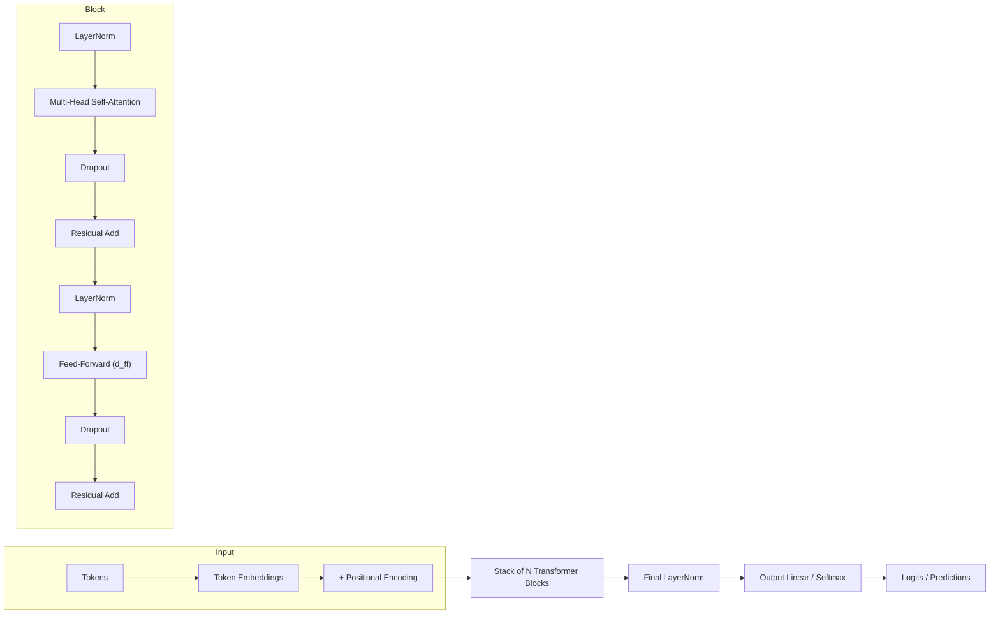
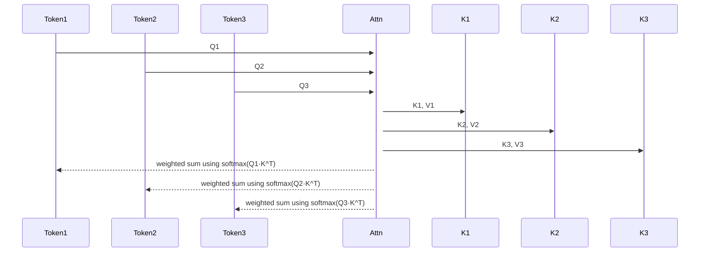
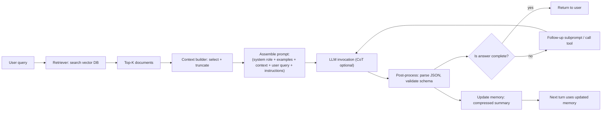
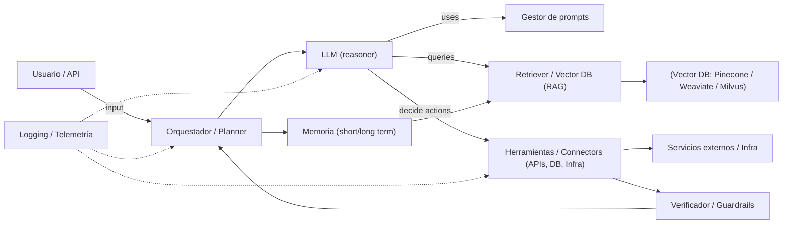
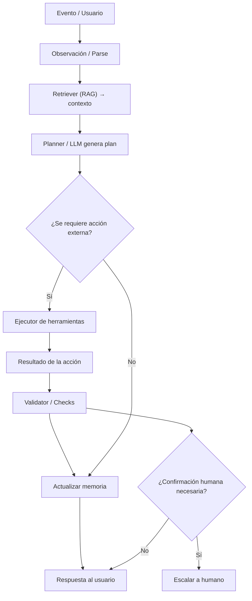
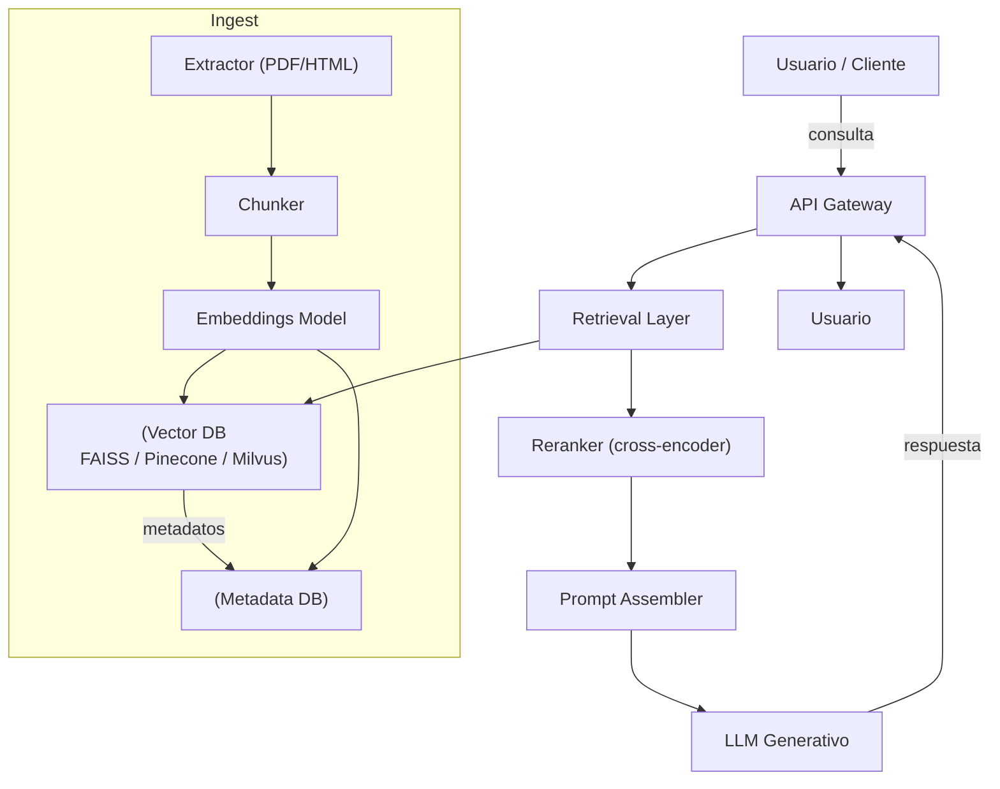
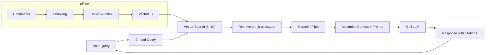
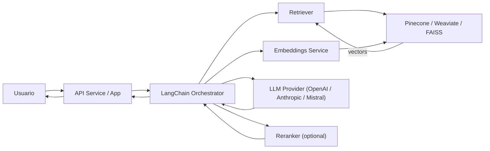
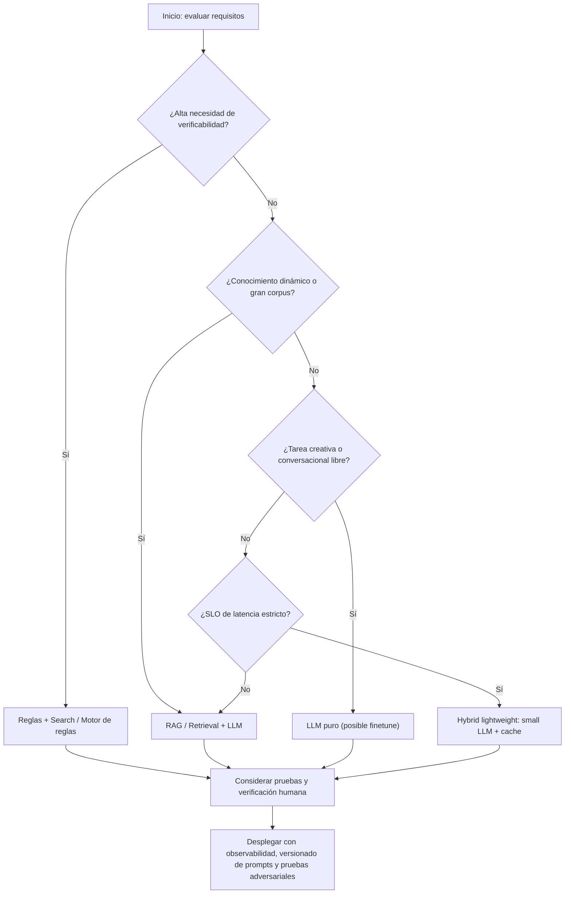

La inteligencia artificial generativa y los agentes basados en modelos de lenguaje a gran escala (LLMs) están transformando rápidamente múltiples industrias, desde la automatización hasta la gestión del conocimiento. Sin embargo, comprender en detalle cómo funcionan estos sistemas, desde la tokenización hasta la arquitectura Transformer y los mecanismos de atención, es fundamental para poder diseñar soluciones robustas y eficientes. En este contexto, el diseño avanzado de prompts y la integración de pipelines RAG se han convertido en pilares esenciales para maximizar el potencial de los LLMs.

Este artículo está dirigido a ingenieros senior y arquitectos de nube con experiencia en sistemas distribuidos y aprendizaje automático que buscan profundizar en el funcionamiento interno y diseño avanzado de IA generativa y agentes inteligentes. Se explorarán los fundamentos técnicos de los LLMs, la arquitectura Transformer, técnicas sofisticadas para la creación de prompts, así como la arquitectura y casos de uso de agentes basados en LLM.

Además, se analizarán en detalle los pipelines de generación aumentada por recuperación (RAG), explicando su arquitectura, ventajas y desafíos, y se presentará una implementación práctica con LangChain y bases de datos vectoriales. Finalmente, se discutirán las limitaciones, consideraciones de escalabilidad y comparativas con enfoques alternativos para ofrecer una visión integral y aplicada de esta tecnología avanzada.

## Tabla de contenidos

- Fundamentos técnicos de los modelos de lenguaje a gran escala (LLMs)
- Arquitectura Transformer y mecanismos clave: atención y autoatención
- Diseño avanzado de prompts: zero-shot, one-shot, few-shot, cadena de pensamiento y prompting estructurado
- Agentes basados en LLM: concepto, arquitectura y casos de uso
- Pipelines de generación aumentada por recuperación (RAG): fundamentos y arquitectura
- Implementación práctica con LangChain y bases de datos vectoriales
- Limitaciones, desafíos y consideraciones de escalabilidad en IA generativa y agentes
- Comparativa con enfoques alternativos y recomendaciones finales

## Fundamentos técnicos de los modelos de lenguaje a gran escala (LLMs)

### Tokenización: cómo funciona y qué tipos existen

La tokenización transforma texto en unidades discretas (tokens) que el modelo procesa. No es solo "separar por palabras": la elección del esquema de tokenización afecta la longitud de la secuencia, la robustez a palabras desconocidas y la eficiencia. Tipos principales:

- Tokenización por caracteres: cada carácter es un token. Ventaja: cero OOV (out-of-vocabulary), útil en lenguajes morfológicamente complejos; desventaja: secuencias muy largas.
- Tokenización por palabras (whitespace): tokens comprensibles humanamente, pero sufre OOV y vocabularios gigantes.
- Subword (la opción dominante): corta palabras en unidades subléxicas para equilibrar vocabulario y cobertura. Implementaciones populares:
  - BPE (Byte Pair Encoding): combina pares de símbolos frecuentes hasta obtener un vocabulario fijo (Sennrich et al., 2016). Bueno para captura de patrones frecuentes.
  - WordPiece: variante usada en BERT; optimiza probabilidad condicional en corpus (Google).
  - Unigram (SentencePiece): modelo probabilístico que selecciona un conjunto de subwords que maximizan la probabilidad del corpus.
- Byte-level BPE: tokeniza a nivel de bytes (p. ej. GPT-2, GPT-NeoX), evitando problemas con caracteres raros y preservando reversibleidad.

Ejemplo tangible: la palabra `unaffordable` puede tokenizarse como `un@@ affordable` (subword), o como tokens `u n a f f o r d a b l e` (char), o como un solo token si está en el vocabulario. Tokens subword suelen reducir la longitud y conservar información morfológica.

### Embeddings: representación densa del significado

Un embedding es un vector numérico d-dimensional que representa un token, subword o texto (frase/documento). Se aprende durante el preentrenamiento o se obtiene por modelos especializados (p. ej. Sentence-BERT). Propiedades clave:

- Distancias y ángulos importan: similitud semántica suele medirse con coseno o producto escalar.
- Dimensionalidad: valores típicos 256, 384, 768, 1024, 1536. Mayor dimensión = mayor capacidad para codificar matices, pero más costo computacional.
- Normalización: a menudo los embeddings se L2-normalizan antes de comparar para que el coseno sea equivalente al producto escalar.

Ejemplo: con embeddings de dimensión 768, `"perro"` y `"can"` tendrán una alta similitud coseno (~0.8-0.95) mientras que `"perro"` y `"computadora"` tendrán similitud baja (~0.1-0.3), números orientativos dependientes del modelo.

### ¿Por qué son esenciales las representaciones vectoriales?

Las representaciones vectoriales permiten:

- Operaciones algebraicas: dot-product para atención, promedio ponderado para pooling, y combinaciones lineales para razonar semánticamente.
- Búsqueda semántica (ANN): recuperación por similaridad en espacios vectoriales (FAISS, Annoy, HNSWlib) habilita RAG y búsqueda por significado en lugar de coincidencia exacta.
- Transferencia y fine-tuning: embeddings preentrenados encapsulan conocimiento lingüístico generalizable a tareas downstream.

Atención (mecanismo central en Transformers) trabaja con vectores: cada token se proyecta a Query (Q), Key (K) y Value (V) vectors; la atención escalada es

softmax(Q K^T / sqrt(d_k)) V

esa multiplicación de matrices es posible porque Q/K/V son vectores en espacio continuo, y el producto escalar opera como medida de compatibilidad.

### Impacto en la capacidad de generalización

- Tokenización y OOV: subword y byte-level reducen OOV; mejores subwords significan que el modelo ve morfemas en vez de neologismos desconocidos, lo que mejora generalización a palabras compuestas o formas derivadas.
- Granularidad vs longitud: tokenización muy fina (bytes/char) mejora robustez pero aumenta la longitud de entrada, perjudicando eficiencia y, a veces, la memoria de largo plazo del modelo.
- Calidad de embeddings: embeddings bien entrenados capturan relaciones sintácticas y semánticas (analogy arithmetic, clustering por temas), lo que permite al modelo realizar transfer-learning con menos datos.
- Sesgo de vocabulario: vocabularios construidos sobre corpus sesgados pueden afectar representación y generalización en dominios raros; es un trade-off entre vocabulario fijo y adaptabilidad.

En resumen, tokenización y embeddings son las bases que transforman texto discreto en geometría computable: decisiones aquí afectan longitud de secuencia, coste computacional, robustez a palabras nuevas y la capacidad del modelo para extrapolar desde patrones vistos durante el preentrenamiento.

### Recomendaciones prácticas

- Para modelos multi-idioma, preferir tokenizadores de subword o byte-level (p. ej. SentencePiece unigram o byte-level BPE).
- Elegir dimensión de embedding acorde al uso: 384–768 suele ser un buen trade-off para retrieval; 1536+ si buscas máxima granularidad semántica a costa de coste.
- Medir: comparar longitud media de tokens y cobertura de vocabulario en tu dominio; evaluar similitud semántica y latencia de búsqueda en vectores.

*Diagrama: Proceso de tokenización y generación de embeddings*

```mermaid
flowchart LR
  A[Texto crudo] --> B(Tokenización)
  B --> B1["Char | Word | Subword | Byte-BPE"]
  B1 --> C[IDs de tokens]
  C --> D(Embeddings lookup)
  D --> E["Vectores (d-dimensionales)"]
  E --> F["Operaciones: atención, similarity search, pooling"]
  F --> G["Aplicaciones: RAG, clasificación, generación"]
  style B1 fill:#f9f,stroke:#333,stroke-width:1px
  style E fill:#bbf,stroke:#333,stroke-width:1px
  style F fill:#bfb,stroke:#333,stroke-width:1px
```



## Arquitectura Transformer y mecanismos clave: atención y autoatención

### Estructura general y componentes principales

Un Transformer es una pila de bloques modulares que operan sobre secuencias de tokens mediante mecanismos de atención y transformaciones puntuales. Componentes clave (decoder-only para LLMs o encoder/decoder para tareas seq2seq):

- Input Embeddings: vectores de dimensión `d_model` que representan tokens (WordPiece/BPE). 
- Positional Encodings: sinusoides o embeddings aprendidos que inyectan orden en la secuencia.
- Multi-Head Self-Attention (MHSA): conjunto de `h` cabezas que calculan relaciones entre todos los tokens.
- Feed-Forward Network (FFN): MLP por posición, típicamente `d_ff ≈ 4 * d_model` con activación GELU.
- Normalización y Residuals: `LayerNorm` + conexiones residuales que estabilizan el entrenamiento.
- Output head: para LLMs, una capa lineal que proyecta a logits vocabulario (a menudo con weight tying).

Parámetros de diseño relevantes: `d_model`, `n_layers`, `n_heads`, `d_k = d_model/n_heads`, `d_ff`, tipo de normalización (pre-norm vs post-norm), y tamaño del vocabulario.

### ¿Cómo funciona la atención y la autoatención?

Atención escalada por producto punto (scaled dot-product attention) es la pieza elemental. Dado un conjunto de queries Q, keys K y values V (matrices):

Attention(Q,K,V) = softmax(Q K^T / sqrt(d_k) + Mask) V

- Q, K, V se obtienen multiplicando las embeddings por matrices de proyección aprendidas W_Q, W_K, W_V.
- La división por `sqrt(d_k)` estabiliza gradientes al crecer la dimensión.
- `Mask` opcional implementa atención causal (triangular) o enmascarado para ignorar posiciones padding.

Multi-head attention divide `d_model` en `h` subespacios: cada cabeza calcula atención en dimensión `d_k`, luego las salidas se concatenan y se proyectan con W_O. Ventaja: cabezas pueden aprender diferentes relaciones (corto/largo alcance, sintácticas, semánticas).

Autoatención = self-attention: Q,K,V provienen de la misma secuencia; esencial para que cada token integre contexto global en una sola capa. En LLMs decoder-only, la máscara triangular garantiza causalidad (el token i solo mira tokens ≤ i).

### Ventajas frente a RNN/CNN

- Paralelismo: atención opera sobre la secuencia completa en paralelo (implementable con operaciones matriciales), mientras RNNs son inherentemente secuenciales — gran ventaja en hardware moderno (TPU/GPU).
- Modelado de dependencias a largo plazo: atención conecta cualquier par de tokens directamente; RNNs requieren pasar información a través de muchos pasos, sufriendo gradientes difusos.
- Flexibilidad estructural: múltiples cabezas y capas pueden captar patrones de distinto alcance y tipo; CNNs requieren grandes receptivos o dilataciones para largo alcance.
- Escalabilidad: transformer scale-up (más parámetros, más datos) ha demostrado mejorar rendimiento de forma consistente.

Trade-off: complejidad O(n^2) en memoria y cómputo para secuencia de longitud n, mitigada con aproximaciones (sparse attention, sliding windows, Linformer, Performer) o con chunking/longformer techniques.

### Implementación de capas y consideraciones de entrenamiento en LLMs

Bloque típico (pre-norm, práctica extendida):

1. x = x + Dropout(MHSA(LayerNorm(x)))
2. x = x + Dropout(FFN(LayerNorm(x)))

Detalles prácticos:

- Positional encodings: Transformers amplios usan embeddings posicionales aprendidos; modelos con extrapolación usan RoPE (rotary positional embeddings).
- Activaciones: GELU (Hendrycks & Gimpel) es estándar.
- Normalización: `pre-norm` (LayerNorm antes de cada subcapa) facilita entrenamiento de modelos muy profundos.
- Inicialización: Xavier/kaiming y sesgos de atención a 0; para logits de vocab suelen atar pesos embedding y head.

Optimización y escalado:

- Optimizadores: AdamW (betas 0.9/0.95, eps 1e-8) con weight decay separado para biases/LayerNorm.
- Schedulers: warmup lineal (p. ej. 2k–10k pasos) + decaimiento (cosine/linear).
- Mixed precision: BF16 o FP16 con autocast (NVIDIA AMP) para reducir memoria y acelerar.
- Distribución: ZeRO (DeepSpeed) o FSDP (FairScale) para particionar estados de optimizador y parámetros; tensor parallelism (Megatron-LM) para capas masivas.
- Checkpointing activación: reduce memoria al recalcular activaciones en backward.
- Gradient accumulation y clipping: permiten batch efectivo grande sin exigir GPU memoria.

Medidas de estabilidad: usar gradiente norm clipping (p. ej. 1.0–5.0), parametrización de LayerNorm eps, y monitorear pérdida y overflow en FP16.

### Resumen práctico

El Transformer es un motor de representación por atención que reemplaza recurrencia por operaciones matriciales paralelas. Implementar LLMs a producción implica decisiones en arquitectura (heads, d_model), técnicas de entrenamiento (pre-norm, AdamW, warmup, mixed precision) y estrategia de escalado (ZeRO/FSDP, tensor parallelism). Estas elecciones dictan no solo performance, sino viabilidad operativa en infraestructuras en la nube.

*Diagrama: Arquitectura básica de un Transformer*



*Diagrama: Flujo de atención entre tokens (secuencia)*



## Diseño avanzado de prompts: zero-shot, one-shot, few-shot, cadena de pensamiento y prompting estructurado

### Diferencias entre zero-shot, one-shot y few-shot

- Zero-shot: el modelo recibe únicamente la instrucción y el input, sin ejemplos. Útil cuando el comportamiento es simple o cuando hay restricciones fuertes de tokens. Riesgo: ambigüedad y respuestas más variables.

- One-shot: se incluye un único ejemplo que demuestra la tarea. Es una forma ligera de sesgar el modelo hacia el formato o estilo esperado.

- Few-shot: se proporcionan varios ejemplos (3–10 típicamente) para establecer patrones claros. Mejora la consistencia y el formato de salida, pero consume tokens y puede sobreajustar si los ejemplos son atípicos.

Ejemplo sencillo (traducción a español):

- Zero-shot: `"Traduce al español: 'The system crashed at midnight.'"`
- One-shot: `"Ejemplo: 'Hello' -> 'Hola'. Traduce: 'The system crashed at midnight.'"`
- Few-shot: incluir 3–5 pares de ejemplo "source -> target" antes de la instrucción.

Decisión práctica: use zero-shot para exploración rápida; one/few-shot para producción cuando el formato debe ser estricto.

### Cadena de pensamiento (Chain-of-Thought, CoT)

Cadena de pensamiento es una técnica que pide al modelo exponer pasos intermedios en su razonamiento ("Let's think step by step" / "Piensa paso a paso"). No es simplemente una instrucción de estilo: cuando los LLMs grandes son suficientemente grandes (p. ej. GPT-3.5+/GPT-4), exponer pasos mejora la exactitud en tareas de razonamiento aritmético, lógica y multi-paso (véase literatura sobre CoT).

Cuándo usar CoT:

- Problemas de razonamiento distribuido (aritmética compleja, deducción, planeamiento).
- Cuando se necesita trazabilidad intermedia para verificación humana o auditoría.

Limitaciones y contraindicaciones:

- Incrementa tokens y costo.
- Puede inducir a "alucinaciones" en pasos intermedios si el modelo confabula.
- No siempre mejora respuestas para tareas que son puramente de formato/estilo.

Técnicas prácticas:

- Usar CoT con ejemplos few-shot que muestren los pasos.
- Si la salida final debe ser concisa, pedir explícitamente un resumen final tras los pasos: "Expón tu razonamiento y termina con la respuesta en una línea".

### Prompting basado en personalidad

Consiste en inyectar un rol, tono y sesgo comportamental mediante el sistema message o instrucciones iniciales. Ejemplos de elementos: rol ("Actúa como un arquitecto cloud senior"), tono ("conciso, directo"), restricciones morales/legales ("no ofrecer código que viole licencias"), preferencias de formato ("usar bullet points técnicos").

Impacto:

- Mejora consistencia de estilo y expectativas del usuario.
- Puede introducir sesgos si la "personalidad" prioriza ciertas soluciones.

Consejos:

- Mantener separadas las instrucciones de personalidad (system) y el contenido de la consulta (user).
- Probar con varias semánticas ("You are" vs "You act as") y medir cambios en outputs.

### Estructurar prompts para tareas complejas o multi-turn

Patrones efectivos:

- Encabezado / System role: define restricciones, tono y seguridad.
- Contexto recuperado: incluir solo texto relevante (RAG) y usar delimitadores como triple backticks.
- Ejemplos: few-shot cuando el formato es crítico.
- Instrucción clara y pasos esperados: "Paso 1: ... Paso 2: ..." o usar checklist.
- Especificar formato de salida (JSON Schema o markers) para facilitar parsing.
- Funciones / tool calling: delegar sub-tareas (ej. ejecutar consulta SQL) y pedir solo interpretación del resultado.

Estrategias para multi-turn:

- Mantener estado compacto: almacenar resúmenes en lugar de todo el historial (memory compression).
- Descomposición: dividir la tarea en subtareas y orquestar con un agente que llama al LLM por cada subtarea.
- Validación y post-procesado: usar un segundo prompt para verificar o corregir la salida.

Ejemplo de plantilla estructurada (resumen):

1) system: tono, restricciones.
2) context: documentos relevantes (≤ token budget).
3) examples: 3 pares.
4) user: pregunta + formato requerido (JSON schema).

### Mejores prácticas y limitaciones

Mejores prácticas:

- Ser explícito: formato, unidades, ejemplos y criterios de éxito.
- Delimitar contexto con marcadores y truncar inteligentemente.
- Preferir few-shot cuando la exactitud del formato importa; zero-shot para exploración.
- Controlar aleatoriedad: temperatura baja (0–0.2) para outputs deterministas; mayor para creatividad.
- Test de adversarial prompts y evaluación automatizada (unit tests sobre salida esperada).
- Mantener prompts versionados y medidos (A/B testing de plantillas).

Limitaciones:

- Fragilidad ante cambios de distribución y sensibilidad a la redacción exacta.
- Coste en tokens con few-shot y CoT; latencia mayor.
- Riesgo de sobreajuste a ejemplos y de explotación por prompts malignos.
- Dificultad para garantizar veracidad — combine RAG y verificación externa.

### Comparativa rápida

(Ver tabla de abajo para ejemplos y tradeoffs.)

### Diagrama

Se incluye un diagrama mermaid que muestra un flujo de diseño de prompt estructurado para un caso de uso RAG multi-turn (recuperación -> ensamblado de prompt -> LLM -> post-procesado -> memoria).

*Diagrama: Comparación de técnicas de prompting*

| Técnica | Descripción | Ejemplo breve | Ventajas | Limitaciones | Uso recomendado |
|---|---|---:|---|---|---|
| Zero-shot | Solo instrucción, sin ejemplos | "Resume el siguiente texto" | Rápido, bajo tokens | Ambiguo, menos consistente | Exploración, queries simples |
| One-shot | Un ejemplo de referencia | "Ej: 'Hi'->'Hola'. Traduce: ..." | Ligero control de formato | Puede ser insuficiente | Cuando se necesita un anclaje mínimo |
| Few-shot | Varios ejemplos (3-10) | Varios pares input->output | Consistencia, control de estilo | Alto coste en tokens, riesgo de overfit | Producción con formato crítico |
| Chain-of-Thought | Pide pasos de razonamiento | "Piensa paso a paso..." | Mejora razonamiento multi-step | Más tokens, posible alucinación | Aritmética, lógica, auditoría de razonamiento |
| Prompting estructurado | Plantillas, delimitadores, JSON schema | System + context + examples + schema | Reemplazable, parsable, robusto | Complejidad en mantenimiento | Tareas multi-turn y sistemas RAG |

*Diagrama: Flujo: diseño de prompt estructurado para RAG y multi-turn*



## Agentes basados en LLM: concepto, arquitectura y casos de uso

### ¿Qué es un agente basado en LLM y en qué difiere de un modelo de lenguaje?
Un agente basado en LLM combina un modelo de lenguaje a gran escala (LLM) con mecanismos de control, memoria y conectores a sistemas externos para actuar de forma dirigida y persistente en un entorno. Mientras que un "modelo de lenguaje tradicional" es una función estadística que mapea una secuencia de tokens a la siguiente probabilidad de token y se utiliza principalmente para generación o clasificación en una sola pasada, un agente incorpora:

- un bucle de percepción-decisón-acción (observe -> think -> act),
- persistencia (memoria a corto y largo plazo),
- integración con herramientas/APIs (bases de datos, motores de búsqueda, orquestadores),
- políticas de seguridad y verificación.

La diferencia clave es que el agente tiene autonomía limitada para tomar decisiones secuenciales y efecto sobre el mundo externo, mientras que el LLM por sí solo sólo genera texto condicionado a un prompt.

### Arquitectura típica de un agente generativo

Una arquitectura práctica y reproducible para un agente basado en LLM contiene los siguientes bloques (ver diagrama de arquitectura):

- Interface de usuario / canal: chat, API, webhook.
- Orquestador / Planner: decide intenciones, descompone tareas (planner explícito o chain-of-thought estructurado).
- LLM principal: motor de razonamiento (p. ej. GPT-4o, Claude 2, Llama 3) con parámetros de temperatura, max_tokens.
- Gestor de prompts / templates: templates parametrizados (prompt engineering), plus dynamic prompt construction.
- Memoria: short-term (conversación actual), long-term (vector DB + embeddings), session store.
- Recuperador (Retriever): busca contexto relevante en vector DB (RAG) — top_k configurable.
- Tooling / Connectors: wrappers para APIs, bases de datos, ejecuciones de código, orquestadores (Terraform, Kubernetes), terminal simulado.
- Verificador / Validator: ejecución de pruebas, validación de outputs, chequeo contra factualidad.
- Observability & Safety: logging, rate limiting, guardrails (policy engine), human-in-the-loop.

Cada componente puede escalarse y desplegarse en contenedores o funciones serverless; la latencia objetivo varía por caso de uso (chat en tiempo real < 500 ms LLM latency si se usa streaming o caché; tareas de orquestación pueden tolerar segundos).

### Componentes necesarios para autonomía en entornos reales

Para que un agente sea verdaderamente "autónomo" y útil en producción necesita:

- Percepción y grounding: input parsing, extracción de entidades y grounding contra datos reales (RAG + retriever).
- Planificación y división de tareas: un planner que cree subtareas y determine llamadas a herramientas.
- Ejecutor de acciones (tools): acciones idempotentes y transaccionales cuando se interactúa con infra o datos críticos.
- Memoria con versionado: histórico de decisiones y justificaciones, plus checkpointing para revertir.
- Mecanismos de comprobación: pruebas automatizadas, simulación, confirmación humana para acciones de alto riesgo.
- Políticas y límites: quota, permisos, validación de salida (e.g., regex, esquemas JSON), y un circuito de seguridad (kill switch).
- Telemetría y auditabilidad: registros de inputs/outputs, hashes de prompts, embeddings para reproducibilidad.

Tradeoffs: más autonomía aumenta riesgo de efectos no deseados (cambios en infra, fugas de datos). Diseñe con permisos mínimos, pruebas de integración y stages (sandbox → staging → prod).

### Ciclo de interacción (observe → reason → act)

El ciclo típico es:

1. Observación: el agente recibe un user prompt o evento.
2. Recuperación: el retriever busca contexto relevante (RAG, top_k=3–10).
3. Razonamiento/Planning: LLM genera plan de acciones (p. ej. call API X, compute Y).
4. Ejecución: el agente invoca herramientas; recoge resultados.
5. Validación: comprobaciones automáticas y/o confirmación humana.
6. Actualización de memoria y respuesta final al usuario.

Este loop puede iterar hasta que la meta esté satisfecha o se alcance una condición de parada.

### Casos de uso relevantes para empresas y arquitectos de nube

- Asistentes de soporte con RAG: agentes que combinan embeddings (OpenAI embeddings o text-embedding-3) + Pinecone/Weaviate para respuestas contextualizadas; reducción del TTR y escalado del 24/7.
- Soporte a DevOps / CloudOps: agentes capaces de generar y aplicar cambios en infra (Terraform plan/apply), ejecutar tareas de diagnóstico y abrir tickets; requieren strong guardrails y dry-run obligatorio.
- Agentes de cumplimiento y auditoría: monitorización proactiva de logs y generación de informes con evidencia enlazada (RAG). En entornos regulados, se necesitan trails inmutables.
- Automatización de pipelines de datos y ETL: agentes que detectan esquemas, generan transformaciones y orquestan jobs (Airflow/Kubernetes).
- Asistentes de ingeniería y generación de código: code synthesis con verificación por tests unitarios automáticos antes de aplicar PRs.
- Robotic Process Automation (RPA) mejorado: lectura de formularios y acciones transaccionales con conciliación automática.

Ejemplo numérico: para un agente de soporte con 100k consultas/mes, una arquitectura RAG que usa un embedding de 1536-d y top_k=5 puede reducir las llamadas al LLM costoso en ~40% si la respuesta está en caché o en retriever; sin embargo se agrega coste de vector DB (p. ej. Pinecone ~$X por millón de operaciones) y coste de embeddings.

### Recomendaciones prácticas y trade-offs

- Empezar con un loop humano-in-the-loop para tareas con efectos críticos.
- Separar claramente lectura (RAG) de escritura (acciones que mutan sistemas) y aplicar permisos.
- Instrumentar prompts y almacenar hashes para reproducibilidad.
- Usar pruebas de regresión sobre el comportamiento agente-externo (tests end-to-end).

La adopción de agentes exige diseño defensivo: seguridad, observabilidad y límites explícitos son tan importantes como la calidad del LLM.

*Diagrama: Arquitectura típica de un agente basado en LLM*



*Diagrama: Ciclo de interacción: observe → reason → act*



## Pipelines de generación aumentada por recuperación (RAG): fundamentos y arquitectura

La Generación Aumentada por Recuperación (RAG) combina recuperación de información (IR) sobre conocimiento externo con la generación de texto de un LLM para producir respuestas más precisas, actualizadas y verificables. En lugar de pedir al LLM que dependa exclusivamente de sus parámetros (memoria implícita), RAG inyecta contexto relevante —pasajes, metadatos o fragmentos de documentos— en el prompt, reduciendo la probabilidad de alucinaciones y ampliando el alcance factual.

### ¿Por qué importa RAG?
- Precisión y verifiabilidad: al proporcionar evidencias textuales al modelo, se facilita la verificación y anclaje de las respuestas.
- Actualidad y control de dominio: permite incluir información fuera del corpus de entrenamiento (documentación interna, bases legales, logs), sin reentrenar el LLM.
- Coste-eficiencia: para muchas tareas, recuperar varios fragmentos y pedir al LLM que sintetice es más barato que pasar por un LLM de mayor tamaño para memorizar todo.

### Integración de bases de datos vectoriales con LLMs
Arquitecturalmente, la base de datos vectorial (FAISS, Milvus, Pinecone, Weaviate, etc.) actúa como el componente de recuperación semántica:

1. Ingesta y preprocesado: documentos -> limpieza -> chunking (ej. 512–1,024 tokens) con overlap (ej. 128–256 tokens).
2. Embeddings: cada chunk se transforma a un vector usando un modelo de embeddings (p. ej. OpenAI embeddings, text-embedding-3-small, o modelos de Hugging Face).
3. Indexación: vectores + metadatos se indexan en la vector DB elegida. Configuración típica: dimensión d del embedding (ej. 1536), métricas (cosine/inner_product), shards/replicas según QPS.
4. Consulta: la query del usuario se embebe, se busca en la DB (knn) y se recuperan los top_k (ej. 3–10) pasajes.
5. Post-procesado: reranking (BM25 + MMR), filtrado por metadatos (fecha, licencia), deduplicación.
6. Construcción del prompt: se seleccionan los pasajes más relevantes y se construye un prompt con instrucciones (system + user + context)
7. LLM: el LLM genera la respuesta condicionada en el contexto recuperado.

Puntos concretos de integración:
- Hybrid search: combinar BM25/Elastic con vector search para asegurar recall de palabras-clave.
- Reranking con un modelo cross-encoder (p. ej. sentence-transformers cross-encoders) para ordenar los pasajes antes del prompt.
- Metadata filtering: evita exponer datos sensibles o obsoletos antes de llamar al LLM.

### Arquitectura típica
Una arquitectura RAG estándar contiene:
- Ingest pipeline: extractor (PDF/HTML), splitter (tamaño y overlap), embedders.
- Vector DB: index, replicas, TTL/actualización de vectores.
- Retrieval layer: API que expone búsquedas semánticas, filtros y reranking.
- Prompt assembly: templates, chains (p. ej. LangChain), manejo de tokens (recortar para token limits).
- LLM serving: LLMs generativos (local o API), con control de temperatura, max_tokens.
- Observability: logs de consultas, métricas de latencia, tasa de cobertura (¿los pasajes recuperados contienen la respuesta?).

Beneficios frente a generación pura
- Menos alucinaciones: la respuesta puede citar pasajes concretos.
- Soporta datos dinámicos y corporativos sin reentrenamiento del modelo.
- Mejor control legal/ético: se puede auditar qué documentos sustentan la respuesta.
- Escalabilidad y coste: permite delegar memorización a un índice eficiente; los embeddings son más baratos que tokens LLM si se actualizan con frecuencia.

Limitaciones y trade-offs
- Latencia añadida por la búsqueda y reranking (optimizable con caching y pipelines paralelos).
- Coste de indexación y almacenamiento vectorial (ej. Pinecone/milvus/FAISS ops + embeddings API).
- Calidad dependiente de chunking y calidad de embeddings; mal chunking causa contexto insuficiente.

### Buenas prácticas rápidas
- Chunk length 512–1,024 tokens, overlap 128–256.
- top_k entre 3–8 y rerank con cross-encoder si la precisión es crítica.
- Usar MMR para diversidad si la redundancia es un problema.
- Siempre incluir metadatos y políticas de expiración para fuentes cambiantes.

A continuación hay un ejemplo concreto (Python + LangChain + FAISS) que ilustra un pipeline mínimo ejecutable.

*Diagrama: Arquitectura típica de un pipeline RAG*



*Diagrama: Flujo de datos en un sistema RAG*



## Implementación práctica con LangChain y bases de datos vectoriales

LangChain es una librería de orquestación para LLMs que abstrae componentes recurrentes: encadenado de prompts, obtención de embeddings, mecanismos de recuperación y construcción de agentes. Facilita pipelines RAG al proporcionar interfaces estandarizadas para "LLM", "Embeddings", "Retriever" y "Chains"; esto reduce el código "pegamento" necesario para combinar una base de datos vectorial, un motor de embeddings y una LLM en producción.

### ¿Cómo LangChain facilita RAG?
- Componentización: `DocumentLoaders`, `TextSplitters`, `Embeddings`, `VectorStore` y `Chains` permiten reemplazar implementaciones (Pinecone, Weaviate, FAISS, OpenAI, Azure) sin reescribir la lógica de alto nivel.
- Retrievers y cadenas preconstruidas: `RetrievalQA`, `ConversationalRetrievalChain` o `RAG` encapsulan pasos comunes —recuperar docs, formar prompt con contexto, llamar al LLM y postprocesar— con hooks para re-ranking y filtrado.
- Integración con agentes: LangChain conecta herramientas (APIs, motores de búsqueda, bases de datos) a un agente que decide cuándo usar cada herramienta.

### Integración con bases vectoriales (Pinecone, Weaviate, FAISS)
Patrón general:
1. Ingesta: extraer documentos, limpiar, segmentar (chunking) y almacenar metadatos.
2. Embeddings: calcular vectores por chunk con un modelo (p. ej. OpenAI embeddings o sentence-transformers).
3. Indexación: subir vectores y metadatos al vector store.
4. Consulta: convertir query a embedding, recuperar K vecinos con filtro opcional, luego ensamblar prompt.

Características clave y diferencias:
- Pinecone: SaaS gestionado (consistencia, replicas, escalado). Buena opción para producción; requiere credenciales y control de coste. Soporta filtros por metadatos y métricas (cosine, euclidean).
- Weaviate: vector DB con capacidades semánticas y GraphQL integradas. Soporta embeddings en el servidor y módulos extensibles.
- FAISS (local): alta performance en CPU/GPU, ideal para prototipos y ETL locales; sin gestión de red ni autenticación; requiere manejo manual de persistencia y shard/replica para escalado.

Tradeoffs: Pinecone/Weaviate simplifican operaciones y SLA, pero añaden coste y latencia de red; FAISS es más barato y rápido internamente pero exige infraestructura y monitoreo.

### Patrones de diseño recomendados
- Chunking sensible: chunk_size 500–1000 tokens con overlap 50–200 tokens; evita cortar entidades importantes.
- Metadata-first filtering: aplicar filtros por metadatos (fecha, fuente) a nivel de vector DB para reducir costo y latencia del LLM.
- Hybrid search: combinar BM25 (sparse) + vector (dense) para consultas factuales/recientes.
- Reranking: recuperar 50 vectores, rerankear con un modelo ligero (cross-encoder) a top-K para prompts más precisos.
- Prompt engineering: usar plantillas con delimitadores claros y límites de contexto; enviar solo top-K documentos y tokens quepan en la ventana de contexto del LLM.
- Caching y TTL: cachear embeddings y respuestas frecuentes; invalidar por cambios de contenido.
- Observabilidad: instrumentar latencia de embedding, latencia del vector DB, y tasa de aciertos (does retrieved text answer user?).

### Ejemplo práctico (Python): pipeline RAG básico con LangChain + FAISS
- chunk_size: 800, overlap: 200
- embeddings: sentence-transformers `all-mpnet-base-v2` (emb_dim=768)
- retriever: FAISS local

```python
# Requisitos: langchain, faiss-cpu, sentence-transformers, python>=3.9
from langchain.document_loaders import DirectoryLoader
from langchain.text_splitter import RecursiveCharacterTextSplitter
from langchain.embeddings import HuggingFaceEmbeddings
from langchain.vectorstores import FAISS
from langchain.chains import RetrievalQA
from langchain.llms import OpenAI

# 1) Cargar y chunkear
loader = DirectoryLoader("./docs", glob="**/*.md")
docs = loader.load()
splitter = RecursiveCharacterTextSplitter(chunk_size=800, chunk_overlap=200)
chunks = splitter.split_documents(docs)

# 2) Embeddings
emb = HuggingFaceEmbeddings(model_name="all-mpnet-base-v2")

# 3) Indexar en FAISS
vectorstore = FAISS.from_documents(chunks, embedding=emb)
vectorstore.save_local("faiss_index")

# 4) Crear chain RAG
llm = OpenAI(temperature=0)
retriever = vectorstore.as_retriever(search_kwargs={"k": 5})
qa = RetrievalQA.from_chain_type(llm=llm, chain_type="stuff", retriever=retriever)

# Ejecutar
query = "¿Cuál es la arquitectura recomendada para RAG en producción?"
print(qa.run(query))
```

Explicación: el ejemplo muestra un flujo minimal: ingest, chunk, embeddings, indexación local y una `RetrievalQA` que monta prompt con los documentos recuperados. Para Pinecone/Weaviate, sustituir la creación del `vectorstore` por los adaptadores oficiales (p. ej. `Pinecone.from_documents(...)`) y proporcionar la API key y dimension (ej. 1536 para embeddings OpenAI).

### Operacionalización
- CI/CD: pipeline de reindexado incremental (ingesta -> embeddings delta -> upsert vectors).
- Monitoreo: métricas de recalls, latencias, costos por embedding/consulta.
- Seguridad: cifrado en tránsito y en reposo, control de acceso a la API del vector DB.

En resumen, LangChain reduce la complejidad al ofrecer componentes reutilizables; elegir Pinecone/Weaviate/FAISS depende de requisitos de coste, latencia y operaciones; y aplicar patrones como metadata-filtering, reranking e híbrido sparse+dense mejora precisión y costos.

*Diagrama: Arquitectura de referencia: LangChain + Vector DB + LLM*



## Limitaciones, desafíos y consideraciones de escalabilidad en IA generativa y agentes

Los LLMs y los pipelines RAG son herramientas potentes, pero no son una panacea. Aquí se sintetizan las limitaciones técnicas inherentes, los retos de escalar agentes/RAG en producción y los impactos en latencia, coste y consistencia, además de riesgos éticos y de seguridad con mitigaciones prácticas.

### Limitaciones inherentes a los LLMs y a la generación de texto
- Hallucinations: los modelos inventan hechos cuando están poco o nada anclados al contexto. RAG reduce esto pero no lo elimina: si la recuperación falla, el resultado seguirá siendo inventado.
- Ventana de contexto finita: modelos comunes ofrecen entre ~4k y 128k tokens; problemas de coherencia y estado persistente cuando la historia excede la ventana.
- Falta de razonamiento simbólico y memoria a largo plazo: a menos que se diseñe un almacenamiento externo, el modelo no recuerda datos pasados más allá del contexto.
- Sensibilidad al prompt y fragilidad: pequeñas variaciones en el prompt pueden cambiar drásticamente la salida.
- Sesgos y toxicidad aprendidos: reflejo de los datos de entrenamiento.
- Coste y consumo de recursos: modelos grandes requieren GPU/TPU y elevado gasto energético.

### Desafíos de escalar agentes y pipelines RAG en producción
- Throughput y concurrencia: la inferencia es cara por token. Escalar a cientos/thousands QPS exige batching, múltiples replicas y/o usar modelos mixtos (small local + large remote).
- Latencia de recuperación: RAG añade pasos (embedding -> búsqueda vectorial -> re-ranker -> inferencia). La búsqueda vectorial (FAISS, Milvus, Pinecone, Chroma) es rápida en memoria, pero la latencia sube si hay reindexaciones o si el índice está distribuido.
- Coste por consulta: embeddings + búsqueda + tokens de contexto + inferencia. Los embeddings son O(N) por documento en el indexado inicial; mantener índices actualizados con frecuencia es costoso.
- Consistencia y frescura: índices vectoriales son eventual-consistent; las actualizaciones (ingest) no siempre aparecen inmediatamente en las consultas. Para datos altamente dinámicos hay que diseñar TTLs, reindexación incremental o cambios en metadatos.
- Estado multi-agente y orquestación: coordinar varias herramientas y agentes con locks, semáforos y transacciones por operación es complejo; el límite es coherencia entre agentes y persistencia de decisiones.

### Latencia, coste y consistencia: trade-offs prácticos
- Latencia vs coste: batching reduce coste/token pero aumenta latencia por lote. Streaming de tokens reduce perceived latency.
- Exactitud vs coste: usar un modelo grande (p. ej. GPT-4) sube precisión, pero a un coste por token 10–100× mayor que modelos pequeños (p. ej. Llama/Onnx local). Híbrido: rerank con un pequeño modelo y confirmar con un grande solo cuando el small es incierto.
- Consistencia vs disponibilidad: para índices distribuidos, elegir entre reindexar sin downtime (eventual) o pausar writes para garantizar consistencia fuerte.

### Riesgos éticos y de seguridad y mitigaciones
- Prompt injection: sanitizar prompts y diseñar delimitadores rígidos, validación de instrucciones externas y usar RLHF y filtros de seguridad.
- Exfiltración de datos sensibles: enmascaramiento, cifrado en tránsito/repouso, políticas de retención y creación de embeddings con tokenización que evita PII.
- Uso malicioso: control de accesos, límites de tasa, monitoreo de patrones anómalos y procesos de red-team.
- Responsabilidad y trazabilidad: registrar prompts, embeddings y resultados (audit logs), junto con métricas de confianza y fuentes citadas.

### Recomendaciones prácticas
- Medir: latencia p50/p95, coste por respuesta y tasa de hallucination por flujo.
- Arquitectura híbrida: caching de embeddings, indexado incremental, modelos locales pequeños para prefiltrado + modelo remoto para confirmación.
- Observabilidad: trazas distribuidas (OpenTelemetry), métricas de calidad y canary deployments para nuevos índices o prompts.

*Diagrama: Resumen: limitaciones, impacto y mitigaciones*

| Limitación / Desafío | Impacto | Mitigaciones prácticas |
|---|---|---|
| Hallucinations | Información incorrecta o inventada | RAG con re-ranking, verificación por modelos especializados, citar fuentes, human-in-the-loop |
| Ventana de contexto limitada | Pérdida de estado largo/plazo | Chunking + retrieval, memoria externa, resumen incremental |
| Latencia por embeddings/búsqueda | Alta latencia de respuesta | Caching de embeddings, batching, índices en memoria (FAISS), réplica de índices |
| Coste por token/consulta | Costes operativos elevados | Modelos mixtos (small+large), sampling adaptativo, prefiltrado, optimización de prompts |
| Consistencia de índices | Respuestas desactualizadas | Reindex incremental, versionado de índice, TTL y flags de frescura |
| Riesgos de seguridad (prompt injection, PII) | Exposición de datos, abuso | Sanitización, ACLs, cifrado, auditoría y red-team |

## Comparativa con enfoques alternativos y recomendaciones finales

Los LLMs y los agentes generativos no son una bala de plata: ofrecen flexibilidad y capacidades de lenguaje natural que los sistemas basados en reglas o los modelos clásicos no pueden igualar en tareas abiertas, pero vienen con costes y retos operativos específicos. En esta sección sintetizo cuándo elegir cada enfoque, criterios técnicos y de negocio para la decisión, cuándo preferir RAG y prácticas concretas para llevar a producción soluciones de IA generativa.

### Comparativa esencial: LLMs/Agentes vs reglas y modelos clásicos

- Determinismo y verificabilidad: los sistemas basados en reglas y las reglas de negocio son deterministas, auditables y fáciles de certificar. Los LLMs son estocásticos y requieren mitigaciones (RAG, verificación, tests) para proveer respuestas confiables.
- Flexibilidad y comprensión del lenguaje: los LLMs superan con creces a reglas y clasificadores tradicionales en comprensión contextual, síntesis y generación de texto libre.
- Mantenimiento y coste: las reglas escalan mal en complejidad pero suelen ser más baratas en infra y predecibles. LLMs implican costes de inferencia, necesidad de actualización de embeddings/bases vectoriales, y control de tokens.
- Latencia y capacidad real-time: reglas y motores de búsqueda pueden ser extremadamente rápidos; RAG introduce latencia (recuperación + re-ranking + generación) aunque puede optimizarse con caching y batching.

### Criterios técnicos y de negocio para elegir arquitectura

- Requisito de exactitud y trazabilidad: si la respuesta debe ser verificable/legalmente auditable, prioriza reglas + search o un RAG con strong provenance y verificación humana.
- Dinámica del conocimiento: si la base de conocimiento cambia frecuentemente (documentación, productos), RAG es casi obligatorio para evitar reentrenamiento.
- Tipo de tarea: generación creativa o diálogo abierto → LLM puro o finetune; respuesta basada en hechos → RAG o búsqueda con post-verificación; acciones críticas (transacciones) → reglas + aprobación humana.
- Latencia/coste objetivo: si el SLO de latencia es estricto (<200 ms p50), favorece arquitecturas híbridas (cache + small LLMs + selective retrieval).
- Escalabilidad operativa: número de usuarios concurrentes y volumen de consultas guiarán la elección de vector DB (FAISS, Milvus, Pinecone, Weaviate) y del plan de inferencia (GPU vs CPU, batching).

### ¿Cuándo usar RAG vs generación pura o búsqueda tradicional?

Recomendaciones prácticas:
- Usa RAG cuando:
  - La aplicación requiere respuestas factuales basadas en corpus grande o cambiante.
  - Necesitas reducir hallucinations y proporcionar trazabilidad (provenance).
  - Quieres combinar la fluidez del LLM con evidencia recuperada.
- Prefiere generación pura cuando:
  - La tarea es creativa, libre (storytelling, marketing copy) y no necesita verificación de hechos.
  - El coste/latencia de recuperar contexto es inaceptable.
- Usa búsqueda tradicional (IR) cuando:
  - Las respuestas deben ser documentos exactos o snippets indexados; se prioriza precisión literal sobre fluidez.
  - El dominio es estructurado y las consultas pueden resolverse por matching booleano o BM25.

En la práctica muchas soluciones exitosas son híbridas: IR para localizar documentos candidatos → embeddings + re-ranking → RAG con un LLM pequeño/medio para composición y síntesis.

### Prácticas, herramientas y checklist para producción

Operacionalización y mitigación de riesgos:
- Source control para prompts y templates (treat prompts as code). Versiona prompts y plantillas de system messages.
- Registro de prompts/respuestas y metadata (embedding ids, top-k retrieved, scores) para debugging y red-teaming.
- Métricas: precisión factual (por muestreo), tasa de hallucinations, latencia p50/p95, coste por request. Usa SLOs claros.
- Seguridad: filtros de contenido, sanitización de inputs, rate-limits y validación de acciones antes de ejecutar efectos secundarios.
- Testing: suites automáticas de regresión de prompts, pruebas adversariales y tests de integración con stubs de vector DB y LLM.
- Infra y herramientas recomendadas: LangChain o LlamaIndex para orquestación RAG; FAISS/Milvus/Pinecone/Weaviate para vector stores; Prometheus + Grafana para métricas; Sentry/ELK para logs.
- Diseño de RAG: chunking 500–1,000 tokens con overlap (50–100 tokens), top-k retrieval típico 3–10, umbral de similitud (cosine) para filtrado (p. ej. >0.75), caché de embeddings y respuestas para consultas frecuentes.

### Tradeoffs finales

- Interpretabilidad vs flexibilidad: reglas ganan en interpretabilidad; LLMs ganan en cobertura y UX conversacional.
- Coste vs frescura: RAG entrega frescura sin reentrenamiento, pero añade costos operativos (vector DB, embeddings). Finetuning puede reducir inferencia costosa pero implica procesos de MLOps más complejos.

Si tu caso de uso exige comprobabilidad y baja tolerancia al error, comienza con reglas/IR y añade RAG de forma incremental. Si necesitas conversación natural y cobertura amplia, comienza con LLMs y añade retrieval y guardrails.

*Diagrama: Comparación por criterios y casos de uso*

| Criterio / Enfoque | Reglas / BPM | Modelos clásicos / IR | LLMs puros | RAG / Agentes híbridos |
|---|---:|---:|---:|---:|
| Determinismo / auditabilidad | Alto | Medio | Bajo | Medio-Alto (si hay provenance) |
| Cobertura lingüística | Baja | Media | Alta | Alta |
| Escalabilidad del conocimiento | Baja (mucho mantenimiento) | Media | Media | Alta (actualizable por retrieval) |
| Latencia típica | Muy baja | Baja | Variable (media-alta) | Media-Alta (recuperación + generación) |
| Coste operativo | Bajo | Medio | Alto | Alto (vector DB + inferencia) |
| Casos de uso recomendados | Workflows transaccionales, compliance | Búsqueda documental, FAQs | Creatividad, diálogos abiertos | Asistentes conversacionales con evidencia, support desk, agentes autónomos |

*Diagrama: Guía para seleccionar arquitectura según requisitos*



## Conclusión

La comprensión profunda de los modelos de lenguaje a gran escala y su arquitectura es clave para diseñar soluciones de inteligencia artificial generativa efectivas y escalables. El diseño avanzado de prompts, que incluye técnicas como zero-shot, few-shot y prompting estructurado, permite optimizar la interacción con los LLMs y mejorar la calidad de las respuestas generadas. Por otro lado, los agentes basados en LLM integran múltiples componentes que amplían las capacidades de generación, planificación y ejecución, adaptándose a casos de uso complejos en entornos empresariales.

Los pipelines RAG representan una evolución crucial al combinar recuperación semántica con generación, mejorando la precisión y frescura de las respuestas mediante bases de datos vectoriales y herramientas como LangChain. No obstante, es fundamental considerar los desafíos asociados a la latencia, coste y mantenimiento de índices vectoriales para asegurar un rendimiento adecuado.

Para avanzar en proyectos con IA generativa, se recomienda implementar prácticas sólidas de versionado y trazabilidad de prompts, así como pruebas adversariales para mitigar alucinaciones y garantizar la calidad. Adoptar diseños híbridos y estrategias de caching puede mejorar la escalabilidad y eficiencia. En definitiva, dominar estos aspectos técnicos y arquitectónicos permitirá a los profesionales construir agentes inteligentes robustos y adaptables a las demandas actuales del mercado.

## Referencias

1. [Attention Is All You Need (Vaswani et al., 2017)](https://arxiv.org/abs/1706.03762) — Paper fundador que introduce el Transformer y el uso de Q/K/V vectors y atención escalada.
2. [Neural Machine Translation of Rare Words with Subword Units (Sennrich et al., 2016, BPE)](https://arxiv.org/abs/1508.07909) — Descripción original de Byte Pair Encoding (BPE) aplicada a tokenización subword.
3. [Hugging Face Tokenizers — documentation](https://huggingface.co/docs/tokenizers/index) — Guía práctica sobre implementaciones modernas de tokenizadores (BPE, WordPiece, Unigram, byte-level).
4. [Sentence-Transformers — Semantic Textual Similarity and Embeddings](https://www.sbert.net/) — Framework para obtener embeddings de frases/documentos y utilidades de búsqueda semántica (modelos como all-MiniLM-L6-v2).
5. [Hugging Face — Transformer architecture overview](https://huggingface.co/docs/transformers/main/en/architecture_summary) — Resumen práctico de componentes y variantes utilizadas en implementaciones modernas.
6. [DeepSpeed ZeRO: memory-efficient training](https://www.microsoft.com/en-us/research/project/deepspeed/) — Estrategias de particionado de optimizador/gradientes para entrenar LLMs a escala.
7. [Megatron-LM and model parallelism](https://github.com/NVIDIA/Megatron-LM) — Implementaciones de paralelismo tensorial y pipeline para escalar entrenamiento de Transformers.
8. [Stub: Diseño avanzado de prompts (resultado de búsqueda)](https://example.invalid/stub/1) — Resultado stub proporcionado en la búsqueda (referencia interna).
9. [Stub: Diseño avanzado de prompts (resultado de búsqueda 2)](https://example.invalid/stub/2) — Resultado stub proporcionado en la búsqueda (referencia interna).
10. [Stub: Diseño avanzado de prompts (resultado de búsqueda 3)](https://example.invalid/stub/3) — Resultado stub proporcionado en la búsqueda (referencia interna).
11. [Chain of Thought Prompting (paper, arXiv)](https://arxiv.org/abs/2201.11903) — Wei et al., estudio sobre cómo CoT mejora razonamiento en LLMs grandes.
12. [LangChain docs — Prompt templates and agents](https://docs.langchain.com) — Guía práctica para construir pipelines RAG, plantillas y agentes que orquestan prompts.
13. [LangChain — Agents](https://python.langchain.com/en/latest/modules/agents/) — Guía práctica sobre patrones de agentes, herramientas y uso de memoria en LangChain.
14. [OpenAI — Function calling and tool use (concepts aplicables)](https://platform.openai.com/docs/guides/gpt/function-calling) — Conceptos de llamado de funciones y diseño de herramientas que se aplican a arquitecturas de agentes.
15. [Pinecone docs — Vector search](https://docs.pinecone.io/) — Referencias sobre diseño de índices vectoriales, rendimiento y costes operativos para sistemas RAG.
16. [Weaviate — Docs](https://weaviate.io/developers/) — Alternativa de vector DB con capacidades de schema y metadata; útil para casos de uso de agentes y RAG.
17. [LangChain — Documentation](https://langchain.readthedocs.io/) — Guías y componentes para implementar chains RAG, RetrievalQA, integrations con vector stores.
18. [Pinecone — Documentation](https://www.pinecone.io/docs/) — Servicios gestionados de vector DB, buenas prácticas para producción (replicas, namespaces, métricas).
19. [FAISS — GitHub (Facebook Research)](https://github.com/facebookresearch/faiss) — Biblioteca para búsqueda de vectores eficiente en memoria/CPU/GPU, útil para prototipos y despliegues on-prem.
20. [OpenAI — Retrieval-Augmented Generation guide](https://platform.openai.com/docs/guides/retrieval-augmented-generation) — Conceptos y patrones para RAG, including prompt assembly and citations.
21. [LangChain Documentation](https://docs.langchain.com) — Documentación oficial de LangChain: componentes, chains y adaptadores para vector stores.
22. [Pinecone Docs — getting started](https://docs.pinecone.io) — Guía de Pinecone para creación de índices, métricas y mejores prácticas en producción.
23. [Weaviate Documentation](https://weaviate.io/developers) — Documentación de Weaviate: módulos de embeddings, GraphQL y deployment.
24. [FAISS GitHub](https://github.com/facebookresearch/faiss) — Repositorio y guías de FAISS para indexación local y rendimiento en CPU/GPU.
25. [Retrieval-Augmented Generation (RAG) — Lewis et al., 2020](https://arxiv.org/abs/2005.11401) — Artículo fundacional que describe el enfoque RAG y sus implicaciones.
26. [FAISS: A library for efficient similarity search](https://github.com/facebookresearch/faiss) — Implementaciones y consideraciones de indexado y búsqueda vectorial a escala.
27. [LangChain Documentation — Production patterns and caching](https://langchain.readthedocs.io/) — Prácticas comunes para orquestar LLMs, caching y manejo de memoria en agentes.
28. [OpenAI: Best practices for responsible use](https://platform.openai.com/docs/guides/safety-best-practices) — Recomendaciones para mitigación de riesgos, privacidad y seguridad.
29. [Retrieval-Augmented Generation for Knowledge-Intensive NLP — Patrick Lewis et al. (RAG)](https://arxiv.org/abs/2005.11401) — Paper que introduce y valida el enfoque RAG: cuándo la recuperación mejora la generación factual.
30. [LangChain documentation](https://langchain.readthedocs.io/en/latest/) — Guías y patrones para orquestación de pipelines RAG y construcción de agentes.
31. [OpenAI: Best practices for prompt design](https://platform.openai.com/docs/guides) — Recomendaciones prácticas para diseño de prompts, manejo de tokens y mitigación de riesgos.
