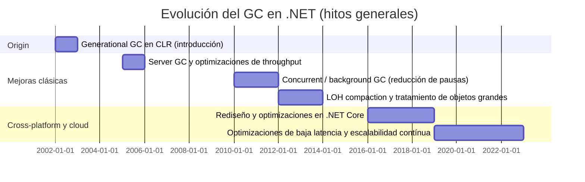
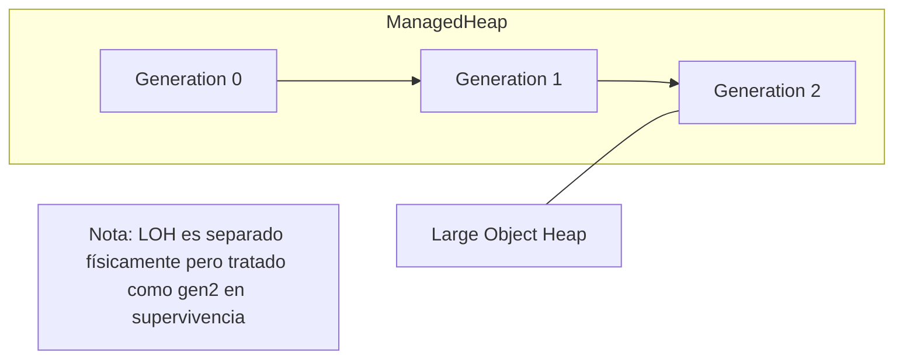
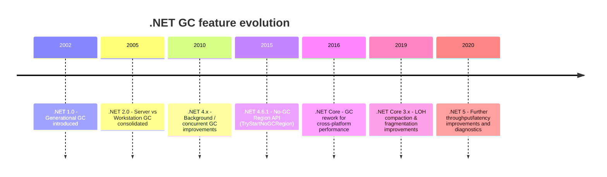
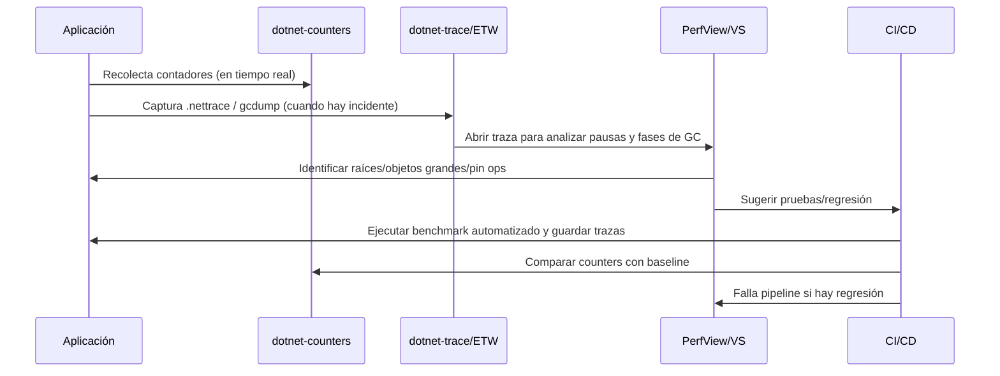

La gestión eficiente de la memoria es un pilar fundamental para el rendimiento y la estabilidad de aplicaciones modernas, especialmente en entornos backend y cloud donde la demanda de escalabilidad y baja latencia es crítica. El Garbage Collector (GC) de .NET es una pieza clave en esta gestión automática, diseñada para simplificar el manejo de memoria y evitar errores comunes asociados a la administración manual. En un ecosistema donde la competencia con otros runtimes como Java HotSpot es constante, entender cómo funciona el GC de .NET y cómo ha evolucionado resulta esencial para sacar el máximo provecho de esta tecnología.

En este artículo, abordaremos desde los conceptos básicos y la arquitectura interna del GC en .NET, incluyendo su modelo generacional y modos de operación, hasta las mejoras más relevantes introducidas en las últimas versiones del framework. También cubriremos herramientas y metodologías para monitorear y probar el comportamiento del GC, así como consejos prácticos para optimizar el rendimiento de las aplicaciones mediante un manejo adecuado de las asignaciones y configuraciones específicas.

El contenido está orientado a ingenieros backend senior y arquitectos cloud con un conocimiento intermedio de los conceptos de gestión de memoria y la plataforma .NET, buscando ofrecer una visión técnica pero accesible que permita tomar decisiones informadas para mejorar la eficiencia y escalabilidad de sistemas en producción.

## Tabla de contenidos

- Introduction and Historical Context
- Fundamentals of .NET Garbage Collection
- Generations in .NET GC: Concepts and Mechanics
- Evolution of the .NET GC: Major Improvements and Versions
- Testing and Monitoring .NET GC Behavior
- Practical Tips and Tricks for Optimizing GC
- Limitations, Tradeoffs, and Alternatives
- Conclusion and Recommendations

## Introduction and Historical Context

La gestión automática de memoria fue una de las decisiones arquitectónicas centrales cuando Microsoft diseñó .NET y su Common Language Runtime (CLR). Este apartado resume por qué nació el recolector de basura (GC) en .NET, cómo heredó ideas de generaciones anteriores, cuáles fueron sus objetivos de diseño y cómo encaja en el ecosistema de runtimes administrados.

### Retos que motivaron la introducción del GC en .NET

- Errores humanos con memoria manual: fugas, dobles liberaciones y corrupción de memoria en código C/C++ son una fuente persistente de fallos en servidores y aplicaciones de larga ejecución.
- Fragmentación y complejidad en entornos multihilo: liberar y compactar memoria de forma segura y eficiente cuando múltiples hilos asignan y liberan objetos requiere coordinación que complica el desarrollo.
- Latencia y pausas impredecibles: en servidores y GUI la latencia de respuesta es crítica; las estrategias de manejo de memoria deben equilibrar throughput y pausas.
- Finalización y recursos no administrados: manejo de determinismo en la liberación de recursos (I/O, handles) sin obligar al programador a liberar memoria manualmente.

Estos problemas empujaron a .NET hacia un modelo administrado donde el runtime controla el ciclo de vida de los objetos para reducir la carga cognitiva del desarrollador y mejorar la robustez.

### Evolución: desde sistemas anteriores hasta la implementación en .NET

La historia no es lineal: antes de .NET existían varias técnicas de gestión de memoria:
- Asignación manual (malloc/free): máxima eficiencia cuando se hace correctamente, pero propenso a errores.
- Conteo de referencias: determinista para la mayoría de casos, pero falla con ciclos y tiene overhead por actualizaciones de contadores.
- Recolectores conservadores (p. ej. Boehm): permiten migrar código C/C++ sin meta-data completa, pero con limitaciones (retención falsa, no compactación segura).

.NET apostó por un recolector trazador generacional (mark-compact/mark-sweep híbrido) basándose en la hipótesis generacional: la mayoría de los objetos mueren jóvenes. A partir de esa base, el GC de .NET evolucionó hacia modos diferenciados (workstation vs server), recolecciones concurrentes/background para reducir pausas, mejoras en el tratamiento del Large Object Heap (LOH) y una reescritura para .NET Core orientada a escalabilidad y cross-platform.

### Objetivos y principios de diseño del GC de .NET

- Throughput (rendimiento agregado): minimizar el tiempo global gastado en GC para maximizar procesamiento útil.
- Latencia y pausas cortas: ofrecer modos que reduzcan el stop-the-world para aplicaciones interactivas o de baja latencia.
- Escalabilidad en servidores: aprovechar múltiples núcleos con heaps por procesador y GC en paralelo.
- Bajo coste para el desarrollador: que la mayoría del código no necesite preocuparse por la liberación de memoria.
- Interoperabilidad: coexistir con código nativo (P/Invoke, objetos pinneados) y con finalizadores.

Estas metas explican por qué el GC de .NET expone configuraciones (server/workstation, concurrent/background) y por qué el runtime mantiene metadata de tipos y raíces (pila, registros) para hacer un trazado preciso.

### .NET GC en el contexto de runtimes administrados

El GC de .NET se ubica junto a otras implementaciones trazadas como HotSpot (Java) o V8 (JavaScript). Comparte ideas clave (generacionalidad, trazado de raíces) pero difiere en los tradeoffs: .NET tiende a optimizar interoperabilidad con código nativo y ofrece modos explícitos adaptados a escenarios server vs desktop. A su vez, las mejoras recientes en .NET Core/.NET 5+ han acercado su diseño a requisitos cloud—menor latencia, mejor compactación del LOH y menor memoria residente en cargas de trabajo escalables.

En resumen: el GC de .NET es la respuesta a errores humanos, complejidad multihilo y requisitos de rendimiento/latencia. No es una panacea, sino una pieza de infraestructura con opciones y tradeoffs que iremos desgranando en secciones posteriores.

*Diagrama: .NET GC — timeline de evolución*



*Diagrama: Comparación de enfoques de gestión de memoria (pre-.NET GC)*

| Enfoque | Mecanismo | Ventajas | Desventajas |
|---|---:|---|---|
| Manual (malloc/free) | Programador controla asignación/liberación | Máximo control y potencialmente mínima sobrecarga | Alto riesgo de fugas, corrupción y bugs difíciles de depurar |
| Conteo de referencias | Incremento/decremento de contador por referencia | Determinista, sencillo de entender | Overhead por actualización; no resuelve ciclos sin ayuda adicional |
| Recolector conservador (Boehm) | Trazado sin metadata completa (conservador) | Permite migración de código no administrado | Retenciones falsas, no siempre compacta, menos seguro para pinning |
| Recolector generacional trazador (modelo .NET) | Mark/compact con generaciones y recolecciones parciales | Menos pausas para objetos jóvenes, buena latencia/throughput | Requiere metadata, complejidad en interacción con código nativo |

## Fundamentals of .NET Garbage Collection

### ¿Qué es el "managed heap" y cómo lo organiza el GC de .NET?

El "managed heap" es el área de memoria que el runtime .NET (CLR/CoreCLR) reserva para los objetos gestionados. No es una sola región monolítica: el GC lo organiza en varias estructuras lógicas para mejorar rendimiento y reducir pausas.

Conceptos clave:

- Generaciones: gen0, gen1 y gen2. Objetos recién creados empiezan en gen0; si sobreviven a colecciones se promueven a gen1 y luego a gen2. El heurístico parte de la observación de que la mayoría de objetos mueren jóvenes.
- Segmentos: el heap se compone de uno o más "segments" (bloques contiguos de memoria). Para Server GC hay múltiples heaps (uno por núcleo lógico), cada uno con sus propios segmentos.
- Large Object Heap (LOH): objetos grandes (típicamente > 85 KB) se asignan en el LOH. Históricamente el LOH no se compactaba con frecuencia, aunque versiones recientes introducen compactación controlada.
- Thread Allocation Contexts (TACs): cada hilo obtiene un pequeño área (bump-pointer) para hacer asignaciones rápidas sin atomics.

Esta organización reduce contención y hace la asignación casi O(1) en el camino rápido.

### ¿Cómo identifica el GC objetos vivos vs muertos?

El GC usa un algoritmo de traza a partir de raíces (root set). Las raíces incluyen:

- Registros de CPU y montones de stack de cada hilo.
- Variables estáticas y referencias dentro del AppDomain / Assembly.
- GC handles (pinned handles, weak handles, etc.).
- La cola de finalizadores (objetos con finalizadores pendientes).

A partir de esas raíces, el GC recorre las referencias siguiendo punteros y marca objetos alcanzables como vivos. Todo lo que no esté marcado al final del trazado se considera muerto y queda listo para reclamación.

Mecanismos importantes:

- Card table / write barriers: cuando un objeto de una generación inferior referencia uno de una generación superior, el runtime usa una tabla de tarjetas para registrar ese "cross-generation reference"; esto permite que las colecciones de generaciones inferiores no tengan que escanear todo gen2.
- Remembered sets: estructuras que mantienen referencias de objetos promovidos o referencias pinneadas para optimizar el trazado.

### Fases de un ciclo típico de GC

Un ciclo de GC no es simplemente "pause + free"; aquí están las fases simplificadas:

1. Safe-point y suspensión (stop-the-world parcial o total): los hilos cooperan para entrar en un estado donde sus stacks son consistentes.
2. Root scanning: el GC escanea stacks, registros y handles para obtener el conjunto inicial de raíces.
3. Mark / tracing: el GC traza referencias desde las raíces y marca objetos alcanzables. En "Background/Concurrent GC" esta fase puede ocurrir concurrentemente con la ejecución de la aplicación (con restricciones).
4. Relocation / copy / compact:
   - Para generaciones jóvenes, .NET usa colecciones basadas en copia (evacuación) que copian objetos vivos a un nuevo espacio y actualizan punteros (rápido y evita fragmentación).
   - Para gen2 (y LOH históricamente), hay una mezcla de marcado y compactación: marcar vivos, luego compactar en una pasada de pausa.
5. Pointer fixup: se actualizan todas las referencias a los objetos movidos.
6. Reclamación y reuso de segmentos: se liberan bloques con solo objetos muertos.
7. Finalización: objetos con finalizadores que dejaron de ser alcanzables se pasan al finalizer thread para ejecutar ~Finalize.

Pausas y concurrencia: en Server GC y Workstation GC sin background, muchas de estas fases implican pausas STW (stop-the-world). Background/Concurrent GC reduce la pausa de la fase de marcado de gen2 usando trabajo concurrente, aunque todavía requiere una pausa para la compactación/relocation.

Diagrama (colección típica) — ver la sección de diagramas.

### ¿Cómo funciona la asignación "under the hood"?

- Camino rápido (fast-path): para objetos pequeños, el runtime incrementa un puntero de asignación (bump-pointer) dentro del TAC del hilo; esto es una operación muy barata (sin locks).
- Cuando el TAC se agota, el hilo solicita más espacio al heap global; eso puede requerir locks y, si no hay suficiente espacio en el segmento, disparar una colección gen0.
- Para Server GC hay múltiples heaps (uno por CPU). Cada heap tiene su propio TACs, por eso Server GC escala mejor en throughput en máquinas con muchos núcleos.
- Objetos grandes se asignan directamente en el LOH, sin pasar por el camino rápido clásico; así se evita copiar buffers grandes en colecciones jóvenes.

Ejemplo práctico: una ráfaga de pequeñas asignaciones causará colecciones gen0 frecuentes. Si muchos objetos sobreviven a una gen0, subirán a gen1/gen2 y reducirán frecuencia de GC pero aumentarán costo de colecciones completas.

### Modos principales de GC en .NET

- Workstation GC: optimizado para latencia (aplicaciones de escritorio). Por defecto busca reducir pausas en máquinas clientes. Implementa versiones concurrent/background para mitigar pausas de gen2.
- Server GC: orientado a throughput en servidores. Crea un heap por procesador lógico y realiza colecciones en paralelo por cada heap; aumenta utilización pero reduce latencia por core.
- Background / Concurrent GC: modo que permite marcar gen2 concurrentemente con la ejecución de la aplicación; disponible tanto para Workstation como para Server para reducir pausas de marcado de gen2.
- Latency modes (GCSettings.LatencyMode): opciones programáticas para influir en la agresividad del GC — por ejemplo `SustainedLowLatency` y `LowLatency` para ventanas cortas donde se desea minimizar pausas (útil en cortes críticos), a costa de mayor uso de memoria.

Cómo configurarlo:

- En .NET Core / .NET 5+: habilitar Server GC desde el proyecto (.csproj) con <ServerGarbageCollection>true</ServerGarbageCollection> o mediante variables de entorno (COMPlus_gcServer).
- Inspección en runtime con `System.GC` y `System.Runtime.GCSettings`.

### Recomendaciones prácticas rápidas

- Mida antes de cambiar: use dotnet-trace, dotnet-counters, perfview o herramientas APM.
- Para aplicaciones servidor con múltiples núcleos y alto throughput, pruebe Server GC.
- Use LatencyMode solo en ventanas cortas y controladas; evita usarlo globalmente en producción sin pruebas.

*Diagrama: Ciclo típico de recolección del GC de .NET*

```mermaid
flowchart LR
  A[Aplicación Ejecutando] --> B[Safe-point: hilos se cooperan]
  B --> C[Scan Roots]
  C --> D[Mark/Trace (marcado de objetos alcanzables)]
  D --> E{Background GC?}
  E -- Sí --> F[Mark concurrente (app continúa)]
  E -- No --> G[Mark STW]
  F & G --> H[Evacuate / Compact / Copy]
  H --> I[Fixup referencias]
  I --> J[Reclaim memoria]
  J --> K[Finalizers encolados]
  K --> L[Aplicación reanuda ejecución]
  style F fill:#f9f,stroke:#333,stroke-width:1px
  style G fill:#fdd,stroke:#333,stroke-width:1px
```

*Diagrama: Layout del managed heap y segmentos*

```mermaid
flowchart TB
  subgraph Process
    direction TB
    H[Managed Heaps]
    subgraph Heaps
      direction LR
      Heap1[Heap (CPU0)]
      Heap2[Heap (CPU1)]
      HeapN[Heap (CPUN)]
    end
  end

  Heap1 --> S1[Segment: Gen0 (ephemeral)]
  Heap1 --> S2[Segment: Gen1]
  Heap1 --> S3[Segment: Gen2]
  Heap1 --> LOH1[Large Object Heap]

  click LOH1 "https://docs.microsoft.com/dotnet/standard/garbage-collection/large-object-heap" "LOH docs"

  note right of Heap1
    Cada heap tiene TACs por hilo
    y su propio conjunto de segmentos.
  end

  style LOH1 fill:#ffd,stroke:#333
  style Heap1 fill:#eef,stroke:#333
  style Heap2 fill:#eef,stroke:#333
  style HeapN fill:#eef,stroke:#333
```

## Generations in .NET GC: Concepts and Mechanics

### Hipótesis generacional: por qué importa

La hipótesis generacional postula dos observaciones empíricas: la mayoría de los objetos mueren jóvenes, y los objetos que sobreviven mucho tiempo tienen mayor probabilidad de seguir vivos. El recolector de .NET explota esto para reducir trabajo y pausas: en lugar de escanear y copiar todo el heap en cada colección, se centra primero en los objetos recién creados (donde está la mayor mortalidad). Eso reduce el coste promedio por colección y las pausas perceptibles por la mutua interacción con el recolector.

Por qué importa en producción: si tu aplicación crea muchos objetos efímeros (peticiones HTTP, objetos DTO, buffers temporales), la GC puede reciclarlos barato sin tocar la parte del heap con objetos de larga vida (caches, singletons). Si rompes la hipótesis (por ejemplo, reteniendo referencias a objetos nuevos durante mucho tiempo o alocar grandes buffers constantemente), la GC realizará más colecciones costosas (promociones, gen2/full GCs) y verás latencias y mayor uso de memoria.

### Generaciones 0, 1 y 2: definición y gestión en .NET

- Gen 0: espacio para objetos recién creados. Es pequeño y se colecta con mucha frecuencia. Las colecciones de gen 0 son rápidas (corto tiempo de pausa) y la mayoría de objetos mueren aquí.
- Gen 1: espacio intermedio ("survivor"). Objetos que sobreviven a una colección de gen 0 se promocionan a gen 1. Gen 1 actúa como amortiguador para evitar promociones prematuras a gen 2.
- Gen 2: espacio para objetos de larga duración. Objetos que sobreviven sucesivas promociones terminan en gen 2. Una colección de gen 2 corresponde a una "full GC" (recolecta todas las generaciones y, típicamente, el LOH también).

Conceptualmente, cada generación agrupa objetos por expectativa de vida. Internamente, .NET mantiene segmentos y estructuras que permiten copiar y compactar (según modo) objetos durante las colecciones.

### ¿Qué dispara una colección en cada generación?

- Gen 0: se dispara cuando el espacio disponible en la región ephemera (ephemeral segment) se agota por nuevas asignaciones, o explícitamente por `GC.Collect(0)`. También puede iniciarse por heurísticas internas cuando hay presión de memoria.
- Gen 1: una colección de gen 1 normalmente ocurre cuando una recolección de gen 0 promueve suficientes objetos y el sistema decide que debe limpiar gen 1 para liberar espacio; también `GC.Collect(1)` la fuerza.
- Gen 2 (Full GC): se dispara cuando gen 2 está lleno o hay presión de memoria severa (ej. asignaciones grandes repetidas, bajo memoria física), por `GC.Collect(2)` o cuando el runtime necesita recuperar memoria a nivel de proceso. En modo servidor con background GC, las colecciones gen 2 pueden ejecutarse en background mientras que los hilos mutadores siguen ejecutándose (con reglas específicas).

Nota práctica: `GC.Collect(n)` recoge la generación n y todas las inferiores — `GC.Collect(1)` afecta a gen 0 y gen 1.

### Large Object Heap (LOH) y su relación con las generaciones

LOH alberga objetos grandes (umbral por defecto: 85,000 bytes). Los objetos en LOH no se asignan en el heap generacional normal; sin embargo, se consideran conceptualmente equivalentes a generación 2 en términos de supervivencia: no se mueven entre gen 0/1/2. Por defecto, hasta .NET 4.5 el LOH no se compactaba, con lo que la fragmentación era una preocupación real. A partir de .NET 4.5 existió la opción de compactar LOH en la siguiente colección completa mediante `GCSettings.LargeObjectHeapCompactionMode` y en .NET Core y .NET 5+ la gestión ha mejorado (mejor compactación, reducción de fragmentación y mejoras en el comportamiento con objetos pinneados).

Consecuencia práctica: muchas asignaciones grandes frecuentes fragmentan LOH y disparan colecciones completas. Evita crear y destruir buffers grandes continuamente: mejor reutilizar arrays usando ArrayPool<T> o memory pooling.

### Implicaciones para el rendimiento de la aplicación

- Latencias y pausas: las colecciones de gen 0 son rápidas; las de gen 2 son costosas. Diseña para minimizar full GCs. Promover muchos objetos al gen 2 incrementa la frecuencia de full GCs.
- Fragmentación/LOH: uso intensivo de arreglos grandes sin pooling puede aumentar el RSS y provocar full GCs y compactaciones costosas.
- Pinning: objetos pinneados impiden la compactación y aumentan fragmentación; minimizar pinning (p. ej., en interop con native) reduce problemas.
- Finalizadores: los objetos con finalizador sobreviven al menos una colección más (se colocan en la queue de finalización), lo que provoca promociones innecesarias si no se gestionan bien.

Buenas prácticas rápidas:
- Reutiliza buffers grandes con `System.Buffers.ArrayPool<T>`.
- Evita retenedores globales de objetos temporales; favor patterns que reduzcan raíces.
- Usa `GC.GetGeneration(obj)` y counters para entender promociones.
- Monitoriza con `dotnet-counters`, `dotnet-trace`, PerfView o herramientas APM para ver frecuencias de gen0/gen2, pausas y LOH uso.

### Ejemplo corto (C#)

```csharp
using System;

class Program
{
    static void Main()
    {
        object o = new byte[16]; // pequeño -> gen0
        Console.WriteLine(GC.GetGeneration(o)); // 0

        // Forzamos colecciones y observamos promociones
        GC.Collect(0);
        GC.WaitForPendingFinalizers();
        Console.WriteLine(GC.GetGeneration(o)); // 0 o 1 según sobreviva

        // Crear objeto grande -> LOH
        object big = new byte[100_000];
        Console.WriteLine(GC.GetGeneration(big)); // típicamente 2 (LOH)

        // Forzar full GC
        GC.Collect(2);
        GC.WaitForPendingFinalizers();
    }
}
```

Explicación: `GC.GetGeneration` muestra la generación actual; `GC.Collect(n)` fuerza la colección de la generación n y menores. El array de 100k supera el umbral LOH y se aloja en LOH (comportamiento típico).

*Diagrama: Flujo: asignación, colecciones y promociones generacionales*

```mermaid
flowchart LR
  A[Allocate small object] --> B[Gen 0]
  B -->|Die in gen0| X[Collected]
  B -->|Survive| C[Gen 1]
  C -->|Die in gen1| X
  C -->|Survive| D[Gen 2]
  D -->|Full GC| X

  A2[Allocate large object (>85kB)] --> LOH[Large Object Heap (LOH)]
  LOH -->|Considered gen2 for lifetime| D
  LOH -->|Fragmentation| Frag[LOH fragmentation]

  click B "https://learn.microsoft.com/dotnet/standard/garbage-collection/fundamentals" "GC fundamentals"
```

*Diagrama: Arquitectura: layout generacional incluyendo LOH*



## Evolution of the .NET GC: Major Improvements and Versions

A continuación repaso los hitos más relevantes en la evolución del recolector de basura de .NET, explico las diferencias prácticas entre los modos server y workstation, qué aporta el background GC, las opciones de baja latencia y las mejoras introducidas en .NET Core / .NET 5+.

### Hitos principales

- Generational GC (release inicial, .NET 1.x): adopción del esquema generacional (Gen0/Gen1/Gen2) y del heap manejado por el CLR — fundamento de todas las optimizaciones posteriores.
- Server vs Workstation (introducido en versiones tempranas, consolidado en .NET 2.0): dos configuraciones optimizadas para cargas distintas: throughput (server) y baja latencia/cliente (workstation).
- Background / Concurrent GC (evolución en .NET 2.0–4.x): pasar de pause-globales a colecciones de Gen2 que se ejecutan en paralelo con la mutator, reduciendo pausas perceptibles en aplicaciones interactivas/servicios.
- No-GC Region / GC.TryStartNoGCRegion (introducido en .NET 4.6.1 y disponible en .NET Core): API para pedir al runtime que evite colecciones durante una sección crítica, si se cumplen las condiciones de memoria.
- LOH compaction y mejoras de heap (varias versiones, encabezadas en .NET Core 3.x y .NET 5+): reducción de fragmentación, compactación controlada del Large Object Heap.
- Reescritura y optimizaciones cross-platform en .NET Core / .NET 5+: mejoras de rendimiento, escalabilidad en Linux/macOS, mejor uso de múltiples núcleos, reducción de pausas y nuevos knobs de configuración.

(Ver línea temporal en el diagrama adjunto.)

### Server vs Workstation: diferencias prácticas y cuándo usar cada una

- Server GC
  - Modelo: un heap por núcleo lógico y threads de recolección dedicados. Más paralelismo en la recolección.
  - Ventajas: mayor throughput en aplicaciones CPU/u I/O intensivas y servidores con muchas peticiones concurrentes.
  - Coste: uso de memoria mayor (más heaps), mayor coste de contexto para heaps múltiples, posibles pausas más grandes en ciertos escenarios si no está bien dimensionado.
  - Uso recomendado: backend server processes, microservicios con alta concurrencia en máquinas multicore.

- Workstation GC
  - Modelo: heap único (o menos paralelo), optimizado para baja latencia y entornos de escritorio/servicio interactivo.
  - Ventajas: latencias de respuesta menores en cargas interactivas; mejor para aplicaciones con UI o donde la latencia es crítica.
  - Coste: menor throughput en cargas altamente concurrentes.
  - Uso recomendado: aplicaciones cliente, procesos con baja concurrencia o cuando se prioriza latencia por petición.

Cómo activar: en .NET Core / .NET 5+ via runtimeconfig.json o variable de entorno.

Ejemplo runtimeconfig.json para Server GC:

```json
{
  "runtimeOptions": {
    "configProperties": {
      "System.GC.Server": true
    }
  }
}
```

O usar la variable de entorno (ej.: para pruebas): `COMPlus_gcServer=1`.

### ¿Qué es background GC y por qué importa?

Background GC permite que una colección de Gen2 se realice concurrentemente con la ejecución de la aplicación. En lugar de detener todo el mundo durante la compactación de Gen2, el GC crea hilos en segundo plano que van reclamando y compactando mientras la mutator sigue ejecutándose (con algunos puntos de sincronización). El efecto práctico: grandes reducciones en las pausas «Full GC» y mejor experiencia para aplicaciones interactivas o servicios con picos de trabajo.

Tradeoffs: la concurrencia consume CPU extra (hilos de GC), y la compactación concurrente puede incrementar el uso temporal de memoria (retener más objetos hasta completar la compactación).

### Modos de baja latencia y sus tradeoffs

- GCLatencyMode.LowLatency / SustainedLowLatency (API: `System.Runtime.GCSettings.LatencyMode`): reduce la frecuencia de colecciones de generación baja y evita algunas colecciones de fondo. Se usa para ventanas cortas donde la latencia es crítica.
- No-GC Region (`GC.TryStartNoGCRegion` / `GC.EndNoGCRegion`): reservar una región sin permitir colecciones mientras dura la operación. Requiere estimar y reservar memoria suficiente; si falla, no se desactiva la GC globalmente.

Tradeoffs comunes
- Aumenta el consumo de memoria (se retrasan colecciones).
- Sólo es práctico por periodos cortos o cuando se pueden pre-asignar buffers.
- No garantiza ausencia total de pausas si hay presión de memoria o error en la reserva.

Ejemplo C#: usar LowLatency y TryStartNoGCRegion

```csharp
using System;
using System.Runtime;

// Modo de baja latencia para una sección crítica (ejecución corta)
GCSettings.LatencyMode = GCLatencyMode.LowLatency;

// Intentar entrar en una región sin GC (reserva 100 MB)
if (GC.TryStartNoGCRegion(100 * 1024 * 1024)) {
    try {
        // operación crítica sin pausas por GC
    }
    finally {
        GC.EndNoGCRegion();
    }
} else {
    // fallback: no se pudo reservar la región
}
```

### Mejoras en .NET Core / .NET 5+ frente a .NET Framework

- Cross-platform y reescritura del runtime: el GC fue optimizado para Linux/macOS y escenarios cloud; se redujeron costuras específicas de Windows.
- Mejor uso de múltiples núcleos: escalado más eficiente de Server GC y menor overhead por heap.
- LOH compactado y mejoras de fragmentación introducidas o consolidadas en .NET Core 3.x y .NET 5: menor crecimiento de memoria en aplicaciones con muchos objetos grandes.
- Más knobs de configuración (configProperties), telemetría y diagnósticos (dotnet-trace, dotnet-dump, EventCounters) que facilitan la toma de decisiones para tuning.

En resumen: la evolución se ha movido desde un esquema generacional clásico a un GC más concurrente, configurable y optimizado para cargas cloud/containers. Para arquitectos: escoger server vs workstation y usar mecanismos de baja latencia debe basarse en perfil de carga, presupuesto de memoria y observabilidad real (trazas y métricas).

*Diagrama: .NET GC feature evolution timeline*



*Diagrama: Feature comparison across .NET GC versions*

| Feature | .NET Framework (pre-Core) | .NET Framework (4.x) | .NET Core 2.x | .NET Core 3.x / .NET 5+ |
|---|---:|---:|---:|---:|
| Generational GC | Sí (fundamento) | Sí | Sí | Sí |
| Server / Workstation modes | Sí | Sí | Sí | Sí (mejor escalado) |
| Background / concurrent GC | Limitado | Mejorado | Sí | Sí (mejoras) |
| No-GC Region (TryStartNoGCRegion) | Parcial / tardío | Introducido | Sí | Sí |
| LOH compaction | Limitado | Introducido en updates | Mejoras | LOH compaction más estable |
| Cross-platform optimizations | No | Parcial | Sí (reescritura) | Sí, consolidado |
| Diagnostics / knobs | Menos | Mejor | Más | Más (EventCounters, configProperties) |

## Testing and Monitoring .NET GC Behavior

Observar, reproducir y diagnosticar el comportamiento del recolector en producción y en pruebas es imprescindible para evitar latencias inesperadas. En esta sección resumo las herramientas, métricas clave, técnicas para generar carga y cómo integrar la monitorización en pipelines CI/CD.

### Herramientas y APIs principales

- dotnet-counters (CLI, parte del .NET SDK): monitor en tiempo real contadores de `System.Runtime` como `gc-heap-size`, `gen-0-gc-count`, `time-in-gc`, `allocated-bytes-rate`, `loh-size`. Útil para alarmas y gráficos sencillos.
- dotnet-trace (CLI): captura trazas EventPipe/ETW (.nettrace) para análisis profundo (GCStart, GCEnd, GCHeapStats, GC/Mark, GC/Free). Se usa para analizar pausas y fases internas de GC.
- dotnet-gcdump: obtiene volcados de estado del heap (gcdump) que se pueden abrir con `dotnet-gcdump analyze` o PerfView/Visual Studio para inspeccionar raíces y tamaños de generación.
- dotnet-dump: para crear y analizar volcados de minidump nativos y managed.
- PerfView (Windows, cross-platform builds available): sigue siendo la herramienta más eficaz para analizar .NET GC/ETW trazas y ver fases de GC, pausas por hilo y dependencias.
- ETW / EventPipe: nivel bajo para capturar eventos de runtime en producción con bajo overhead; `dotnet-trace` y `PerfView` usan estos mecanismos.

Versiones: use las utilidades provistas por su SDK (.NET 6/7+ tienen herramientas maduras). PerfView se obtiene desde https://github.com/microsoft/perfview.

### Interpretación de métricas clave

Consulte la tabla más abajo para un resumen práctico. Puntos esenciales:

- Pause times (latencia): mida percentiles (P50/P95/P99). Pausas largas en Gen2 indican trabajo de compactación/mark/sweep o demasiados objetos vivos.
- Heap sizes y tendencias: crecimiento constante de heap sin caídas sugiere fugas o objetos promovidos indebidamente a Gen2.
- Collection counts: muchas Gen0 collections con alto allocation-rate puede indicar presión de alocación; muchas Gen2 collections son más costosas y deben minimizarse.
- Time-in-GC (%): si la aplicación pasa >5-10% en GC bajo carga estable, investigue allocation-rate y lifetime of objects.

### Simular y stress-testear escenarios de GC

Técnicas prácticas:

- Microbenchmarks orientados a asignaciones: use un pequeño harness que genere objetos cortos y largos, controlando qué se mantiene vivo (ver ejemplo C# abajo).
- Aumentar la tasa de asignación: simular cargas de pico para forzar Gen0 collections y observar if background/compacting causes long pauses.
- Pruebas de SOAK y ramp-up: ejecutar pruebas largas para detectar leak/regresión de promoción a Gen2.
- GCStress (solo para pruebas de runtime, environment variables COMPlus_GCStress* en builds del runtime) — no apropiado para producción.

### Analizar logs y trazas para identificar cuellos de botella

Workflow recomendado:

1. Capturar counters (dotnet-counters) durante la reproducció n del problema.
2. Si hay pausas, recolectar un `.nettrace` con dotnet-trace o PerfView durante el incidente.
3. Abrir la traza en PerfView: inspeccionar `GC/Start`, `GC/Stop`, eventos de `GCHeapStats` y ver timelines por hilo para identificar blockers (pinned objects, I/O durante GC, finalizers lentos).
4. Generar y analizar `gcdump` para ver raíces que mantienen objetos vivos en Gen2.

Consejos: busque objetos grandes en LOH, hilos con pin ops frecuentes y finalizers con latencia.

### Integración en CI/CD (mejores prácticas)

- Automatice pruebas de rendimiento que incluyan métricas de GC: asignaciones por request, heap peak, time-in-gc (P95/P99). Run under representative load for 1–5 minutes.
- Grave counters y traces como artefactos (dotnet-counters collect / dotnet-trace collect) y guárdelos junto a la build para análisis post-mortem.
- Baselines y alertas: definir umbrales (ej. time-in-gc > 5% o allocation-rate > X MB/s) y fallar pipelines solo si superan límites razonados.
- Regression detection: compare métricas con la build base usando scripts (por ejemplo, prombench, or simple JSON diffs) y bloquear merges que aumenten allocation-rate o latencias de GC.
- Use contenedores/entornos reproducibles para minimizar ruido de OS/host.

*Diagrama: Flujo de monitorización y diagnóstico de GC*



*Diagrama: Métricas comunes de GC y su interpretación*

| Métrica | Qué indica | Interpretación práctica |
    |---|---:|---|
    | gen-0-gc-count / gen-1-gc-count / gen-2-gc-count | Nº de colecciones por generación | Muchas Gen0 => alta tasa de asignación; muchas Gen2 => trabajo costoso en heap completo |
    | gc-heap-size | Tamaño total del heap gestionado | Crecimiento sostenido → posible fuga o promoción excesiva |
    | allocated-bytes-rate | MB/s asignados | Alto valor → optimizar alocaciones; reduce throughput si CPU en GC aumenta |
    | loh-size / poh-size | Tamaño del Large Object Heap / Pinned OH | Objetos grandes frecuentes → fragmentación, pausas de compactación |
    | time-in-gc (%) | % tiempo CPU en GC (métrica agregada) | >5–10% bajo carga sostenida → investigar allocation-rate y lifetimes |
    | GC pause P95/P99 | Latencias de pausas GC | Picos en P99 requieren analizar causas: compactación, finalizers lentos, pinned objects |

## Practical Tips and Tricks for Optimizing GC

Reducir la presión del GC no es magia: es disciplina de diseño y conocimiento de las herramientas. Aquí tienes patrones concretos, API y configuraciones que funcionan en producción.

### Patrones de código para reducir presión y fragmentación

- Reusar buffers en lugar de crear arrays/strings en hot paths. Usa `ArrayPool<T>` para buffers grandes y frecuentes (evita crear y descartar arrays >85,000 bytes — LOH).
- Evita boxing de value-types y allocations implícitas (por ejemplo, enumerables de LINQ y `string.Format` repetitivo). Prefiere loops `for` sobre `IEnumerable` en hot paths.
- Minimiza closures en callbacks: las lambdas que capturan variables crean objetos de cierre. Usa `static` local functions (C# 9+) o pasar estado explícito.
- Prefiere `struct` cuando tenga sentido (sin boxing) y `Span<T>/Memory<T>` para operaciones de slicing sin alloc.
- Reduce la frecuencia de asignaciones de objetos grandes para evitar fragmentación del LOH; si necesitas grandes buffers, usa `ArrayPool<T>` o memoria nativa.

### Uso práctico de Span<T>, ArrayPool<T> y APIs de memoria

- `Span<T>` y `Memory<T>` permiten manipular memoria sin asignaciones. `stackalloc` con `Span<T>` es excelente para buffers temporales pequeños.
- `ArrayPool<T>.Shared.Rent(size)` evita crear arrays nuevos; siempre `Return` cuando termines. Útil para parsing, serialización y redes.
- `String.Create` permite construir cadenas sin temporales intermedias.

Ejemplo rápido (C#):

```csharp
// Rentar un buffer, usar Span y devolverlo
var pool = ArrayPool<byte>.Shared;
byte[] buffer = pool.Rent(1024 * 8); // 8KB
try
{
    Span<byte> span = buffer.AsSpan(0, 1024);
    // Procesar usando span sin asignaciones adicionales
    Process(span);
}
finally
{
    pool.Return(buffer);
}

void Process(Span<byte> s) { /* ... */ }
```

Evita olvidar `Return` — usa wrappers que devuelvan automáticamente buffers (IDisposable) en helpers para reducir fugas.

### Configurar modos de GC y thresholds

Decisiones típicas:
- Server GC (`System.GC.Server=true`) para servicios en máquinas con múltiples núcleos y alto throughput: mejora paralelismo de colección y latencia promedio.
- Workstation GC (por defecto en algunos escenarios) para aplicaciones de escritorio/ baja concurrencia.
- Para ventanas críticas de baja latencia usa `GC.TryStartNoGCRegion` / `GC.EndNoGCRegion` o `GCSettings.LatencyMode = GCLatencyMode.LowLatency` (con cuidado; requiere que estimes memoria disponible).

Configurar en .NET Core se hace via runtimeconfig.json (propiedades `System.GC.Server`, `System.GC.Concurrent`) o variables de entorno en escenarios avanzados — siempre probar en entorno lo más parecido a producción.

### Peligros comunes que degradan el GC

- Pinning prolongado: objetos fijados impiden el compactador y fragmentan el heap (especialmente LOH).
- Finalizadores lentos o que realizan I/O: retienen objetos en la cola de finalización y promueven a gen2.
- Exceso de allocations en hot-paths: incluso muchas gen0 collections pueden matar throughput.
- Crear grandes objetos frecuentemente (>85,000 bytes) genera estrés en LOH y fragmentación.

### Pinned objects y finalizadores: buenas prácticas

- Pinear solo por el tiempo mínimo: usa `fixed` para pin de corta duración en métodos y `GCHandle` solo cuando no hay alternativa. Evita pinning a través de `async/await` boundaries.
- Para interoperabilidad a largo plazo, considera memcpy a memoria nativa (`Marshal.AllocHGlobal`) y administrar manualmente el ciclo de vida.
- Implementa finalizadores solo si necesitas liberar recursos no administrados. Sigue el patrón `IDisposable` + `GC.SuppressFinalize(this)` y preferir `SafeHandle` para recursos nativos.
- Mantén el código del finalizador mínimo; delega liberación costosa a un hilo de fondo.

### Resumen de acciones concretas

- Usar `Span<T>`/`Memory<T>` y `ArrayPool<T>` en hot paths.
- Evitar closure allocations, boxing y LINQ al estilo "allocate-every-iteration".
- Seleccionar Server vs Workstation GC según carga, y usar NoGCRegion/LatencyMode para ventanas críticas.
- Evitar pinning prolongado y finalizadores pesados; emplear `SafeHandle` y `IDisposable`.

*Diagrama: Decision tree for GC tuning strategies*

```mermaid
flowchart TD
  A[¿Alta tasa de allocations?] -->|Sí| B[¿Mayoría <85KB?]
  A -->|No| C[¿Pausas/latencia visibles?]
  B -->|Sí| D[Usa Span/ArrayPool/ValueTask; optimiza hot-path]
  B -->|No| E[Evita LOH allocations repetidas; usa ArrayPool o memoria nativa]
  C -->|Sí| F[Considera Server GC / ajustar LatencyMode / NoGCRegion]
  C -->|No| G[Monitorear y perfilar (dotnet-counters, PerfView)]
  D --> H[Revisar closure/boxing/LINQ allocations]
  E --> I[Pool para objetos grandes o fragmentación controlada]
  F --> J[Probar en ambiente con carga real y medir pausas]
  H --> K[Implementar cambios y re-probar]
  I --> K
  J --> K
  G --> K
  K[Iterar: perfilar -> cambiar -> validar]
```

## Limitations, Tradeoffs, and Alternatives

La recolección de basura de .NET es potente y adecuada para la mayor parte de cargas de trabajo de servidor y cliente, pero no es una panacea. Aquí explico dónde suele fallar, los compromisos implicados, alternativas prácticas y cuándo tiene sentido evitar o complementar al GC.

### Limitaciones conocidas y escenarios problemáticos

- Pausas no deterministas: aunque .NET usa GC en background y concurrente para minimizar pausas, los *full blocking GCs* (colecciones completas) siguen provocando pausas perceptibles en escenarios con mucha memoria viviente o presión de memoria. Esto impacta latencias de cola y servicios en tiempo real.
- Fragmentación y LOH: objetos grandes (>85 KB) van al Large Object Heap; el LOH históricamente no se compactaba (mejoras recientes permiten compacción), por lo que cargas con muchos objetos grandes o pinning pueden fragmentar y aumentar el footprint.
- Pinning y interop: objetos anclados durante P/Invoke o por GCHandle impiden la compacción y degradan el throughput y latencia.
- Finalizadores y recursos no administrados: finalizadores largos o dependientes de orden (finalization queues) pueden crear cuellos de botella y retener memoria más tiempo.
- Escenarios de baja latencia extrema o hard real-time: GC no garantiza latencias límites estrictas — no es un recolector “hard real-time”.

### Tradeoffs: throughput vs latency vs memoria

El GC ofrece knobs que mueven el balance entre estos tres ejes. Algunos ejemplos prácticos:

- Server GC (COMPlus_gcServer / runtimeconfig) optimiza throughput y uso de CPU en máquinas multicore a costa de mayor uso de memoria y, a veces, pausas mayores.
- GCLatencyMode (System.Runtime.GCSettings.LatencyMode) y modos tipo LowLatency reducen pausas sacrificando throughput o aumentando el footprint.
- Background/Concurrent GC reduce pausas en gen2 pero introduce trabajo concurrente que compite por CPU.
- NoGCRegion (GC.TryStartNoGCRegion) permite ventanas sin GC si se controla el uso de memoria; riesgo alto: fallo si se supera el presupuesto.

(Incluyo abajo una matriz comparativa con parámetros y sus efectos.)

### Alternativas y comparativa práctica

- Pooling y estructuras stack-like: ArrayPool<T>, MemoryPool<T>, Span<T>, stackalloc -> mejora significativa sin escapar al GC; recomendado para buffers y hot-path allocations.
- Memoria no administrada: Marshal.AllocHGlobal, NativeMemory (DotNet 6+), o arenas custom en unsafe. Ofrecen control y latencia determinista a costa de seguridad, complejidad y fugas potenciales.
- Allocators terceros / nativos: jemalloc, mimalloc (v1.x–v2.x) enlazados nativamente pueden reducir fragmentation y mejorar throughput en algunos escenarios, pero requieren interop y pruebas de estabilidad.
- Coleccionadores de otros runtimes: G1/ZGC/Shenandoah (JVM) priorizan latencia con algoritmos region-based y concurrent compaction; aprenden a mantener pausas cortas sacrificando algo de throughput.

Cuadro rápido: cuando usar cada enfoque

- Mantén GC: aplicaciones típicas de servidor web, microservicios y backend.
- Complementa con pooling/Span: hot paths y buffers de I/O.
- Bypass con memoria nativa: drivers, codecs, sistemas embebidos, o cuando necesitas latencias hard-bounded.

### Lecciones de otros runtimes

Los diseños modernos priorizan la fragmentación y latencia: recolección basada en regiones + concurrent compaction (Shenandoah, ZGC) reduce pausas pero complica la implementación; la lección es que ganar latencia a menudo cuesta más CPU y complejidad. .NET ha ido incorporando ideas (background GC, LOH compaction), pero el balance depende del objetivo (throughput vs P99 latency).

### Cuándo bypass o suplementar al GC

- Ventanas críticas cortas: `GC.TryStartNoGCRegion` (con presupuesto realista) para evitar pausas momentáneas.
- Hot-path allocation: usar `Span<T>`, `stackalloc` o `ArrayPool<T>` en loops intensivos.
- Interop pesado o buffers grandes persistentes: asignar en nativo y controlar ciclo de vida manualmente.

Evita el bypass prematuro: medir (PerfView, dotnet-counters, dotnet-trace) y sólo complicar la arquitectura cuando la telemetría muestre GC como cuello de botella.

*Diagrama: Matriz de compromiso para parámetros de tuning del GC*

| Parámetro | Throughput | Latencia | Huella de memoria |
|---|---:|---:|---:|
| Server GC (COMPlus_gcServer=1) | Alto | Moderado a peor | Alto |
| Background/Concurrent GC | Moderado | Mejora pausas gen2 | Similar a algo mayor |
| GCLatencyMode = LowLatency | Peor | Mejora pausas | Aumenta |
| GC.TryStartNoGCRegion | N/A (sin GC) | Determinista en ventana | Debe reservar memoria |
| LOH compaction | Similar | Mejora fragmentación | Requiere memoria adicional temporal |
| Reducir allocations (ArrayPool/Span) | Mejora | Mejora | Reduce uso de heap |

*Diagrama: .NET GC vs alternativas*

```mermaid
flowchart LR
  A[Aplicación .NET] --> B[GC administrado]
  B --> B1[Server / Background]
  B --> B2[NoGCRegion / Latency Modes]
  A --> C[Complementos]
  C --> C1[ArrayPool / MemoryPool / Span]
  C --> C2[Memoria Nativa (Marshal, NativeMemory)]
  C --> C3[Allocators nativos (jemalloc/mimalloc)]
  A --> D[Otras plataformas]
  D --> D1[JVM (G1/ZGC/Shenandoah)]
  D --> D2[Rust (Ownership, sin GC)]
  B1 -. tradeoff .-> B2
  C2 -. riesgo: fugas/seguridad .-> B
  D1 -. lección: region-based concurrent compaction .-> B
  D2 -. lección: seguridad y determinismo por ownership .-> C2
```

## Conclusion and Recommendations

Recordar los puntos clave del recolector de .NET hace que las decisiones de diseño y operación sean mucho más efectivas. Las ideas que deben quedarse en la cabeza son simples pero poderosas:

- El GC es generacional: optimizado para objetos de corta vida; minimizar asignaciones evita mucho trabajo del GC.
- Existen dos modos operativos importantes: *workstation* (bajas latencias en escritorio) y *server* (alto throughput en servidores multiproceso). Elegir el modo correcto cambia la escalabilidad y la latencia.
- El Large Object Heap (LOH) y la compactación son fuentes habituales de pausas y fragmentación; evita asignaciones grandes frecuentes.
- El GC moderno hace trabajo concurrente/background para reducir pausas, pero sigue habiendo tradeoffs CPU vs latencia.
- Medir antes de tocar parámetros: sin datos, los cambios son apuestas.

Recomendaciones prácticas para producción

1) Medir y establecer un objetivo claro
- Definir SLOs/SLAs: p99 latency, throughput, CPU y memoria. Las decisiones de GC deben mapear a esos objetivos.
- Herramientas de primera línea: dotnet-counters, dotnet-trace, dotnet-gcdump, PerfView y ETW para Windows. Recolecta métricas de tiempo en GC, tamaño del heap, cuentas de GCs por generación y latencias de pausa.

2) Priorizar cambios de código sobre micro‑tuning
- Reducir asignaciones (usar Span<T>, Memory<T>, object pooling y evitar boxing innecesario) suele tener mayor impacto que cambiar flags del GC.
- Revisa patrones que generan LOH: strings concatenados (usa StringBuilder), grandes arrays temporales (al poolarlos o usar ArrayPool<T>).

3) Si toca tunear, hágalo con cuidado y en etapas
- Habilitar Server GC si la carga se beneficia de throughput en máquinas con varios núcleos.
- Para .NET Core y superiores, usar runtime config para cambios predecibles (ejemplo abajo). Alternativa: variables de entorno en entorno controlado.
- No ignores la afinidad entre CPU, contención y GC: server GC puede aumentar el uso de CPU y afectar densidad de contenedores.

4) Operación continua
- Integra trazas y dumps GC en pipelines de observabilidad. Automatiza alertas sobre incremento de TimeInGC o crecimiento del LOH.
- Practica escenarios de carga similares a producción antes del deploy (pruebas de resistencia con muestreo de heap).

Balancear GC con otras prioridades

- Latencia vs throughput: para p99 sensible, optimiza para pausas (reducir asignaciones, preferir background GC); para throughput masivo, server GC es usualmente mejor.
- CPU vs memoria: técnicas como pooling reducen trabajo del GC pero aumentan uso de memoria y complejidad. Evalúa coste de CPU en la nube (vCPU pricing) frente a coste de instancia extra.
- Contenedores y cgroups: .NET 3.0+ es consciente de límites de memoria; asegúrate de configurar límites de contenedor correctamente.

Recursos para seguir aprendiendo

- Documentación oficial de Garbage Collection (Microsoft)
- dotnet diagnostics (dotnet-counters, dotnet-trace, dotnet-gcdump)
- PerfView (análisis profundo de ETW)

Conocer bien las métricas, preferir cambios en el código y usar herramientas de diagnóstico en producción son las mejores apuestas para mantener aplicaciones .NET con buen comportamiento de memoria y latencia.

## Conclusión

Comprender el funcionamiento y evolución del Garbage Collector de .NET es fundamental para quienes buscan optimizar aplicaciones en entornos de alta demanda. La clave está en medir y analizar datos concretos antes de realizar ajustes, ya que cada escenario puede requerir configuraciones distintas para balancear throughput, latencia y uso de memoria.

Las recomendaciones prácticas apuntan a reducir la presión sobre el GC mediante técnicas como el uso de Span, ArrayPool y la minimización de asignaciones temporales, en lugar de depender exclusivamente del micro-tuning del recolector. Además, elegir adecuadamente entre Server y Workstation GC según el objetivo de la aplicación permitirá aprovechar mejor los recursos disponibles.

Finalmente, la integración de monitoreo continuo con herramientas como dotnet-counters y PerfView, junto con la automatización de alertas y análisis de dumps, facilita detectar y resolver problemas relacionados con la gestión de memoria antes de que impacten en producción. Aplicando estos conocimientos y buenas prácticas, los desarrolladores y arquitectos podrán diseñar sistemas .NET más robustos, eficientes y escalables en la nube.

## Referencias

1. [Garbage Collection (GC) Fundamentals — Microsoft Docs](https://learn.microsoft.com/dotnet/standard/garbage-collection/) — Resumen oficial de diseño y modos de GC en .NET; útil para conceptos y configuración.
2. [ECMA-335: Common Language Infrastructure (CLI) Standard](https://www.ecma-international.org/publications-and-standards/standards/ecma-335/) — Especificación del CLR/CLI que define raíces del diseño del runtime y requisitos de metadata.
3. [The Boehm-Demers-Weiser Conservative Garbage Collector](https://www.hboehm.info/gc/) — Proyecto histórico que ilustra límites de recolectores conservadores frente a GCs precisos.
4. [.NET memory and garbage collection fundamentals](https://docs.microsoft.com/dotnet/standard/garbage-collection/fundamentals) — Introducción oficial y conceptos básicos (generaciones, roots, LOH).
5. [Server garbage collection](https://docs.microsoft.com/dotnet/standard/garbage-collection/server-garbage-collection) — Detalles sobre Server GC y heaps por CPU.
6. [Large object heap (LOH)](https://docs.microsoft.com/dotnet/standard/garbage-collection/large-object-heap) — Comportamiento de objetos grandes y compactación del LOH.
7. [GCSettings.LatencyMode](https://docs.microsoft.com/dotnet/api/system.gcsettings.latencymode) — Opciones de latencia y uso de SustainedLowLatency/LowLatency.
8. [Fundamentals of garbage collection - .NET](https://learn.microsoft.com/dotnet/standard/garbage-collection/fundamentals) — Resumen oficial de conceptos: generaciones, colecciones, background GC.
9. [Large object heap (LOH) - .NET](https://learn.microsoft.com/dotnet/standard/garbage-collection/large-object-heap) — Comportamiento del LOH, umbral de 85,000 bytes y compactación.
10. [GC.Collect Method (System) - Microsoft Docs](https://learn.microsoft.com/dotnet/api/system.gc.collect) — Comportamiento de GC.Collect(n) y efectos de colecciones por generación.
11. [Overview of garbage collection in .NET](https://docs.microsoft.com/dotnet/standard/garbage-collection/overview) — General overview and fundamentals; consulta para descripción de modes y conceptos.
12. [Server garbage collection](https://docs.microsoft.com/dotnet/standard/garbage-collection/server) — Explica diferencias entre Server y Workstation GC y cuándo usar cada uno.
13. [Specify a no-GC region (GC.TryStartNoGCRegion)](https://docs.microsoft.com/dotnet/standard/garbage-collection/large-object-heap#no-gc-region) — Documentación de la API No-GC Region y recomendaciones de uso.
14. [Garbage collection latency modes](https://docs.microsoft.com/dotnet/standard/garbage-collection/latency) — Describe GCLatencyMode, tradeoffs y escenarios de baja latencia.
15. [dotnet-counters (diagnostics docs)](https://learn.microsoft.com/dotnet/core/diagnostics/dotnet-counters) — Documentación oficial de dotnet-counters y contadores System.Runtime.
16. [dotnet-trace (diagnostics docs)](https://learn.microsoft.com/dotnet/core/diagnostics/dotnet-trace) — Cómo capturar trazas EventPipe / ETW para análisis con PerfView o speedscope.
17. [dotnet-gcdump](https://learn.microsoft.com/dotnet/core/diagnostics/dotnet-gcdump) — Generación y análisis de volcados de heap gestionado.
18. [PerfView (GitHub Wiki)](https://github.com/microsoft/perfview/wiki) — Guía para usar PerfView en análisis de GC y trazas ETW.
19. [Memory and spans](https://learn.microsoft.com/dotnet/standard/memory-and-spans/) — Guía oficial sobre Span<T>, Memory<T> y patrones de uso sin allocations.
20. [ArrayPool<T> (System.Buffers)](https://learn.microsoft.com/dotnet/api/system.buffers.arraypool-1) — Documentación de ArrayPool para rent/return de buffers reusables.
21. [Run time configuration for the GC](https://learn.microsoft.com/dotnet/core/run-time-config/garbage-collector) — Cómo configurar Server/Concurrent GC en .NET Core/5+.
22. [Large Object Heap (LOH)](https://learn.microsoft.com/dotnet/standard/garbage-collection/large-object-heap) — Umbral LOH (~85,000 bytes) y consideraciones sobre fragmentación.
23. [Pinning and GCHandle](https://learn.microsoft.com/dotnet/standard/interop/pinning) — Consejos sobre pinning, GCHandle y alternativas para interoperabilidad.
24. [.NET Garbage Collection documentation](https://learn.microsoft.com/dotnet/standard/garbage-collection/) — Documentación oficial sobre diseño y opciones del GC en .NET.
25. [Low-latency garbage collection (Microsoft Docs)](https://learn.microsoft.com/dotnet/standard/garbage-collection/low-latency) — Guía sobre modos de latencia (GCLatencyMode) y NoGCRegion.
26. [dotnet/runtime — GC design notes](https://github.com/dotnet/runtime/tree/main/docs/design/coreclr/gc) — Diseño y mejoras históricas del GC en el repositorio oficial.
27. [Garbage Collector Tuning (Oracle / Java)](https://docs.oracle.com/en/java/javase/11/gctuning/) — Comparativa y lecciones de colectores de Java (G1, ZGC, Shenandoah).
28. [Rust Book — Ownership](https://doc.rust-lang.org/book/ch04-00-understanding-ownership.html) — Modelo de memoria alternativo (ownership) para evitar GC; útil como contraste de diseño.
29. [.NET garbage collection (GC) overview](https://learn.microsoft.com/dotnet/standard/garbage-collection/) — Visión general oficial del GC de .NET — conceptos, generaciones, LOH y modos de GC.
30. [Run-time configuration settings for the garbage collector](https://learn.microsoft.com/dotnet/core/run-time-config/garbage-collector) — Propiedades de configuración como System.GC.Server y System.GC.RetainVM.
31. [dotnet diagnostics documentation](https://learn.microsoft.com/dotnet/core/diagnostics/) — Guía de herramientas: dotnet-counters, dotnet-trace, dotnet-gcdump y prácticas de diagnóstico.
32. [PerfView (GitHub)](https://github.com/microsoft/perfview) — Herramienta para análisis profundo de ETW y trazas de rendimiento en entornos Windows y .NET.
