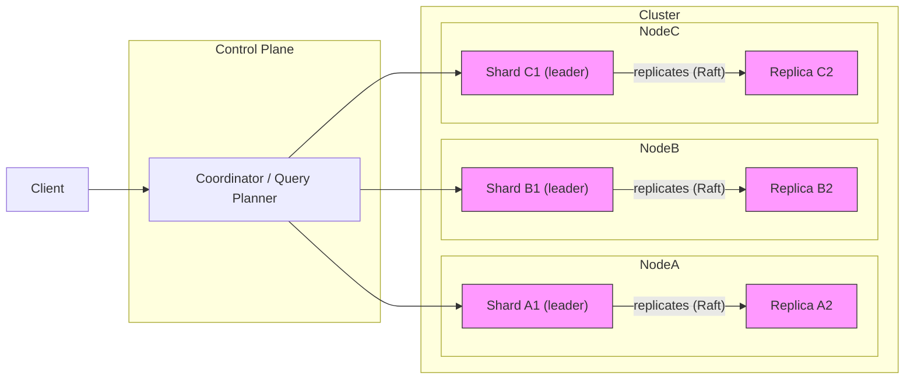
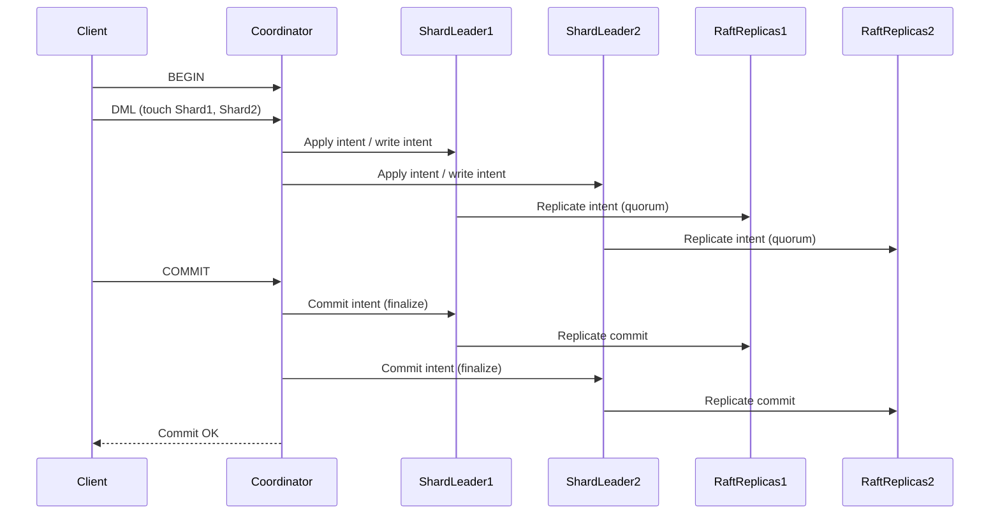
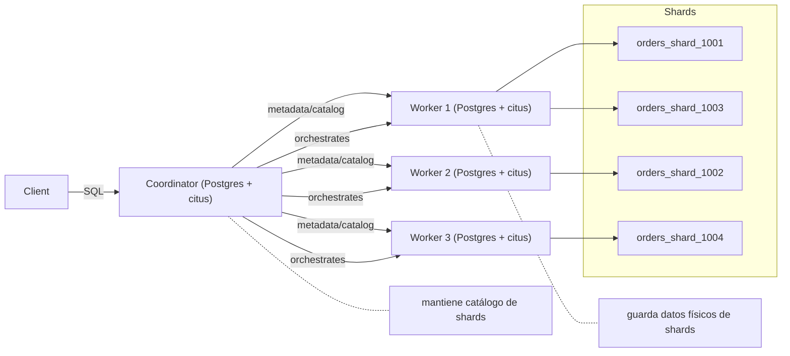
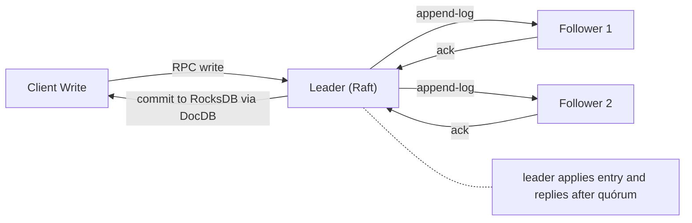
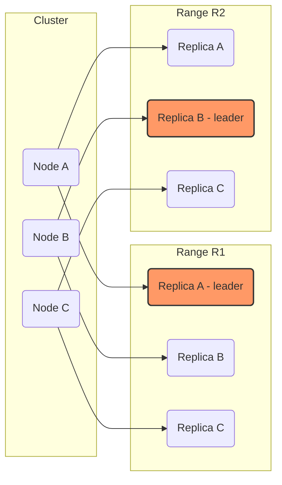
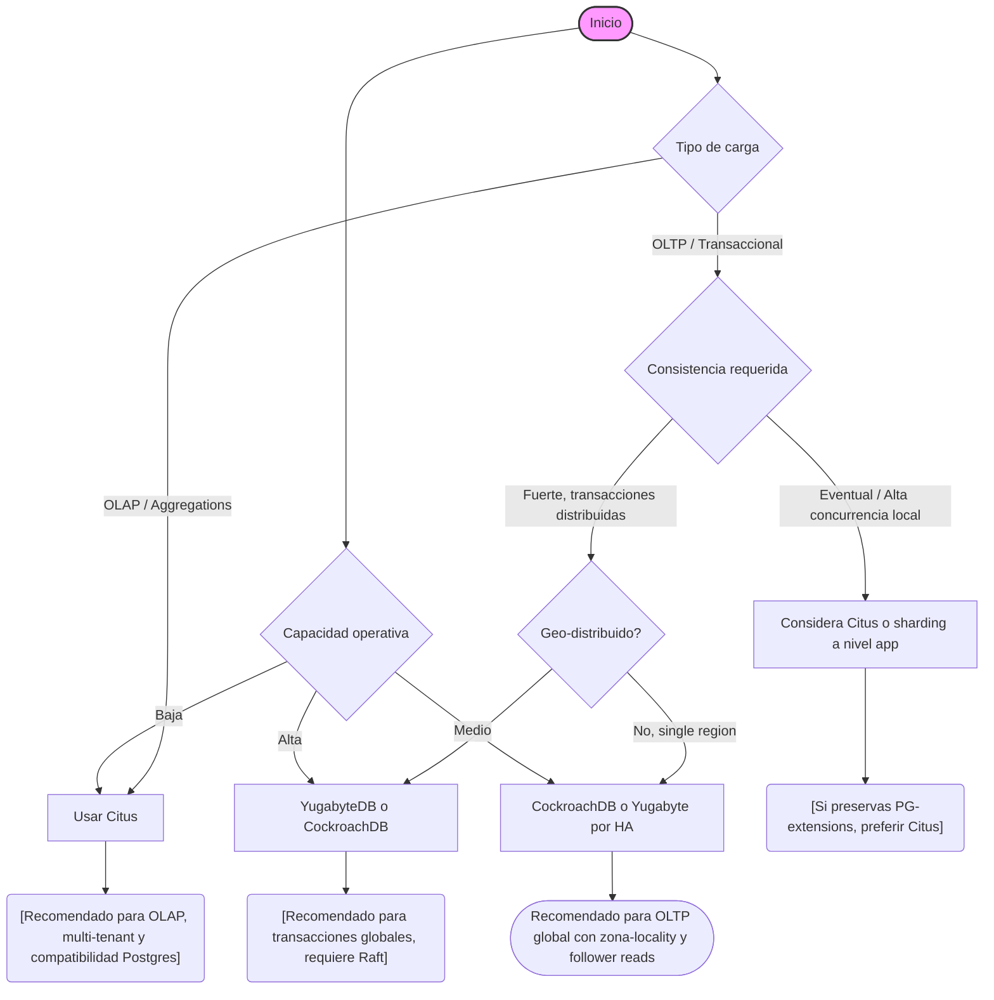

El crecimiento exponencial de las aplicaciones modernas y la demanda de sistemas altamente escalables han puesto en primer plano la necesidad de escalar PostgreSQL más allá de una única instancia. El escalado vertical, aunque sencillo, encuentra límites prácticos en CPU, memoria y operaciones de disco, lo que hace imprescindible explorar soluciones de escalado horizontal para cargas de trabajo intensivas y distribuidas.

En este artículo, abordaremos en profundidad tres propuestas principales para escalar PostgreSQL horizontalmente: Citus, Yugabyte y CockroachDB. Analizaremos sus fundamentos arquitectónicos, cómo implementan el sharding y la replicación, y qué mecanismos de consenso utilizan para garantizar consistencia y alta disponibilidad. Además, presentaremos ejemplos prácticos y configuraciones para ilustrar su uso en escenarios reales.

Dirigido a ingenieros backend senior y arquitectos cloud con experiencia en PostgreSQL y sistemas distribuidos, este análisis avanzado busca ofrecer una comprensión detallada de las fortalezas, limitaciones y tradeoffs de cada solución, facilitando una elección informada según los requisitos específicos de cada proyecto.

## Tabla de contenidos

- Introduction: Why Horizontal Scaling for PostgreSQL?
- Architectural Foundations of PostgreSQL Horizontal Scaling
- Citus: Architecture, Use Cases, and Examples
- YugabyteDB: Distributed Postgres with Strong Consistency
- CockroachDB: PostgreSQL-Compatible Distributed SQL
- Limitations and Tradeoffs of Each Solution
- Real-World Usage Scenarios and Recommendations
- Conclusion: Choosing the Right Horizontal Scaling Approach

## Introduction: Why Horizontal Scaling for PostgreSQL?

PostgreSQL es una base de datos relacional madura y potente, pero en su diseño básico corre como una sola instancia que, aunque multi‑proceso, comparte un único almacenamiento y estado primario. Eso funciona muy bien para muchas aplicaciones, pero llega un punto en que añadir CPU, RAM o discos (escalado vertical) ya no resuelve nuevos requerimientos de rendimiento, concurrencia o geo‑distribución. Esta sección resume por qué y cuándo hay que considerar escalar horizontalmente PostgreSQL, cuáles son los límites de una sola máquina y qué expectativas razonables debemos tener.

### Límites típicos de una sola instancia PostgreSQL

- CPU y concurrencia: PostgreSQL usa procesos por conexión. Con miles de conexiones activas la sobrecarga de contexto y sincronización (locks, LWLocks) crece; en la práctica se usan pools de conexiones (pgbouncer) para mitigar, pero la hot‑path de ejecución SQL sigue limitado por núcleos de CPU y contención en estructuras compartidas.
- I/O y WAL: El rendimiento de escritura está dominado por fsync del WAL y I/O de almacenamiento. Con discos NVMe bien configurados puedes obtener decenas de miles de transacciones pequeñas por segundo; con discos rotacionales o almacenamiento saturado, caes a miles o cientos.
- Memoria y caché: `shared_buffers`, `work_mem` y la caché del sistema operativo determinan cuánta carga puede servirse en memoria. Cuando la huella de datos excede la memoria, empieza a penalizar la latencia por I/O.
- Conexiones y locks: operaciones concurrentes que compiten por índices, tablas o páginas (por ejemplo, hot updates o checkpoints) generan contención y latencia.
- Operaciones de mantenimiento: VACUUM/ANALYZE, checkpoints y reindex pueden bloquear o degradar rendimiento en picos.

Números ilustrativos (depende mucho del HW y workload): con NVMe y CPUs modernos, un single‑node optimizado puede servir desde decenas de miles (workload muy simple) hasta pocos miles TPS en cargas con índices pesados y joins. No existen límites absolutos: el punto es que la curva de coste/beneficio del vertical scaling se vuelve pobre.

### Workloads que empujan a escalar horizontalmente

- Multi‑tenant SaaS con crecimiento de clientes y datos por tenant.
- OLTP de alta concurrencia con baja latencia (millones de usuarios, picos de tráfico). 
- Ingesta masiva de eventos / time‑series (IoT, telemetría) donde el I/O sostenido supera la capacidad del nodo.
- Geo‑distribución: aplicaciones que requieren lectura/escritura cerca del usuario o tolerancia a fallas de región.
- HTAP / analytics en datos operacionales donde queramos escalar CPU para consultas pesadas sin interferir con OLTP.

### Principales desafíos al escalar relacionales horizontalmente

- Consistencia y transacciones: preservar ACID globalmente obliga a protocolos distribuidos (2PC, consenso), lo que añade latencia y complejidad.
- Joins y consultas ad‑hoc: consultas que cruzan shards implican movimiento de datos o planificación distribuida costosa.
- Re‑sharding y balanceo: mover datos en vivo sin downtime o sin degradar el servicio es complejo.
- Índices secundarios y constraints: mantener índices únicos globales o foreign keys entre shards complica la arquitectura.
- Operaciones DDL y migraciones de esquema: requieren coordinación para no romper aplicaciones.

### Escalado horizontal vs vertical — diferencias prácticas

- Vertical: incrementar CPU/RAM/IO en una sola VM/servidor. Simplicidad operacional, compatibilidad plena con PostgreSQL, pero límites físicos y coste exponencial en cierto punto.
- Horizontal: añadir nodos y distribuir datos/consulta. Mejora la capacidad agregada y la resistencia a fallos por partición, pero exige sharding/replicación, consenso y sacrificios en latencia o consistencia en algunos diseños.

### Metas y expectativas reales

Al adoptar horizontal scaling esperamos:
- Escalar capacidad de almacenamiento y throughput linealmente en la medida de lo posible.
- Mantener latencias aceptables para el SLA (aceptar que transacciones distribuidas serán más lentas).
- Soportar alta disponibilidad y fallover transparente.
- Minimizar el trabajo operacional mediante re‑sharding automático, monitoreo y herramientas de observabilidad.

No esperes que "funcione igual pero más rápido" sin rediseñar datos y acceso: habrá tradeoffs entre consistencia, latencia, complejidad operativa y coste.

### Ejemplo práctico: medir techo con pgbench

Usa `pgbench` para estimar el techo de una sola instancia antes de diseñar la estrategia de escalado:

```bash
# carga y benchmark simple (ajusta -c, -j y -T según cores)
pgbench -i -s 50 postgres
pgbench -c 50 -j 8 -T 60 postgres
```

Si con incrementos de `-c` y `-j` observas que throughput se estabiliza o latencias crecen exponencialmente, estás frente a un cuello de botella que requiere horizontar (o rearchitecturar la carga).

*Diagrama: PostgreSQL single-node scaling limits and bottlenecks*

```mermaid
flowchart LR
  Client["Clients / Connections"] -->|queries| Postgres[PostgreSQL single node]
  Postgres --> CPU[CPU cores]
  Postgres --> Memory["shared_buffers / OS cache"]
  Postgres --> Disk["Storage (WAL & data) IOPS/Latency"]
  Postgres --> Locks["Locks / LWLocks / Contention"]
  Postgres --> Maintenance["VACUUM / Checkpoints"]
  CPU --> Bottleneck["(Bottleneck)"]
  Memory --> Bottleneck
  Disk --> Bottleneck
  Locks --> Bottleneck
  Maintenance --> Bottleneck
  Bottleneck -->|symptom| Latency["Increased latency / failed SLA"]
  Bottleneck -->|symptom| Throughput[Throughput cap]
  subgraph Notes
    direction LR
    note1([Connection pool (pgbouncer) mitigates but doesn't remove core limits])
  end
  Client --- note1
```

## Architectural Foundations of PostgreSQL Horizontal Scaling

En esta sección examinamos los ladrillos arquitectónicos que determinan el comportamiento y las garantías de las soluciones que extienden PostgreSQL horizontalmente: sharding, replicación, algoritmos de consenso, modelos de transacción y los efectos prácticos de particiones y fallos.

### ¿Qué es el sharding y cómo se implementa en estos sistemas?

Sharding = particionar los datos de una tabla en múltiples fragmentos (shards/tablets/ranges) y distribuirlos entre nodos para paralelizar almacenamiento y CPU. Las decisiones de partición determinan latencia de consultas, coste de transacciones multi-shard y rebalancing.

Patrones comunes:

- Hash sharding: asigna filas a shards por un hash de la clave de partición. Ventaja: balanceo uniforme; desventaja: pobre para rangos/escaneos ordenados.
- Range sharding: particiona por rangos de valores (timestamps, ids). Ventaja: eficiente para scans y colocación geo; desventaja: hotspotting si la carga no está distribuida.
- Reference/replicated tables: tablas pequeñas leídas por muchas consultas se replican íntegramente en cada nodo (Citus reference tables, similar en otras soluciones).

Implementaciones específicas:

- Citus (extensión de PostgreSQL): sharding a nivel de tabla. El `coordinator` PostgreSQL recibe SQL y encola consultas a los `worker` PostgreSQL donde residen los shards. Shard routing se basa en la `distribution_column` (hash o colocación personalizada). Citus implementa lógica de planner y ejecución distribuida dentro del ecosistema PostgreSQL.
- YugabyteDB (YSQL): cada tabla se divide en tablets; cada tablet tiene un grupo de réplicas gestionado por Raft. La capa YSQL se apoya en DocDB (almacenamiento de documentos / KV) donde la partición puede ser por hash o por rango.
- CockroachDB: divide el espacio de claves en ranges (predeterminados ~64 MiB y se escinden dinámicamente). Cada range está replicado y tiene un líder (leaseholder) responsable de servir lecturas/coordinar escrituras.

### Estrategias de replicación: ¿cómo difieren?

Comparativa de alto nivel:

- Citus: originalmente pensada para shards con single replica; la HA se consigue con mecanismos de PostgreSQL (streaming replication, Patroni) o con features empresariales de Citus para réplicas de shards. No hay un consenso distribuido propio por shard en la edición OSS: la alta disponibilidad suele delegarse al nivel de instancia.
- YugabyteDB: réplica sincrónica/quorum por tablet mediante Raft; cada tablet tiene un conjunto de réplicas (f( n )=1), Raft asegura la replicación y la elección de líder.
- CockroachDB: replication por range usando Raft; la réplica líder (leaseholder) atiende operaciones y las réplicas mantienen consenso síncrono con quorum.

Implicación práctica: las soluciones basadas en Raft (Yugabyte, Cockroach) proporcionan replicación consistente y failover automático por rango/tablet; Citus depende de la capa PostgreSQL y del despliegue para obtener HA (más configuración operativa).

### Algoritmos de consenso

- Raft: usado por CockroachDB y YugabyteDB para mantener la consistencia y la durabilidad a nivel de réplica por shard/tablet/range. Raft coordina electores y aplica logs en orden en la mayoría de réplicas.
- Citus (OSS): no expone un algoritmo de consenso por shard; depende de PostgreSQL streaming replication o soluciones externas (Patroni, repmgr) si se necesita failover, lo que traslada la responsabilidad al operador.

Consecuencia: Raft garantiza seguridad en presencia de fallos y particiones (requiere quorum), pero introduce latencia de réplica sincrónica y coste de líder.

### Transacciones distribuidas y modelos de consistencia

Modelos y técnicas:

- Two‑Phase Commit (2PC): coordinador escribe prepare en participantes y luego commit/abort. Citus implementa un 2PC distribuido para transacciones multi-shard (coordinador Citus orquesta). 2PC garantiza atomicidad pero es síncrono y puede bloquear en fallos del coordinador/participante si no hay recuperación.

- Timestamp/MVCC + Raft + transaction coordinator: CockroachDB y Yugabyte soportan transacciones distribuidas con MVCC y un coordinador que usa metadatos (intents) y un protocolo de commit distribuido que evita bloqueos largos. Cockroach implementa commit paralelizado y rollback de intents cuando es necesario; garantiza serializability (consistencia fuerte). Yugabyte implementa transacciones con Hybrid Logical Clocks y también usa Raft para durabilidad por tablet; su modelo en YSQL busca compatibilidad SQL con garantías de snapshot/serial.

Consistencia por defecto:

- CockroachDB: serializable por defecto (fuerte).
- YugabyteDB (YSQL): busca ofrecer compatibilidad con PostgreSQL y garantías de consistencia fuerte; transacciones son ACID con replicación Raft.
- Citus: consistencia depende del despliegue de PostgreSQL y de cómo se configura la replicación; las transacciones multi-shard usan 2PC para atomicidad.

Tradeoff importante: las transacciones fuertes y cross-shard implican mayor latencia y mayor complejidad para el reintento y resolución de contención.

### Particiones de red y modos de fallo

Comportamiento frente a partición (teoría CAP aplicada):

- Sistemas Raft-based (Yugabyte/Cockroach): priorizan consistencia; si un subconjunto de réplicas pierde contacto y no alcanza quorum, la porción sin quorum se volverá read-only o no aceptará commits hasta reunirse; la disponibilidad cae en particiones que aíslan la mayoría del quorum.
- Citus con replicación PostgreSQL: comportamiento depende de la solución de réplica. Si el coordinator pierde workers, queries multi-shard fallan; si un worker primario cae, la conmutación por error depende de streaming replication/Patroni y puede implicar pérdida temporal de disponibilidad.

Fallas típicas y mitigaciones:

- Pérdida del coordinator (Citus): si sólo hay un coordinator, es SPOF; operar con múltiples coordinators (activo/pasivo) y almacenar metadata de forma redundante es necesario para HA.
- Líder de Raft caído (Yugabyte/Cockroach): Raft reelige un nuevo líder; hay latencia de failover pero no corrupción de datos.
- Split brain: Raft evita split-brain mediante quorum; configuraciones manuales que fuerzan nodos fuera de quorum pueden causar pérdida de datos o corrupción si se usan herramientas no compatibles.

Resumen operativo: entender el modelo de replicación y quién controla la metadata (coordinator vs. control plane) es esencial para diseñar RTO/RPO, despliegues multi-AZ y planes de failover.

### Conclusión (práctica)

- Si necesitas replicación y failover integrado a nivel de shard con consistencia fuerte y reequilibrado automático, Yugabyte/Cockroach (Raft) son arquitecturas adecuadas.
- Si quieres extender PostgreSQL con mínimo cambio al SQL y puedes gestionar HA de instancias a nivel infra/SQL, Citus ofrece una ruta práctica, pero requiere trabajo operativo para replicación y disponibilidad.

En la siguiente sección entraremos en los detalles internos de cada producto (Citus, Yugabyte, CockroachDB) y veremos ejemplos de configuración y mediciones de latencia en transacciones cross-shard.

*Diagrama: Arquitectura genérica: sharding y replicación*



*Diagrama: Secuencia: commit de una transacción distribuida*



## Citus: Architecture, Use Cases, and Examples

Citus es una extensión para PostgreSQL que transforma una instalación normal en una base de datos SQL distribuida. No reemplaza PostgreSQL: extiende el motor con un coordinador (master) que mantiene el catálogo y un conjunto de workers que almacenan los fragmentos (shards). A continuación se explica con detalle cómo Citus implementa sharding, replica y ejecuta consultas distribuidas, qué patrones de carga encajan mejor y ejemplos prácticos.

### Arquitectura general

- Coordinador: un nodo PostgreSQL con la extensión `citus` que actúa como entrada única para el cliente. Contiene metadatos (catálogo de shards) y orquesta la planificación y ejecución de consultas.
- Workers: nodos PostgreSQL (también con la extensión `citus`) que almacenan shards (tablas físicas fragmentadas). Los datos del shard residen y se consultan en los workers.
- Cliente → Coordinador → Workers: el coordinador reescribe la consulta, envía subconsultas a workers y combina resultados.

(La siguiente figura muestra la topología coordinador-workers.)

### Cómo implementa Citus el sharding y distribuye consultas

- Modelo de distribución: Citus ofrece sharding por una columna de distribución. El modo por defecto es *hash sharding* sobre la columna que elijas (por ejemplo `user_id`). Cada fila se mapea a un `shard_id` mediante hashing.
- Tabla distribuida vs. tabla de referencia: las tablas grandes se convierten en tablas distribuidas (fragmentadas). Las tablas pequeñas y de lookup se pueden transformar en *reference tables* (replicadas a todos los workers) para evitar movimiento de datos en joins.
- Planificación y envío: cuando recibes una consulta en el coordinador, Citus usa el catálogo para decidir qué shards (y por tanto qué workers) se deben tocar. Genera subconsultas dirigidas a cada worker relevante y ejecuta la fusión/agrupación en el coordinador o en los workers según el plan.
- Colocación y joins: para joins eficientes, colocas las tablas en el mismo sharding key (colocated). Si no están colocadas, Citus emplea estrategias de ejecución distribuida como envío de datos (broadcast) o re-partitioning para ejecutar joins, lo que aumenta I/O y latencia.

### Replicación y tolerancia a fallos

- Citus no reemplaza la replicación de PostgreSQL: típicamente se implementa HA con las herramientas estándar de Postgres (streaming replication, Patroni, repmgr, pg_auto_failover). Los shards se replican a nivel de instancia usando replicación física de PostgreSQL.
- Metadata single-point: el coordinador contiene metadatos críticos. En producción se recomienda hacer HA del coordinador (replicación/standby + conmutación) y tener procedimientos para promover un nuevo coordinador y re-registrar workers si es necesario.
- Enterprise features: versiones comerciales/Enterprise de Citus han ofrecido utilidades adicionales para la gestión y replicación de shards. En la edición OSS, la réplica y orquestación quedan en manos de soluciones de replicación de PostgreSQL.

Tradeoff: Citus optimiza lectura/escalado horizontal de consultas distribuidas, pero la tolerancia a fallos suele depender de infraestructuras de replicación tradicionales; no es una base de datos peer-to-peer con replicación integrada por shard en la edición OSS.

### Transacciones distribuidas y joins

- Transacciones: Citus soporta transacciones distribuidas. Si una transacción afecta a un único shard, se ejecuta como una transacción local (baja latencia). Si afecta a múltiples shards, Citus usa protocolos distribuidos basados en operaciones coordinadas desde el coordinador; internamente aprovecha las capacidades transaccionales de PostgreSQL (incluyendo `PREPARE TRANSACTION` cuando es necesario), por lo que equivalen conceptualmente a 2PC en escenarios multi-shard.
- Rendimiento de transacciones multi-shard: las transacciones que tocan muchos shards incrementan latencia y riesgo de conflictos; diseñar el esquema para minimizar cross-shard writes (por ejemplo, por tenant-id) es recomendable.
- Joins: para joins con la misma clave de reparto (colocated) la operación se ejecuta localmente en cada worker y luego se agregan resultados. Para joins entre tablas no colocadas, Citus puede replicar (broadcast) la tabla pequeña o hacer shuffle de filas, con impacto de I/O y red.

### Casos de uso y patrones de carga adecuados

- Multi-tenant SaaS: tenants shardeados por tenant_id; cargas muy adecuadas porque la mayoría de operaciones quedan en uno o pocos shards.
- Analítica por evento: tablas de eventos masivos shardeadas por dispositivo/usuario o por time-bucket combinado con id; lecturas masivas y agregaciones paralelizables.
- Workloads OLTP escalables en lectura/escritura con esquema que permite colocación de joins.

No ideal cuando:
- Muchas transacciones distribuidas que tocan cientos de shards a la vez (latencia alta).
- Tablas con joins arbitrarios entre columnas no alineadas: forzarán mucho movimiento de datos.

### Ejemplos prácticos: configuración y SQL

- Requisitos mínimos de config (ejemplo): en todos los nodos (coordinator y workers) en `postgresql.conf`:
  - shared_preload_libraries = 'citus'
  - ajustar `max_worker_processes`, `max_parallel_workers_per_gather` según dimensionamiento

- Instalación y registro de nodos (en coordinador):

```sql
-- en cada worker: (instalar la extensión y reiniciar Postgres)
CREATE EXTENSION citus;

-- en el coordinator:
CREATE EXTENSION citus;
SELECT master_add_node('worker01.example.local', 5432);
SELECT master_add_node('worker02.example.local', 5432);
```

- Crear tabla distribuida y referencia, colocación y rebalanceo:

```sql
-- tabla de referencia (replicada a todos los workers)
CREATE TABLE countries (code text primary key, name text);
SELECT create_reference_table('countries');

-- tabla distribuida por user_id (hash sharding por defecto)
CREATE TABLE orders (order_id bigserial primary key, user_id bigint, total numeric, created_at timestamptz);
SELECT create_distributed_table('orders', 'user_id');

-- otra tabla colocada con la misma llave para joins eficientes
CREATE TABLE order_items (item_id bigserial primary key, order_id bigint, product_id int, qty int);
SELECT create_distributed_table('order_items', 'order_id');
SELECT colocate_table('order_items', 'orders');

-- balanceo de shards al agregar nuevos workers
SELECT rebalance_table_shards('orders');
```

- Consulta distribuida y plan (ejemplo):

```sql
EXPLAIN (ANALYZE, VERBOSE)
SELECT o.user_id, sum(o.total) as spent, c.name
FROM orders o
JOIN countries c ON c.code = o.user_id::text -- (ejemplo simplificado)
WHERE o.created_at >= now() - interval '30 days'
GROUP BY o.user_id, c.name
ORDER BY spent DESC
LIMIT 10;
```

El plan muestra envío de subconsultas a los workers con agregación parcial en cada worker y una reducción final en el coordinador.

### Tabla: ejemplo de shard placement

| shard_id | table_name | node | row_count (ej) |
|----------|------------|------|----------------|
| 1001     | orders_1001 | worker01 | 12,345,678 |
| 1002     | orders_1002 | worker02 | 11,987,301 |
| 1003     | orders_1003 | worker01 | 12,001,003 |

(Esta tabla es una vista simplificada del catálogo de Citus; los nombres físicos son `table_shard_xxx`.)

### Recomendaciones operativas rápidas

- Diseña la distribución por una columna que minimice cross-shard traffic (tenant_id, user_id).
- Replica y HA con Patroni/replication; automatiza promotion del coordinator.
- Usa reference tables para lookups frecuentes y `colocate_table` para tablas que se unen por la misma clave.
- Mide latencia de transacciones multi-shard y evita patrones que toquen muchos shards en una sola transacción.

*Diagrama: Citus coordinator-worker node topology*



*Diagrama: Ejemplo de shard placement*

| shard_id | table_name   | node          | row_count (ej) |
|----------|--------------|---------------|----------------|
| 1001     | orders_1001  | worker01      | 12,345,678     |
| 1002     | orders_1002  | worker02      | 11,987,301     |
| 1003     | orders_1003  | worker01      | 12,001,003     |
| 1004     | orders_1004  | worker03      | 11,200,450     |

## YugabyteDB: Distributed Postgres with Strong Consistency

YugabyteDB es una base de datos distribuida que expone una capa SQL compatible con PostgreSQL (YSQL) sobre un almacenamiento distribuido y replicado. Está diseñada para ofrecer consistencia fuerte y transacciones ACID en clusters multinodo, manteniendo la experiencia de desarrollo y operaciones de PostgreSQL cuando es posible.

### Arquitectura y compatibilidad con PostgreSQL

- Capa SQL (YSQL): Yugabyte implementa la API y protocolo de PostgreSQL —puedes usar `psql`, drivers libpq y la mayoría de ORM— a través del subsistema YSQL. Gran parte del front-end de consulta y del parser proviene del código de PostgreSQL integrado dentro de cada Yugabyte tserver (tablet server), lo que facilita portar aplicaciones existentes.
- Almacenamiento distribuido (DocDB): debajo de YSQL está DocDB, un almacenamiento de documentos basado en RocksDB que implementa MVCC y guarda registros en tablets (shards). Cada tabla se divide en múltiples tablets que se distribuyen entre tservers.
- Masters: un pequeño conjunto de procesos master mantiene metadatos del cluster (ubicación de tablets, configuración de replicación, SQL DDL coordinado). Los masters no participan en la replicación de datos de usuario.
- TServers: ejecutan la capa SQL y la capa de almacenamiento. Cada tserver replica tablets para servir solicitudes de lectura/escritura.

Ventaja práctica: los cambios en la capa SQL suelen comportarse como en PostgreSQL (DDL, funciones, tipos), pero algunas extensiones o comportamientos internos pueden variar —comprueba la compatibilidad de extensiones críticas antes de migrar.

### Sharding y replicación

- Sharding (tablets): las tablas se shardean automáticamente por hash de la clave primaria en un número configurable de tablets (por defecto decenas a cientos; p. ej. 32 o 128 dependiendo de la versión/config). Cada tablet es la unidad de distribución y replicación.
- Replicación: cada tablet está replicado por un grupo Raft (replica set) con un líder y múltiples seguidores. El líder sirve las escrituras y coordina la replicación de entradas de log.
- Colocación y colocated tables: Yugabyte permite configurar colocación de tablets por zona/etiqueta, y tablas colocadas para optimizar joins y co-locación de datos relacionados.

Implicación operativa: el tamaño y número de tablets impacta la reubicación y re-balanceo (más tablets = mejor granularidad de balanceo, pero mayor presión en metadata y master).

### Algoritmo de consenso y modelo de consistencia

- Consenso: Yugabyte usa Raft por tablet (una implementación propia basada en el algoritmo Raft). Cada tablet mantiene su propio grupo Raft y log replicado.
- Consistencia: proporciona consistencia fuerte (linearisable para operaciones dirigidas al líder). Las lecturas pueden ser linearisables si van al líder; también existen opciones de lectura desde followers con estalido acotado (follower reads / stale reads) para bajar latencia a costa de frescura.

Este diseño (líder por tablet + Raft) significa que las operaciones de escritura implican un round-trip de red al líder y la replicación a quórum de seguidores antes de confirmar, asegurando durabilidad y consistencia.

### Transacciones distribuidas

Yugabyte implementa transacciones ACID distribuídas sobre múltiples tablets usando:

- MVCC en DocDB: cada fila tiene versions con timestamps obtenidos por HLC (Hybrid Logical Clock). HLC entrega orden parcial/global razonable entre nodos sin depender de un único reloj central.
- Manejador de transacciones: cada transacción tiene un coordinador (el tserver que inicia la transacción) que registra intents (registros provisionales) en las tablets participantes.
- Protocolo de commit: un proceso similar a 2‑phase commit donde el coordinador escribe un registro de estado de transacción (p. ej. COMMIT/ABORT) en una tabla de transacciones distribuida y se realiza la resolución de intents. La commit timestamp proviene de HLC y se aplica de forma consistente usando Raft en cada tablet.
- Aislamiento: YSQL soporta los niveles tradicionales de PostgreSQL (READ COMMITTED, REPEATABLE READ / SNAPSHOT). En la práctica, Yugabyte implementa snapshot isolation sobre MVCC con mecanismos para evitar anomalías; para cargas que requieren serializabilidad completa se deben revisar manualmente las garantías específicas de la versión.

Coste: las transacciones multi-shard implican comunicación adicional (coordinación, escritura de metadatos de transacción y resolution de intents) y aumentan la latencia comparadas con transacciones locales a una sola tablet.

### Operativa y límites prácticos

- Latencia: accesos locales al líder de tablet son rápidos; multi-shard write-heavy workloads pueden ser dominados por latencia de 2PC y múltiples hops Raft.
- Escalado: se escala horizontalmente añadiendo tservers; los masters coordinan rebalanceos. Re-sharding y re-balanceo son automáticos pero generan operaciones de red y I/O.
- Compatibilidad YSQL: la mayor parte de SQL común funciona, pero extensiones de PostgreSQL (p. ej. PostGIS, PL/Python, ciertas indexaciones) deben verificarse; Yugabyte soporta PostGIS en versiones recientes pero con matices.

### Ejemplos de configuración y uso

A continuación ejemplos concretos para empezar en local, crear tablas y ejecutar una transacción distribuida.

#### 1) Levantar un nodo Yugabyte (Docker, ejemplo rápido)

```bash
# Ejecuta un nodo Yugabyte (puertos: 7000 master UI, 5433 YSQL)
docker run -d --name yugabyte -p 7000:7000 -p 5433:5433 yugabytedb/yugabyte:latest bin/yugabyted start --daemon=false

# Espera a que el cluster esté listo
sleep 10

# Conectar con psql (YSQL usa puerto 5433)
psql "host=localhost port=5433 user=yugabyte dbname=postgres"
```

Explicación: en producción usa despliegue multinodo (Helm en k8s o instancias dedicadas). El contenedor anterior es para pruebas locales rápidas.

#### 2) SQL: crear tablas y forzar transacción multi-table (posible multi-tablet)

```sql
-- Conéctate con psql al puerto 5433
CREATE TABLE accounts (id BIGINT PRIMARY KEY, balance BIGINT);
CREATE TABLE transfers (id UUID PRIMARY KEY DEFAULT gen_random_uuid(), from_acct BIGINT, to_acct BIGINT, amount BIGINT, created_at TIMESTAMP DEFAULT now());

-- Ejecutar transacción explicita
BEGIN;
UPDATE accounts SET balance = balance - 100 WHERE id = 1;
UPDATE accounts SET balance = balance + 100 WHERE id = 2;
INSERT INTO transfers (from_acct,to_acct,amount) VALUES (1,2,100);
COMMIT;

-- Si accounts 1 y 2 están en diferentes tablets, esto será una transacción distribuida
```

Notas: Yugabyte hash-shardea por la clave primaria; no hay que crear shards manualmente en la mayoría de casos.

#### 3) Python: pequeña transacción con psycopg2

```python
import psycopg2
from psycopg2.extras import register_uuid

conn = psycopg2.connect(host='localhost', port=5433, user='yugabyte', dbname='postgres')
register_uuid()

try:
    with conn:
        with conn.cursor() as cur:
            cur.execute("SET TRANSACTION ISOLATION LEVEL REPEATABLE READ")
            cur.execute("UPDATE accounts SET balance = balance - %s WHERE id = %s", (100, 1))
            cur.execute("UPDATE accounts SET balance = balance + %s WHERE id = %s", (100, 2))
            cur.execute("INSERT INTO transfers (from_acct, to_acct, amount) VALUES (%s, %s, %s)", (1, 2, 100))
    print('Committed')
except Exception as e:
    print('Error, rolled back', e)
finally:
    conn.close()
```

Explicación: el ejemplo usa la semántica de transacción de libpq (autocommit desactivado dentro de with conn). Si las filas implican multiples tablets, Yugabyte coordinará el commit.

### Recomendaciones operativas y trade‑offs

- Diseño de esquema: para minimizar latencia en transacciones, co‑loca datos que se actualizan juntos (usar tablas colocated o diseñar la PK para reducir multi‑tablet transactions).
- Monitorea latencia de Raft y hotspots: operaciones que golpean un único leader con mucha frecuencia producirán hotspots —aumentar particionado o replicación puede ayudar.
- Lecturas: para cargas de lectura de baja latencia, considera follower reads (stale reads) cuando la frescura ligeramente relajada sea aceptable.
- Versiones y pruebas: verifica compatibilidad de extensiones PostgreSQL y realiza pruebas de carga para entender el coste de transacciones multi-shard.

### Conclusión

YugabyteDB ofrece una opción sólida cuando necesitas una experiencia PostgreSQL-compatible con transacciones distribuidas y consistencia fuerte. Su arquitectura basada en tablets+Raft y DocDB permite escalar horizontalmente manteniendo ACID. La penalización principal están en la latencia y complejidad de transacciones multi-shard: el diseño del esquema y la colocación de datos siguen siendo claves.

*Diagrama: YugabyteDB cluster and tablet server layout*

```mermaid
flowchart LR
  subgraph Masters
    M1[Master 1]
    M2[Master 2]
    M3[Master 3]
  end

  subgraph Cluster
    T1[TServer A]
    T2[TServer B]
    T3[TServer C]
  end

  M1 -->|metadata| T1
  M2 -->|metadata| T2
  M3 -->|metadata| T3

  %% Tablets distributed across TServers
  T1 -- Tablet A (leader) --> T2
  T1 -- Tablet B (follower) --> T3
  T2 -- Tablet C (leader) --> T1

  click T1 "" "TServer: SQL + DocDB"
  click M1 "" "Masters: cluster metadata & placement"
```

*Diagrama: Raft consensus in YugabyteDB (tablet view)*



## CockroachDB: PostgreSQL-Compatible Distributed SQL

CockroachDB propone una capa distribuida transaccional que pretende comportarse como PostgreSQL desde el punto de vista del cliente (wire protocol y la mayor parte del dialecto SQL) mientras reimplementa el almacenamiento y la coordinación para escalar horizontalmente con consistencia fuerte.

### Compatibilidad con el protocolo PostgreSQL

CockroachDB implementa el protocolo `pgwire` (la capa de red usada por PostgreSQL) y expone endpoints compatibles con clientes como `psql`, `libpq`, JDBC y la mayoría de ORMs. Eso significa que, en la práctica, muchas aplicaciones que usan drivers PostgreSQL pueden conectarse a CockroachDB con mínimos cambios de configuración:

- URL de conexión compatible: por ejemplo `postgresql://root@localhost:26257/defaultdb?sslmode=disable`.
- Tipos SQL compatibles: `JSONB`, `ARRAY`, `TIMESTAMP`, etc. La compatibilidad es amplia, pero no total: extensiones PostgreSQL (como `pg_trgm`, `FDW`, PL/pgSQL internals o algunas funciones de procedimientos) pueden no estar presentes o comportarse distinto.
- Exposición parcial de `pg_catalog`/`information_schema`: Cockroach implementa las vistas y columnas necesarias para que muchas herramientas y migraciones funcionen, pero detalles de rendimiento y algunas estadísticas internas difieren.

Tradeoff: excelente experiencia de “lift-and-shift” para muchas aplicaciones, pero proyectos que dependan de extensas extensiones server-side de PostgreSQL requerirán rework.

### Arquitectura interna: ranges (shards) y replicación

CockroachDB se construye sobre un key-value distribuido. Los bloques lógicos de datos son las _ranges_ (rango contiguo de claves). Características clave:

- Cada tabla, índice y fila mapean a claves en el espacio KV; ese espacio se divide dinámicamente en ranges (objetivo de tamaño ~64 MiB por defecto) que se parten y reagrupan según carga.
- Cada range es replicado y gestionado por un grupo Raft (un Raft group): cada range tiene varios replicas (por defecto 3). Cada replica tiene un vehículo Raft con un líder (leaseholder) que coordina operaciones de escritura.
- Distribución y balanceo: los ranges se reubican automáticamente (split/scatter/replicate/rebalancer) para balanceo de capacidad y carga.

Este diseño hace que el “sharding” sea automático y transparente: no necesitas elegir una clave de shard manualmente, aunque el diseño lógico de tablas y el uso de `PRIMARY KEY` / `INTERLEAVING` (antiguo) o particiones geográficas afecta la colocación y el rendimiento.

### Consenso y consistencia fuerte

CockroachDB usa Raft (un algoritmo de consenso) por cada range para garantizar replicas consistentes. Elementos clave:

- Cada operación de escritura para una clave dentro de un range pasa por el líder Raft de ese range y se acepta solo cuando una mayoría de réplicas aplica la entrada.
- El sistema emplea Hybrid Logical Clocks (HLC) para asignar timestamps que permiten un orden global lógico y optimizaciones como follower reads y `AS OF SYSTEM TIME`.
- Para transacciones distribuidas que abarcan ranges múltiples, CockroachDB usa un protocolo de commit distribuido (optimizado con Parallel Commits y un registro de transacción en una range determinada) para garantizar atomicidad y consistencia externa.

Resultado: consistencia serializable por defecto y external consistency (si un commit A sucede antes que B en tiempo real, cualquier node verá A antes que B).

### Modelo de transacciones y concurrencia: tradeoffs prácticos

- Aislamiento: serializable (el más fuerte). Ventaja: elimina clases enteras de bugs por anomalías de aislamiento. Coste: mayor probabilidad de restarts en contención alta.
- Optimistic/intent-based: las escrituras colocan intents (marcas) y se resuelven en commit; los contadores de conflictos provocan `RETRY` automáticos. En cargas con hotspots y altas escrituras contenciosas, las transacciones distribuidas se reiniciarán con frecuencia, aumentando latencia y CPU.
- Latencia de cross-range: transacciones que tocan múltiples ranges implican coordinación Raft y commits distribuidos -> mayor latencia. Diseñar para localidad de datos (particiones por región, claves afines) reduce coste.
- Lecturas: las lecturas pueden servirse desde el leaseholder; Cockroach implementa follower reads (usando closed timestamps) para lecturas de baja latencia sin coordinar con el líder, pero estas requieren garantías sobre la frescura de los datos.

En resumen, Cockroach prioriza corrección y disponibilidad de transacciones a costa de latencias más altas en escrituras cross-range y mayor complejidad operacional cuando hay hotspots.

### Ejemplos prácticos de configuración y uso

- Conexión desde psql (modo inseguro, para desarrollo):

  psql "postgresql://root@localhost:26257/defaultdb?sslmode=disable"

- Iniciar nodo en local (dev):

  cockroach start-single-node --insecure --store=path/to/store --listen-addr=localhost:26257

- Crear base de datos regional y tabla con localidad (geo-partitioning):

  CREATE DATABASE bank PRIMARY REGION "us-east1";
  CREATE TABLE accounts (
    id UUID PRIMARY KEY DEFAULT gen_random_uuid(),
    region STRING NOT NULL,
    balance DECIMAL
  ) LOCALITY REGIONAL BY ROW;

- Forzar colocación/zonas (ejemplo de configuración de réplica por partición):

  ALTER PARTITION FOR VALUES FROM ("us-east1") OF TABLE accounts CONFIGURE ZONE USING num_replicas = 3, constraints = '[+region=us-east1]';

Notas: la sintaxis exacta de `CONFIGURE ZONE` y `LOCALITY` evoluciona entre versiones; revisa la versión de la documentación.

### Recomendaciones operativas

- Diseña para localidad: evita transacciones que toquen filas distribuidas por todo el cluster cuando la latencia write es crítica.
- Usa `EXPLAIN` y `crdb_internal.ranges` para entender cómo se mapean rangos a nodos.
- Monitorea restarts transaccionales y hotspots (contention) con métricas internas; aumenta particionado o cambia esquema cuando sea necesario.

CockroachDB es una opción sólida cuando necesitas compatibilidad con clientes PostgreSQL combinada con consistencia fuerte y escalado horizontal automático, siempre que aceptes los tradeoffs en latencia y diseño de datos para cargas distribuidas.

*Diagrama: CockroachDB: nodo distribuido y layout de ranges*



*Diagrama: Lifecycle de una transacción distribuida en CockroachDB*

```mermaid
sequenceDiagram
  participant Client
  participant Coordinator
  participant RangeA
  participant RangeB
  participant RaftLeaderA
  participant RaftLeaderB

  Client->>Coordinator: BEGIN; write keyA, write keyB
  Coordinator->>RangeA: send write request
  RangeA->>RaftLeaderA: replicate via Raft
  RaftLeaderA-->>RangeA: commit intent
  Coordinator->>RangeB: send write request
  RangeB->>RaftLeaderB: replicate via Raft
  RaftLeaderB-->>RangeB: commit intent
  Coordinator->>RangeCoord: create transaction record
  Note right of Coordinator: Parallel commit protocol
  Coordinator->>RaftLeaderA: finalize intents
  Coordinator->>RaftLeaderB: finalize intents
  RaftLeaderA-->>Coordinator: ack
  RaftLeaderB-->>Coordinator: ack
  Coordinator->>Client: COMMIT complete (external consistency assured)
```

## Limitations and Tradeoffs of Each Solution

### Citus: cuándo no es la mejor opción

Citus extiende PostgreSQL con sharding a nivel de tabla (coordinator + workers). Sus principales limitaciones prácticas:

- Tipos de carga: funciona mejor con cargas OLTP multi‑tenant o workloads donde las consultas pueden ser dirigidas a un único shard (shard key). Las consultas que requieren joins frecuentemente entre múltiples shards o agregaciones globales sufren por latencia y coste de movimiento de datos.
- Transacciones distribuidas: las transacciones que abarcan múltiples shards usan coordinador y, cuando son frecuentes, generan mucho overhead. No es ideal para workloads con transacciones distribuidas intensivas.
- Tolerancia a fallos: Citus en sí no implementa consenso distribuido; depende de la capa PostgreSQL (replicación física/logic, Patroni, repmgr) y de cómo se desplieguen réplicas de los workers. La recuperación de shards y rebalanceo puede ser operacionalmente costoso y lento para tablas muy grandes.

Consejo: si tu aplicación puede escoger un buen shard key y minimizar cross‑shard work, Citus reduce la complejidad; si no, espera latencia y esfuerzo operativo adicional.

### YugabyteDB: tradeoffs entre consistencia, latencia y disponibilidad

YugabyteDB usa Raft por tablet/partición y ofrece consistencia fuerte por defecto (CP en CAP):

- Consistencia: las lecturas/escrituras van al líder del Raft para esa tablet, garantizando linearizability (configurable para lecturas locales). Eso simplifica la razonamiento sobre datos pero implica mayor latencia en topologías geo‑distribuidas cuando el líder está lejos.
- Latencia vs. disponibilidad: con 3 réplicas, necesitas mayoría (2/3) para escritura; perder réplicas reduce disponibilidad. Para minimizar latencia geo‑regional puedes usar geo‑partitioning/placement rules, pero añade complejidad operacional.
- Transacciones distribuidas: Yugabyte implementa transacciones distribuidas (YB‑TXN) con un protocolo similar a 2‑phase commit sobre Raft; son robustas pero incrementan latencia en multi‑tablet operations.

Recomendación: Yugabyte es bueno si quieres consistencia fuerte con compatibilidad PostgreSQL (YSQL) y estás dispuesto a diseñar para la topología de latencia.

### CockroachDB: fortalezas y puntos débiles

- Donde destaca: tolerancia a fallos automática, reequilibrado continuo, SQL distribuido con serializable estricto (el aislamiento más fuerte), y operaciones multi‑región bien pensadas. Excelente para aplicaciones con requisitos de alta disponibilidad y geo‑replicación.
- Retos: compatibilidad PostgreSQL no completa (ciertas extensiones, PL/pgSQL y tipos avanzados pueden no estar soportados). Operaciones como migraciones de esquema a gran escala o consultas analíticas muy pesadas pueden requerir afinamiento.

### Complejidad operativa y madurez del ecosistema

- Citus: menor fricción para equipos PostgreSQL; aprovecha herramientas Postgres (pg_dump, Patroni). Ecosistema mature en términos de extensiones y ORMs.
- Yugabyte: buena compatibilidad YSQL, pero añade stack propio (yb‑master, yb‑tserver, distribuciones de Raft por tablet). Operaciones más nuevas pero en rápida evolución.
- CockroachDB: operativa distinta (nodal, gossip, ranges) y rica en tooling empresarial (BACKUP/RESTORE, monitoreo). Ecosistema fuerte pero diferente al PostgreSQL nativo.

### Backup, escalado y mantenimiento (implicaciones prácticas)

- Backups: Citus requiere estrategia coordinada (coordinator metadata + snapshots/pg_basebackup de workers) para consistencia. Yugabyte y CockroachDB tienen snapshots y utilidades propias que pueden realizar backups consistentes a nivel de cluster.
- Escalado: Citus rebalancer mueve shards (puede ser costoso en I/O). Yugabyte y CockroachDB hacen rebalancing automático de tablets/ranges y son más "plug‑and‑scale" si la red/IO lo permiten.
- Mantenimiento: todos soportan upgrades rolling, pero los procedimientos y riesgos varían; probar en staging con la topología de réplica real es obligatorio.

En resumen: elegir entre Citus, Yugabyte y CockroachDB es elegir un conjunto de tradeoffs: integración y familiaridad (Citus) vs. consistencia fuerte con control de topología (Yugabyte) vs. supervivencia y operaciones automatizadas a gran escala (CockroachDB). Diseña para el patrón de consultas, la topología de latencia y la tolerancia a fallos que tu producto realmente necesita.

*Diagrama: Comparativa: Citus vs YugabyteDB vs CockroachDB*

| Característica | Citus | YugabyteDB | CockroachDB |
|---|---:|---:|---:|
| Modelo de consistencia | PostgreSQL (depende de réplica) | Fuerte (Raft por tablet) | Serializable estricto (interno) |
| Workloads ideales | Multi‑tenant OLTP, single‑shard queries | Transaccional con requerimiento de consistencia | Alta disponibilidad multi‑región, transaccional |
| Fault tolerance | Depende de replicación PostgreSQL + ops | Fuerte (mayoría Raft), configurable geo‑placement | Muy alta, reequilibrado automático y tolerancia a fallos |
| Compatibilidad PostgreSQL | Alta (extensión real) | Alta (YSQL) | Parcial (compat layer) |
| Operacionalidad | Menos cambio de stack, más manual para réplica/shard | Nuevo stack, requiere entender tablets/Raft | Nuevo paradigma (ranges/gossip) con buen tooling |
| Backups | Coordinado (coordinator + workers) | Snapshots cluster con yb‑admin | SQL BACKUP/RESTORE nativo |
| Rebalanceo | Manual/planificado (shard rebalancer) | Automático por tablet/placement rules | Automático por ranges |

## Real-World Usage Scenarios and Recommendations

Elegir entre Citus, YugabyteDB y CockroachDB no es una cuestión de "mejor" absoluto: depende de la forma de tus cargas, requisitos de consistencia/latencia, experiencia operativa y presupuesto. Aquí tienes criterios prácticos y recomendaciones accionables.

### OLTP vs OLAP

- OLTP (muchas transacciones pequeñas, baja latencia por op): CockroachDB y YugabyteDB son las opciones más naturales si tu aplicación requiere transacciones distribuidas, consistencia fuerte y alta disponibilidad en múltiples zonas/regiones. Ambos implementan Raft por rango/tabla y ofrecen serializable/linearizable semantics que facilitan mantener invariantes transaccionales.

- OLAP / Analítica / HTAP read-heavy: Citus sobresale: es una extensión de PostgreSQL que shardea tablas y distribuye consultas analíticas a trabajadores. Si tus queries son agregaciones por tenant/partición y puedes elegir una buena clave de shard (alta cardinalidad, co-localiza joins), Citus ofrece mucho mejor precio/rendimiento para escaneo y agregación que operar un cluster Raft para el mismo trabajo.

- Escenarios mixtos (HTAP): Citus puede cubrir cargas analíticas sobre datos transaccionales con latencia de ingest relativamente alta si aceptas que la coordinación de escrituras sigue siendo Postgres; Yugabyte ofrece una aproximación más integrada para HTAP con YSQL + DocDB, pero con mayor coste operativo.

### Consistencia y latencia: recomendaciones prácticas

- Necesitas consistencia fuerte en escrituras distribuidas y tolerancia a partición (CP en CAP): prioriza Yugabyte o CockroachDB. Ambas garantizan linearizability para la mayoría de operaciones de transacción.

- Prioridad en latencia local/por-región: si quieres que lecturas y escrituras sean locales en cada región, usa geo-partitioning / colocación de rangos:
  - CockroachDB: soporte de "follower reads" (lecturas acotadas por antigüedad) y políticas de zona para colocalizar datos.
  - YugabyteDB: tablas shardeadas en tablets con Raft; puedes configurar replicas por región y leer desde réplicas locales bajo modelos de consistencia configurables.
  - Citus: no tiene consenso global por tabla; si los clientes escriben cross-region sobre un único coordinator aumentará la latencia.

Un número orientativo: una escritura cross-region en una solución Raft multinodo suele costar una o más RTT extra (50–200 ms según distancia). Para latencias <20 ms por operación, evita operaciones cross-region sincronizadas.

### Deployment scenarios que favorecen cada solución

- Citus
  - Multi-tenant SaaS con aislamiento por tenant y consultas OLAP/aggregations.
  - Equipos con fuerte inversión en Postgres que necesitan compatibilidad con extensiones y funciones PostgreSQL.
  - Entornos donde prefieres mantener modelo operativo Postgres (backups pg_dump/pg_restore, familiaridad con pg tools).

- YugabyteDB
  - Aplicaciones globales con requisitos de consistencia, transacciones distribuidas y tolerancia a fallos entre zonas.
  - Migración de workloads Postgres que necesitan escalado horizontal con transacciones ACID.
  - Equipos cómodos con administrar clusters Raft y tablets.

- CockroachDB
  - OLTP global con necesidad de alta disponibilidad, particionado por rango y fuerte tolerancia a fallos.
  - Organizaciones que buscan un producto con operaciones integradas y opciones managed (Cockroach Cloud).

### Cost, complejidad operativa y ecosistema

- Coste: los sistemas Raft (Yugabyte/Cockroach) requieren al menos 3 réplicas para tolerancia a fallos → storage y CPU ~3× por datos primarios; además, más networking y latencia. Citus puede ser más barato para OLAP porque sólo necesita varios workers y no mantiene consenso por tabla.

- Complejidad operativa:
  - Citus: más bajo si ya gestionas Postgres; el coordinator es un punto adicional pero no un consenso global por shard.
  - Yugabyte/Cockroach: mayor complejidad (monitoreo de Raft, rebalancing, compaction y tuning de latencia). Pero ambos tienen herramientas/cloud que reducen esa carga.

- Ecosistema: Citus mantiene compatibilidad con el ecosistema PostgreSQL (extensiones, pglogical). Yugabyte y Cockroach ofrecen compatibilidad con la wire protocol de PostgreSQL y muchas funciones, pero no con todas las extensiones nativas (revisar compatibilidad antes).

### Mejores prácticas para migración e adopción incremental

1. Audit y clasificación de consultas: identifica lecturas pesadas, joins cross-shard y transacciones multi-entity.
2. Selección de shard key: alta cardinalidad, colocaliza joins frecuentes, evita skew. Mide cardinality y acceso con muestras de 7–30 días.
3. Piloto de subset: shardea un subconjunto de tablas/tenants y ejecuta cargas de producción en paralelo.
4. Replicación/CDC para cutover: usa logical replication, Debezium o pglogical para sincronizar datos; luego switchea lecturas/escrituras gradualmente.
5. Validación de integridad: run query-diff y checksums entre origen y destino antes del cutover.
6. Monitoreo y rollback plan: métricas de latencia, latencia de commit, hot-shards; define umbrales claros para rollback.

Estos pasos reducen riesgo y te permiten comparar coste real (latencia, CPU, I/O) antes de comprometerte.

Consulta el diagrama de decisión adjunto para una guía rápida de selección.

*Diagrama: Decision tree para seleccionar una solución de escalado horizontal PostgreSQL*



## Conclusion: Choosing the Right Horizontal Scaling Approach

Elegir una solución de escalado horizontal para PostgreSQL exige priorizar variables técnicas y operacionales, no sólo benchmarks.

Factores esenciales: capacidad de transacción (consistencia fuerte vs eventual), patrón de acceso (clave única, consultas globales, joins transversales), latencia geográfica, requisitos de HA/DR, costes (infraestructura y operaciones), y compatibilidad con el ecosistema SQL/Postgres existente (extensiones, funciones PL, herramientas de observabilidad).

Equilibrar capacidades técnicas vs realidades operativas

- A veces la solución «más potente» (p. ej. replicación transaccional multi-region fuerte) exige equipos SRE con experiencia en consenso y particionado. Si el equipo quiere reducir la carga operativa, las opciones gestionadas (Citus Cloud, Yugabyte Cloud, CockroachCloud) o acercarse a un patrón read-replica + sharding manual pueden ser preferibles.
- Considera la madurez de la herramienta, el soporte comercial, y la compatibilidad con tus migraciones y herramientas de backup/monitoring.

Tendencias que influirán pronto

- Mayor presencia de ofertas gestionadas y capacidades serverless para cargas intermitentes.
- Convergencia en compatibilidad Postgres y mejoras en replicación lógica/particionado en el core de Postgres.
- Separación más clara entre almacenamiento distribuido y capas de ejecución SQL; mayores abstracciones para re-sharding online.

Recomendaciones prácticas por contexto

- Startups/PoC: evita complejidad prematura. Usar managed Citus o shard manual sobre Postgres + replicas.
- Aplicaciones OLTP globales con consistencia fuerte: Yugabyte o CockroachDB (elige según compatibilidad SQL y operaciones de la organización).
- Analítica/consulta masiva: Citus (distributed OLAP sobre Postgres).
- Equipos con baja experiencia SRE: optar por oferta gestionada o soluciones cuya operativa encaje con el personal.

Checklist rápido (puedes copiar y ajustar):

```yaml
decision_criteria:
  - name: consistency_need
    weight: 5
  - name: global_joins
    weight: 4
  - name: operational_expertise
    weight: 5
  - name: multi_region
    weight: 4
  - name: cost_sensitivity
    weight: 3
```

La decisión no es puramente técnica: pondera SLOs, equipo, y roadmap del producto. Empezar con un experimento pequeño (POC multi-az) y validar operaciones es la ruta más segura.

## Conclusión

Escalar PostgreSQL horizontalmente implica un delicado equilibrio entre complejidad técnica, consistencia, latencia y operatividad. Citus se presenta como una opción sólida para cargas analíticas y multi-tenant con un shard key definido, beneficiándose de la simplicidad operativa del ecosistema PostgreSQL tradicional. Por otro lado, Yugabyte y CockroachDB ofrecen una arquitectura distribuida con consistencia fuerte y transacciones distribuidas, ideales para aplicaciones OLTP globales, aunque con un coste operativo y de almacenamiento más elevado.

La elección entre estas alternativas debe basarse en un análisis cuidadoso de los patrones de consulta, la necesidad de consistencia, la distribución geográfica de usuarios y la capacidad del equipo para gestionar la complejidad añadida. Implementar migraciones incrementales y validar exhaustivamente los datos durante el proceso puede minimizar riesgos.

Finalmente, considerar ofertas gestionadas puede aliviar la carga operativa, pero es fundamental que los equipos comprendan las implicaciones técnicas y de mantenimiento de cada solución para asegurar un escalado efectivo y sostenible en el tiempo.

## Referencias

1. [PostgreSQL: Performance Tips](https://www.postgresql.org/docs/current/performance-tips.html) — Guía oficial de tuning y recomendaciones sobre cuellos de botella comunes.
2. [Citus: When to shard PostgreSQL](https://www.citusdata.com/blog/2017/10/09/scaling-postgres/) — Razonamiento práctico sobre cuándo pasar de single‑node a sharding.
3. [YugabyteDB Architecture](https://docs.yugabyte.com/latest/architecture/) — Descripción de cómo un sistema PostgreSQL‑compatible aborda la distribución y consenso.
4. [CockroachDB Architecture](https://www.cockroachlabs.com/docs/stable/architecture/) — Explica tradeoffs de consistencia, replicas y consenso en un SQL distribuido.
5. [Citus architecture and distributed tables](https://docs.citusdata.com/en/latest/architecture/index.html) — Explica el modelo coordinator/workers y create_distributed_table.
6. [YugabyteDB architecture and transactions](https://docs.yugabyte.com/latest/architecture/) — Detalle de tablets, Raft y modelo de transacciones (YSQL sobre DocDB).
7. [CockroachDB architecture and transactions](https://www.cockroachlabs.com/docs/stable/architecture/overview.html) — Descripción de ranges, Raft y el modelo de transacciones distribuidas (serializable).
8. [Citus architecture (official docs)](https://docs.citusdata.com/en/stable/architecture/) — Arquitectura general de coordinador y workers, catálogo de shards y planificación de consultas.
9. [Citus: Distributed tables, reference tables and colocated joins](https://docs.citusdata.com/en/stable/develop/reference_tables.html) — Documentación sobre reference tables y estrategias de colocación para reducir movimiento de datos.
10. [PostgreSQL Two-Phase Commit (PREPARE TRANSACTION)](https://www.postgresql.org/docs/current/sql-prepare-transaction.html) — Detalle de la base transaccional que Citus aprovecha para coordinaciones distribuidas.
11. [YugabyteDB Architecture Overview](https://docs.yugabyte.com/latest/architecture/overview/) — Arquitectura general: tservers, masters, tablets y DocDB.
12. [YSQL: PostgreSQL-compatible API](https://docs.yugabyte.com/latest/api/ysql/what-is-ysql/) — Detalles de compatibilidad YSQL y diferencias con PostgreSQL.
13. [Distributed Transactions in YugabyteDB](https://docs.yugabyte.com/latest/architecture/transactions/) — Explica MVCC, HLC timestamps, intents y el protocolo de commit distribuido.
14. [Raft and replication in YugabyteDB](https://docs.yugabyte.com/latest/architecture/replication/) — Uso de Raft por tablet y opciones de lectura (leader vs follower reads).
15. [CockroachDB architecture overview](https://www.cockroachlabs.com/docs/v23.2/architecture/overview.html) — Visión general de ranges, Raft y arquitectura del sistema.
16. [Transactions in CockroachDB](https://www.cockroachlabs.com/docs/v23.2/transactions.html) — Detalles sobre timestamps HLC, intents, commit protocol y serializability.
17. [SQL and PostgreSQL compatibility](https://www.cockroachlabs.com/docs/v23.2/build-a-cockroachdb-app-overview.html#postgresql-compatibility) — Guía de compatibilidad con drivers y diferencias frente a PostgreSQL.
18. [Replication, rebalancing, and zone configurations](https://www.cockroachlabs.com/docs/v23.2/replication-rebalancing-and-configuration.html) — Cómo funcionan las replicas por range y las configuraciones de zona/constraints.
19. [Citus documentation](https://docs.citusdata.com/) — Documentación oficial de Citus sobre arquitectura, administración y backup.
20. [YugabyteDB documentation](https://docs.yugabyte.com/latest/) — Docs oficiales: diseño basado en Raft, YSQL, y herramientas de backup/restore.
21. [CockroachDB documentation](https://www.cockroachlabs.com/docs/stable/) — Documentación oficial: BACKUP/RESTORE, distribución de ranges, y prácticas operacionales.
22. [Citus documentation (distributed tables)](https://docs.citusdata.com/en/stable/overview.html) — Guía oficial para distribución de tablas y patrones comunes en Citus.
23. [YugabyteDB documentation (architecture overview)](https://docs.yugabyte.com/latest/overview/) — Explica el modelo de tablets/replicas y garantías de consistencia.
24. [CockroachDB documentation (architecture & geo-distribution)](https://www.cockroachlabs.com/docs/stable/architecture/overview.html) — Detalles sobre Raft, particionamiento por rango, and follower reads.
25. [Citus documentation](https://docs.citusdata.com/en/latest/) — Arquitectura, sharding y casos de uso de Citus.
26. [YugabyteDB documentation](https://docs.yugabyte.com/) — Detalles sobre distribución, consistencia y modelos transaccionales.
27. [PostgreSQL official documentation](https://www.postgresql.org/docs/current/) — Referencia para compatibilidad SQL y características del core.
